# CRONOS AI - High-Value LLM Features Integration Plan

**Document Classification**: Technical Architecture & Implementation Plan  
**Target Audience**: Engineering Teams, Product Managers, Technical Executives  
**Version**: 1.0  
**Date**: September 17, 2025  
**Status**: Architecture Complete - Ready for Implementation

---

## Executive Summary

This document presents a comprehensive plan to integrate 5 high-value AI/LLM features into the existing CRONOS AI platform, implementing all features in parallel for maximum market impact. The plan leverages the existing 65% complete architecture and adds advanced LLM capabilities to create unprecedented value in the cybersecurity and protocol analysis space.

### Investment Overview
- **Total Investment**: $2.1M over 6 months
- **Team Size**: 25 engineers across 6 specialized teams
- **Expected ROI**: $50M+ in saved costs and new revenue opportunities
- **Go-to-Market**: Q1 2026

---

## Table of Contents

1. [Feature Architecture Overview](#feature-architecture-overview)
2. [Feature 1: Protocol Intelligence Copilot](#feature-1-protocol-intelligence-copilot)
3. [Feature 2: Autonomous Compliance Reporter](#feature-2-autonomous-compliance-reporter)
4. [Feature 3: Legacy System Whisperer](#feature-3-legacy-system-whisperer)
5. [Feature 4: Zero-Touch Security Orchestrator](#feature-4-zero-touch-security-orchestrator)
6. [Feature 5: Protocol Translation Studio](#feature-5-protocol-translation-studio)
7. [Unified LLM Integration Layer](#unified-llm-integration-layer)
8. [Parallel Implementation Strategy](#parallel-implementation-strategy)
9. [Resource Allocation & Budget](#resource-allocation--budget)
10. [Success Metrics & Validation](#success-metrics--validation)
11. [Technical Integration Specifications](#technical-integration-specifications)
12. [Risk Assessment & Mitigation](#risk-assessment--mitigation)

---

## Feature Architecture Overview

```mermaid
flowchart TB
    subgraph "CRONOS AI Enhanced Platform"
        direction TB
        
        subgraph "Existing Foundation (65% Complete)"
            ai_engine["AI Engine<br/>Protocol Discovery & Analysis"]
            security_arch["Enterprise Security<br/>Quantum Crypto & Zero-Trust"]
            ui_dashboard["Production Dashboard<br/>Real-time Monitoring"]
            data_pipeline["Data Pipeline<br/>Kafka, TimescaleDB, Redis"]
        end
        
        subgraph "New LLM-Enhanced Features"
            protocol_copilot["🤖 Protocol Intelligence Copilot<br/>Natural Language Protocol Analysis"]
            compliance_reporter["📊 Autonomous Compliance Reporter<br/>Regulatory Intelligence & Reporting"]
            legacy_whisperer["🔮 Legacy System Whisperer<br/>Predictive Maintenance & Insights"]
            security_orchestrator["🛡️ Zero-Touch Security Orchestrator<br/>Autonomous Threat Response"]
            translation_studio["🔄 Protocol Translation Studio<br/>API Generation & Bridging"]
        end
        
        subgraph "Unified LLM Layer"
            llm_router["LLM Router & Load Balancer"]
            knowledge_base["Vector Database & Knowledge Graph"]
            rag_engine["RAG Engine & Context Management"]
        end
    end
    
    ai_engine --> protocol_copilot
    ai_engine --> compliance_reporter
    ai_engine --> legacy_whisperer
    ai_engine --> security_orchestrator
    ai_engine --> translation_studio
    
    security_arch --> security_orchestrator
    ui_dashboard --> protocol_copilot
    data_pipeline --> compliance_reporter
    
    llm_router --> protocol_copilot
    llm_router --> compliance_reporter
    llm_router --> legacy_whisperer
    llm_router --> security_orchestrator
    llm_router --> translation_studio
    
    knowledge_base --> rag_engine
    rag_engine --> llm_router
```



---

## Feature 1: Protocol Intelligence Copilot

### Business Value Proposition
- **Unique Value**: AI Protocol Discovery + Natural Language Understanding
- **ROI Impact**: Reduces implementation time from 6 months to 3 months, saves ₹2-3 crores in consultant fees
- **Target Users**: IT teams, protocol engineers, network administrators

### Technical Architecture


### Key Components

#### 1. Natural Language Gateway (`ai_engine/copilot/nlp_gateway.py`)
```python
class NLPGateway:
    """Natural language interface for protocol analysis."""
    
    async def process_query(self, query: str, context: Dict) -> CopilotResponse:
        """Process natural language query about protocols."""
        
        # Intent classification
        intent = await self.intent_classifier.classify(query)
        
        # Query processing with RAG
        enhanced_query = await self.rag_engine.enhance_query(query, context)
        
        # LLM processing
        llm_response = await self.llm_service.process_request(
            LLMRequest(
                prompt=enhanced_query,
                feature_domain="protocol_copilot",
                context=context
            )
        )
        
        return self.format_response(llm_response, intent)
```

#### 2. Protocol Knowledge Base (`ai_engine/copilot/protocol_kb.py`)
```python
class ProtocolKnowledgeBase:
    """Vector-based knowledge storage for protocols."""
    
    def __init__(self):
        self.vector_db = chromadb.Client()
        self.embeddings_model = SentenceTransformers('all-MiniLM-L6-v2')
        
    async def store_protocol_knowledge(self, protocol_data: Dict):
        """Store protocol analysis results as searchable knowledge."""
        
        # Create embeddings
        embeddings = self.embeddings_model.encode([
            protocol_data['description'],
            protocol_data['analysis_summary']
        ])
        
        # Store in vector DB
        self.vector_db.add(
            documents=[protocol_data['analysis_summary']],
            embeddings=embeddings,
            metadatas=[protocol_data['metadata']],
            ids=[protocol_data['id']]
        )
```

### Integration Points
- **Existing AI Engine**: Extends [`CronosAIEngine`](ai_engine/core/engine.py:45) with natural language query capabilities
- **Protocol Discovery**: Enhances [`ProtocolDiscoveryOrchestrator`](ai_engine/discovery/protocol_discovery_orchestrator.py:100) with LLM analysis
- **UI Dashboard**: Adds chat interface to existing dashboard components

---

## Feature 2: Autonomous Compliance Reporter

### Business Value Proposition
- **Unique Value**: Quantum-Safe Encryption + Regulatory Intelligence
- **ROI Impact**: Eliminates ₹1Cr annual compliance reporting costs, prevents ₹50M+ regulatory fines
- **Target Regulations**: PCI-DSS 4.0, Basel III, HIPAA, NERC CIP, FDA medical device regulations

### Technical Architecture


### Key Components

#### 1. Regulatory Knowledge Base (`ai_engine/compliance/regulatory_kb.py`)
```python
class RegulatoryKnowledgeBase:
    """Comprehensive regulatory framework knowledge."""
    
    def __init__(self):
        self.frameworks = {
            'PCI_DSS_4_0': PCIDSSFramework(),
            'BASEL_III': BaselIIIFramework(),
            'HIPAA': HIPAAFramework(),
            'NERC_CIP': NERCCIPFramework(),
            'FDA_MEDICAL': FDAMedicalFramework()
        }
        
    async def assess_compliance(
        self, 
        system_data: Dict, 
        framework: str
    ) -> ComplianceAssessment:
        """Assess system compliance against regulatory framework."""
        
        framework_instance = self.frameworks[framework]
        
        # Collect relevant data
        compliance_data = await self.collect_compliance_data(
            system_data, 
            framework_instance.requirements
        )
        
        # LLM-powered gap analysis
        gap_analysis = await self.llm_service.process_request(
            LLMRequest(
                prompt=self.create_gap_analysis_prompt(
                    compliance_data, 
                    framework_instance
                ),
                feature_domain="compliance_reporter"
            )
        )
        
        return ComplianceAssessment(
            framework=framework,
            compliance_score=gap_analysis.compliance_score,
            gaps=gap_analysis.identified_gaps,
            recommendations=gap_analysis.recommendations
        )
```

#### 2. Automated Report Generator (`ai_engine/compliance/report_generator.py`)
```python
class AutomatedReportGenerator:
    """Generate regulator-ready compliance reports."""
    
    async def generate_compliance_report(
        self, 
        assessment: ComplianceAssessment,
        format: str = "PDF"
    ) -> ComplianceReport:
        """Generate comprehensive compliance report."""
        
        # LLM-powered report writing
        report_content = await self.llm_service.process_request(
            LLMRequest(
                prompt=self.create_report_prompt(assessment),
                feature_domain="compliance_reporter",
                context={
                    'report_format': format,
                    'assessment_data': assessment.__dict__
                }
            )
        )
        
        # Format conversion
        formatted_report = await self.format_converter.convert(
            content=report_content.content,
            target_format=format,
            template=assessment.framework_template
        )
        
        return ComplianceReport(
            content=formatted_report,
            metadata=assessment.metadata,
            audit_trail=self.create_audit_trail(assessment)
        )
```

### Integration Points
- **Data Sources**: TimescaleDB metrics, Redis cache, security events from SIEM integration
- **Security Integration**: Leverages existing enterprise security architecture
- **Monitoring**: Integrates with existing monitoring and alerting systems

---

## Feature 3: Legacy System Whisperer

### Business Value Proposition
- **Unique Value**: Black-Box Protocol Learning + Predictive Maintenance
- **ROI Impact**: Prevents 2-3 critical outages annually (₹10-15M saved), extends system life by 5-10 years
- **Target Systems**: Mainframes, COBOL systems, industrial SCADA, medical devices

### Technical Architecture


### Key Components

#### 1. Enhanced Anomaly Detection (`ai_engine/legacy/enhanced_detector.py`)
```python
class EnhancedLegacySystemDetector(VAEAnomalyDetector):
    """Enhanced anomaly detection for legacy systems."""
    
    def __init__(self, *args, **kwargs):
        super().__init__(*args, **kwargs)
        self.llm_analyzer = LegacySystemLLMAnalyzer()
        self.historical_patterns = HistoricalPatternDatabase()
        
    async def predict_system_failure(
        self, 
        system_data: Dict[str, Any],
        prediction_horizon: int = 30  # days
    ) -> SystemFailurePrediction:
        """Predict system failures using enhanced ML + LLM analysis."""
        
        # Traditional anomaly detection
        anomaly_score = await self.detect_anomaly(system_data)
        
        # LLM-enhanced pattern analysis
        pattern_analysis = await self.llm_analyzer.analyze_patterns(
            current_data=system_data,
            historical_patterns=self.historical_patterns.get_patterns(),
            expert_knowledge=self.expert_knowledge_base
        )
        
        # Synthesize prediction
        return self.synthesize_prediction(anomaly_score, pattern_analysis)
```

#### 2. Tribal Knowledge Capture (`ai_engine/legacy/knowledge_capture.py`)
```python
class TribalKnowledgeCapture:
    """Capture and formalize expert knowledge about legacy systems."""
    
    async def interview_expert(self, expert_input: str) -> FormalizedKnowledge:
        """Convert expert input to structured knowledge."""
        
        llm_response = await self.llm_service.process_request(
            LLMRequest(
                prompt=f"""
                Expert says: "{expert_input}"
                
                Extract and formalize this knowledge into:
                1. System behaviors and patterns
                2. Failure indicators and early warning signs
                3. Maintenance procedures and timing
                4. Critical dependencies and relationships
                """,
                feature_domain="legacy_whisperer"
            )
        )
        
        return FormalizedKnowledge(
            behaviors=llm_response.behaviors,
            failure_indicators=llm_response.failure_indicators,
            maintenance_procedures=llm_response.maintenance_procedures,
            dependencies=llm_response.dependencies
        )
```

### Integration Points
- **Existing Anomaly Detection**: Enhances [`VAEAnomalyDetector`](ai_engine/anomaly/vae_detector.py) with LLM capabilities
- **Protocol Analysis**: Integrates with existing protocol discovery for legacy protocol understanding
- **Monitoring System**: Leverages existing metrics collection and alerting infrastructure

---

## Feature 4: Zero-Touch Security Orchestrator

### Business Value Proposition
- **Unique Value**: Autonomous Response + Legacy Protocol Understanding
- **ROI Impact**: Reduces security team workload by 70%, prevents ₹100M+ breach costs
- **Target Scenarios**: Ransomware response, zero-day exploits, insider threats

### Technical Architecture


### Key Components

#### 1. Zero-Touch Decision Engine (`ai_engine/security/decision_engine.py`)
```python
class ZeroTouchDecisionEngine:
    """Autonomous security decision making."""
    
    async def analyze_and_respond(
        self, 
        security_event: SecurityEvent
    ) -> AutomatedResponse:
        """Analyze threat and execute autonomous response."""
        
        # Multi-stage analysis
        threat_analysis = await self.analyze_threat(security_event)
        business_impact = await self.assess_business_impact(security_event)
        response_options = await self.generate_response_options(
            threat_analysis, 
            business_impact
        )
        
        # LLM-powered decision making
        decision = await self.llm_service.process_request(
            LLMRequest(
                prompt=self.create_decision_prompt(
                    threat_analysis, 
                    business_impact, 
                    response_options
                ),
                feature_domain="security_orchestrator",
                context={
                    'confidence_threshold': 0.95,
                    'business_criticality': business_impact.criticality
                }
            )
        )
        
        # Execute if confidence is high enough
        if decision.confidence >= 0.95:
            return await self.execute_response(decision.recommended_action)
        else:
            return await self.escalate_to_human(decision, security_event)
```

#### 2. Legacy-Aware Response Actions (`ai_engine/security/legacy_response.py`)
```python
class LegacyAwareResponseManager:
    """Manage security responses for legacy systems."""
    
    async def quarantine_legacy_system(
        self, 
        system: LegacySystem,
        threat_level: str
    ) -> QuarantineResult:
        """Safely quarantine legacy system without disruption."""
        
        # Analyze system dependencies
        dependencies = await self.analyze_dependencies(system)
        
        # LLM-powered safe quarantine planning
        quarantine_plan = await self.llm_service.process_request(
            LLMRequest(
                prompt=self.create_quarantine_prompt(system, dependencies),
                feature_domain="security_orchestrator"
            )
        )
        
        # Execute quarantine with safety checks
        return await self.execute_safe_quarantine(quarantine_plan)
```

### Integration Points
- **Existing Security**: Enhances existing quantum crypto and zero-trust architecture
- **Protocol Understanding**: Uses protocol discovery to understand legacy communications
- **SIEM Integration**: Leverages existing SIEM connectors and threat intelligence feeds

---

## Feature 5: Protocol Translation Studio

### Business Value Proposition
- **Unique Value**: AI Protocol Discovery + API Generation
- **ROI Impact**: Saves ₹2-5Cr in integration costs, accelerates digital transformation by 12-18 months
- **Target Use Cases**: Legacy system modernization, API-first architecture, microservices migration

### Technical Architecture


### Key Components

#### 1. Enhanced Protocol Discovery (`ai_engine/translation/enhanced_discovery.py`)
```python
class EnhancedProtocolDiscoveryOrchestrator(ProtocolDiscoveryOrchestrator):
    """Enhanced protocol discovery with API generation."""
    
    def __init__(self, config: Config):
        super().__init__(config)
        self.llm_analyzer = ProtocolLLMAnalyzer()
        self.api_generator = APIGenerator()
        
    async def discover_and_generate_api(
        self, 
        request: DiscoveryRequest
    ) -> APIGenerationResult:
        """Discover protocol and automatically generate API."""
        
        # Use existing discovery capability
        discovery_result = await self.discover_protocol(request)
        
        # Enhance with LLM semantic analysis
        semantic_analysis = await self.llm_analyzer.analyze_protocol_semantics(
            protocol_data=request.messages,
            discovery_result=discovery_result,
            domain_knowledge=self.domain_kb
        )
        
        # Generate API automatically
        if discovery_result.confidence > 0.8:
            api_result = await self.api_generator.generate_api(
                protocol_spec=discovery_result,
                semantic_analysis=semantic_analysis,
                api_style='REST'
            )
            
            return APIGenerationResult(
                discovery_result=discovery_result,
                generated_api=api_result,
                documentation=api_result.documentation
            )
```

#### 2. Multi-Language Code Generator (`ai_engine/translation/code_generator.py`)
```python
class MultiLanguageCodeGenerator:
    """Generate SDKs and client libraries in multiple languages."""
    
    async def generate_sdk(
        self, 
        api_spec: APISpec,
        target_language: str
    ) -> GeneratedSDK:
        """Generate SDK for target programming language."""
        
        # LLM-powered code generation
        code_generation = await self.llm_service.process_request(
            LLMRequest(
                prompt=self.create_code_generation_prompt(api_spec, target_language),
                feature_domain="translation_studio",
                context={
                    'api_specification': api_spec.__dict__,
                    'target_language': target_language,
                    'code_style': 'production_ready'
                }
            )
        )
        
        # Validate and format generated code
        validated_code = await self.validate_generated_code(
            code_generation.content,
            target_language
        )
        
        return GeneratedSDK(
            language=target_language,
            code=validated_code,
            documentation=code_generation.documentation,
            examples=code_generation.examples
        )
```

### Integration Points
- **Protocol Discovery**: Extends existing [`ProtocolDiscoveryOrchestrator`](ai_engine/discovery/protocol_discovery_orchestrator.py:100)
- **Field Detection**: Uses existing [`FieldDetector`](ai_engine/detection/field_detector.py) for API field mapping
- **API Infrastructure**: Integrates with existing REST/gRPC API server architecture

---

## Unified LLM Integration Layer

### Architecture Overview


### Core Implementation

#### 1. Unified LLM Service (`ai_engine/llm/unified_service.py`)
```python
class UnifiedLLMService:
    """Unified LLM service supporting all 5 AI copilot features."""
    
    def __init__(self, config: Dict[str, Any]):
        self.config = config
        self.providers = {}
        self.domain_specialists = {}
        
        # Initialize providers
        self._init_providers()
        self._setup_domain_routing()
    
    def _setup_domain_routing(self):
        """Setup domain-specific model routing."""
        self.domain_specialists = {
            'protocol_copilot': {
                'primary': LLMProvider.OPENAI_GPT4,
                'fallback': LLMProvider.ANTHROPIC_CLAUDE,
                'system_prompt': "You are a protocol analysis expert..."
            },
            'compliance_reporter': {
                'primary': LLMProvider.ANTHROPIC_CLAUDE,
                'fallback': LLMProvider.OPENAI_GPT4,
                'system_prompt': "You are a compliance and regulatory expert..."
            },
            'legacy_whisperer': {
                'primary': LLMProvider.HUGGINGFACE_LOCAL,
                'fallback': LLMProvider.OPENAI_GPT4,
                'system_prompt': "You are a legacy systems expert..."
            },
            'security_orchestrator': {
                'primary': LLMProvider.ANTHROPIC_CLAUDE,
                'fallback': LLMProvider.OPENAI_GPT4,
                'system_prompt': "You are a cybersecurity expert..."
            },
            'translation_studio': {
                'primary': LLMProvider.OPENAI_GPT4,
                'fallback': LLMProvider.ANTHROPIC_CLAUDE,
                'system_prompt': "You are a code generation and API expert..."
            }
        }
    
    async def process_request(self, request: LLMRequest) -> LLMResponse:
        """Process LLM request with intelligent routing."""
        # Implementation details...
        pass
```

#### 2. RAG Engine (`ai_engine/llm/rag_engine.py`)
```python
class RAGEngine:
    """Retrieval Augmented Generation engine."""
    
    def __init__(self):
        self.vector_db = chromadb.Client()
        self.knowledge_graph = Neo4jClient()
        self.embeddings_model = SentenceTransformers('all-MiniLM-L6-v2')
    
    async def enhance_query(
        self, 
        query: str, 
        context: Dict[str, Any]
    ) -> EnhancedQuery:
        """Enhance query with relevant context from knowledge base."""
        
        # Vector similarity search
        similar_docs = await self.vector_db.query(
            query_embeddings=self.embeddings_model.encode([query]),
            n_results=5
        )
        
        # Knowledge graph traversal
        related_entities = await self.knowledge_graph.find_related_entities(
            query_entities=self.extract_entities(query)
        )
        
        # Combine and rank context
        enhanced_context = self.combine_context(
            similar_docs, 
            related_entities, 
            context
        )
        
        return EnhancedQuery(
            original_query=query,
            enhanced_context=enhanced_context,
            confidence=self.calculate_context_confidence(enhanced_context)
        )
```

---

## Parallel Implementation Strategy

### Team Structure

| Team | Focus | Team Members | Timeline |
|------|--------|-------------|----------|
| **Team Alpha** | Protocol Copilot | 4 members | 6 months |
| **Team Beta** | Compliance Reporter | 4 members | 6 months |
| **Team Gamma** | Legacy Whisperer | 4 members | 6 months |
| **Team Delta** | Security Orchestrator | 4 members | 6 months |
| **Team Epsilon** | Translation Studio | 4 members | 6 months |
| **Infrastructure Team** | Shared LLM Layer | 5 members | 6 months |

### Implementation Timeline

```
Phase 1 (Months 1-2): Foundation & Infrastructure
├── Unified LLM Layer Development
├── Enhanced Data Pipeline Setup
├── Vector Database & Knowledge Graph Setup
└── Shared Component Development

Phase 2 (Months 2-4): Feature Development
├── Parallel feature development across all 5 teams
├── Individual feature testing and validation
├── LLM model fine-tuning for each domain
└── Integration with existing CRONOS AI components

Phase 3 (Months 4-5): Integration & Testing
├── Cross-feature integration testing
├── End-to-end workflow validation
├── Performance optimization
└── Security and compliance testing

Phase 4 (Months 5-6): Production Deployment
├── Production environment setup
├── Beta customer pilots
├── Performance monitoring setup
└── Documentation and training
```

---

## Resource Allocation & Budget

### Personnel Costs (6 months)
| Role | Count | Monthly Rate | 6-Month Total |
|------|-------|-------------|---------------|
| Senior Tech Leads | 5 | $15,000 | $450,000 |
| Senior ML Engineers | 8 | $12,000 | $576,000 |
| Backend Developers | 7 | $10,000 | $420,000 |
| Specialists (UI/QA/DevOps) | 5 | $8,000 | $240,000 |
| **Personnel Total** | **25** | **$250,000** | **$1,686,000** |

### Infrastructure & Tools (6 months)
| Category | Monthly Cost | 6-Month Total |
|----------|-------------|---------------|
| LLM API Costs (GPT-4, Claude) | $25,000 | $150,000 |
| Cloud Infrastructure (AWS/GCP) | $15,000 | $90,000 |
| Specialized Tools & Licenses | $5,000 | $30,000 |
| Training & Certification | $3,000 | $18,000 |
| **Infrastructure Total** | **$48,000** | **$288,000** |

### Total Investment
- **Personnel**: $1,686,000
- **Infrastructure**: $288,000
- **Contingency (10%)**: $197,400
- **TOTAL**: **$2,171,400**

---

## Success Metrics & Validation

### Feature-Specific KPIs

#### Protocol Intelligence Copilot
- **Response Accuracy**: >95% correct protocol identification
- **Query Response Time**: <3 seconds for complex queries
- **User Adoption**: 80% of protocol engineers using weekly
- **Cost Savings**: 50% reduction in protocol consulting costs

#### Autonomous Compliance Reporter
- **Compliance Accuracy**: >99% accurate gap identification
- **Report Generation Time**: <30 minutes for comprehensive reports
- **Audit Pass Rate**: 95% first-time audit success
- **Cost Reduction**: 70% reduction in compliance reporting costs

#### Legacy System Whisperer
- **Failure Prediction Accuracy**: >85% accuracy 7 days in advance
- **False Positive Rate**: <10% for critical alerts
- **Outage Prevention**: Prevent 2+ critical outages per year
- **System Uptime**: Improve legacy system uptime by 15%

#### Zero-Touch Security Orchestrator
- **Threat Response Time**: <5 minutes for critical threats
- **False Positive Rate**: <5% for autonomous actions
- **Security Team Workload**: 70% reduction in manual tasks
- **Incident Prevention**: Block 95% of automated attacks

#### Protocol Translation Studio
- **API Generation Accuracy**: >90% functional APIs generated
- **Code Quality**: Pass automated quality checks
- **Development Time**: 80% reduction in integration time
- **SDK Adoption**: 60% developer adoption within 6 months

### Overall Platform Metrics
- **System Performance**: Maintain <100ms latency for existing features
- **Reliability**: 99.9% uptime for LLM-enhanced features
- **Customer Satisfaction**: >4.5/5.0 NPS score
- **Revenue Impact**: $10M+ new ARR from enhanced features

---

## Technical Integration Specifications

### API Integration Points

#### 1. Enhanced AI Engine API
```python
# Extension to existing ai_engine/api/rest.py
@router.post("/api/v2/analyze/natural-language")
async def analyze_natural_language(request: NLQueryRequest):
    """Natural language analysis endpoint."""
    
    copilot = get_protocol_copilot()
    result = await copilot.process_query(
        query=request.query,
        context=request.context
    )
    
    return NLQueryResponse(
        response=result.response,
        confidence=result.confidence,
        source_data=result.source_data,
        processing_time=result.processing_time
    )

@router.post("/api/v2/compliance/assess")
async def assess_compliance(request: ComplianceRequest):
    """Automated compliance assessment endpoint."""
    
    reporter = get_compliance_reporter()
    assessment = await reporter.assess_compliance(
        system_data=request.system_data,
        framework=request.framework
    )
    
    return ComplianceResponse(
        compliance_score=assessment.compliance_score,
        gaps=assessment.gaps,
        recommendations=assessment.recommendations
    )
```

#### 2. WebSocket Integration for Real-time Features
```python
# Real-time LLM interactions via WebSocket
@app.websocket("/ws/copilot")
async def websocket_copilot(websocket: WebSocket):
    await websocket.accept()
    
    copilot = get_protocol_copilot()
    
    try:
        while True:
            # Receive query from client
            data = await websocket.receive_json()
            
            # Process with LLM
            result = await copilot.process_query(
                query=data['query'],
                context=data.get('context', {})
            )
            
            # Send response
            await websocket.send_json({
                'type': 'response',
                'data': result.to_dict()
            })
            
    except WebSocketDisconnect:
        pass
```

### Database Schema Extensions

#### 1. LLM Interactions Log
```sql
-- Track LLM interactions for optimization
CREATE TABLE llm_interactions (
    id UUID PRIMARY KEY,
    feature_domain VARCHAR(50) NOT NULL,
    query_text TEXT NOT NULL,
    response_text TEXT,
    provider_used VARCHAR(50),
    processing_time_ms INTEGER,
    confidence_score FLOAT,
    user_feedback INTEGER, -- 1-5 rating
    created_at TIMESTAMP DEFAULT NOW()
);

-- Index for analytics
CREATE INDEX idx_llm_interactions_domain_time 
ON llm_interactions(feature_domain, created_at);
```

#### 2. Knowledge Base Storage
```sql
-- Vector embeddings storage
CREATE EXTENSION IF NOT EXISTS vector;

CREATE TABLE knowledge_embeddings (
    id UUID PRIMARY KEY,
    content_type VARCHAR(50) NOT NULL, -- 'protocol', 'compliance', 'security'
    content_text TEXT NOT NULL,
    embedding vector(384), -- Sentence transformer dimension
    metadata JSONB,
    created_at TIMESTAMP DEFAULT NOW()
);

-- Vector similarity index
CREATE INDEX ON knowledge_embeddings 
USING ivfflat (embedding vector_cosine_ops);
```

---

## Risk Assessment & Mitigation

### Technical Risks

#### 1. LLM Hallucination Risk
- **Risk**: LLM generating incorrect information for critical systems
- **Mitigation**: 
  - Implement confidence thresholds (>95% for autonomous actions)
  - Human-in-the-loop for critical decisions
  - Extensive validation against known protocols
  - Fallback to traditional AI methods

#### 2. Performance Impact
- **Risk**: LLM processing affecting system performance
- **Mitigation**:
  - Asynchronous processing architecture
  - Caching layer for frequent queries
  - Load balancing across multiple LLM providers
  - Performance monitoring and auto-scaling

#### 3. Cost Escalation
- **Risk**: LLM API costs becoming unsustainable
- **Mitigation**:
  - Local model deployment for sensitive data
  - Query optimization and caching
  - Usage monitoring and rate limiting
  - Negotiated enterprise rates with providers

### Business Risks

#### 1. Market Timing
- **Risk**: Competitors launching similar features first
- **Mitigation**:
  - Accelerated parallel development
  - Unique value proposition (quantum crypto + AI)
  - Strong customer relationships
  - Patent protection for novel approaches

#### 2. Regulatory Compliance
- **Risk**: LLM usage violating data protection regulations
- **Mitigation**:
  - Data anonymization before LLM processing
  - On-premises deployment options
  - Compliance audit of LLM usage
  - Regional data sovereignty controls

---

## Conclusion

This comprehensive integration plan positions CRONOS AI as the first cybersecurity platform to combine enterprise-grade protocol analysis with advanced LLM capabilities. The parallel implementation strategy maximizes market impact while leveraging the existing 65% complete foundation.

**Key Success Factors:**
1. **Leveraging Existing Architecture**: Building on proven components reduces risk
2. **Parallel Development**: Maximizes team velocity and market opportunity
3. **Domain Specialization**: Tailored LLM approaches for each use case
4. **Enterprise Focus**: Production-ready, compliant, and scalable solutions

**Expected Outcomes:**
- **Revenue**: $50M+ in cost savings and new opportunities for customers
- **Market Position**: First-mover advantage in AI-enhanced cybersecurity
- **Technical Leadership**: Industry-leading protocol intelligence platform
- **Customer Value**: Unprecedented automation and insight capabilities

The investment of $2.17M over 6 months will deliver a transformational platform that redefines how organizations approach protocol analysis, compliance, and security operations.

---

**Document Status**: ✅ Ready for Implementation  
**Next Steps**: Finalize team assignments and begin Phase 1 development  
**Review Date**: October 1, 2025