# CRONOS AI: Comprehensive Technical Guide for Enterprise Implementation

**Document Classification**: Technical Implementation Guide  
**Target Audience**: CTOs, CISOs, Enterprise Architects, Infrastructure Engineers  
**Version**: 2.0  
**Date**: September 2025

---

## Executive Overview

Organisations across industries are facing an unprecedented challenge - the quantum computing threat timeline is accelerating whilst their critical infrastructure remains dependent on legacy systems that simply cannot be upgraded. CRONOS AI represents a paradigm shift in how we approach quantum-safe security for enterprise environments.

This isn't just another cybersecurity product. It's an intelligent protection layer that understands your existing infrastructure better than the original developers, learns protocols that haven't been documented in decades, and applies military-grade quantum-safe encryption without touching a single line of your production code.

## The Quantum Reality Check

Let's be frank about what we're dealing with. IBM's quantum roadmap shows cryptographically relevant quantum computers becoming viable by 2030-2033. That's not decades away - it's within the next business planning cycle. China has committed $15 billion to quantum computing research specifically for military and intelligence applications. Meanwhile, our banks are still running COBOL on mainframes, our power grids use protocols from the 1980s, and our hospitals can't patch medical devices without FDA re-approval.

The mathematics is simple: RSA-2048, ECC-256, and AES-128 will become worthless overnight when quantum computers reach sufficient scale. The problem is operational: we cannot replace the systems that run our economy, infrastructure, and healthcare in the time we have left.

---

## Industry-Specific Implementation Scenarios

### Scenario 1: Banking and Financial Services

#### Current State Assessment

Walk into any major bank's data centre today, and you'll find a fascinating contrast. On one side, gleaming new servers running containerised microservices. On the other, IBM Z-series mainframes humming quietly, processing 70% of the world's financial transactions using COBOL code written when their current CTOs were in engineering college.

The financial services sector has invested approximately $100 billion globally in mainframe infrastructure. These systems aren't just databases - they're the digital nervous system of the global economy. Every ATM withdrawal, every credit card transaction, every international wire transfer flows through protocols designed in an era when the biggest cybersecurity concern was preventing physical access to computer rooms.

**Technical Architecture - Current State**

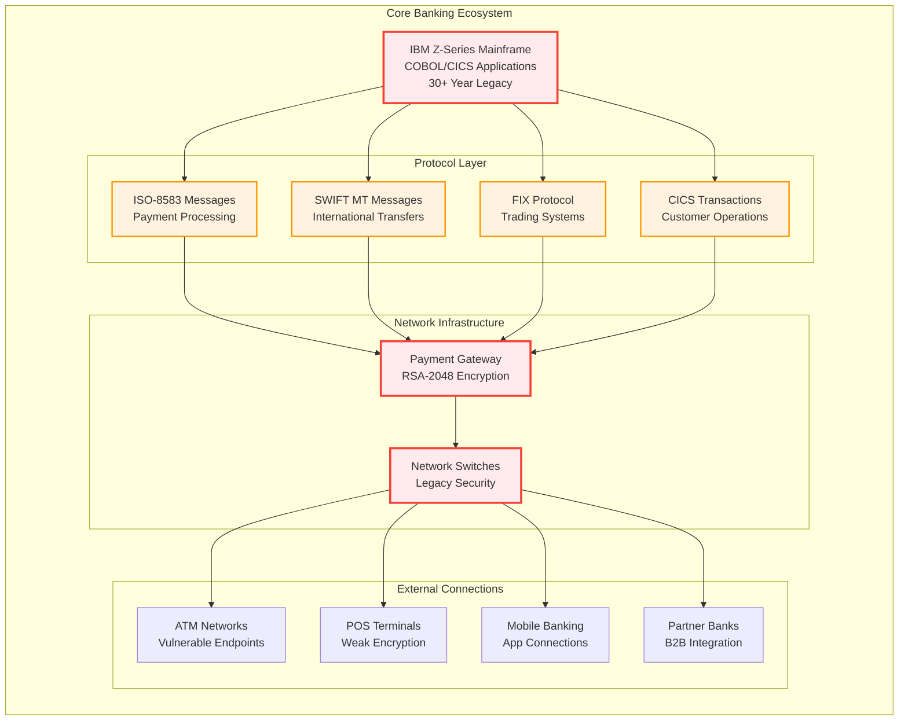
```mermaid
flowchart TB
    subgraph "Core Banking Ecosystem"
        direction TB
        mainframe["IBM Z-Series Mainframe<br/>COBOL/CICS Applications<br/>30+ Year Legacy"]
        
        subgraph "Protocol Layer"
            iso8583["ISO-8583 Messages<br/>Payment Processing"]
            swift["SWIFT MT Messages<br/>International Transfers"]
            fix["FIX Protocol<br/>Trading Systems"]
            cics["CICS Transactions<br/>Customer Operations"]
        end
        
        subgraph "Network Infrastructure"
            gateway["Payment Gateway<br/>RSA-2048 Encryption"]
            switches["Network Switches<br/>Legacy Security"]
        end
        
        subgraph "External Connections"
            atm["ATM Networks<br/>Vulnerable Endpoints"]
            pos["POS Terminals<br/>Weak Encryption"]
            mobile["Mobile Banking<br/>App Connections"]
            partners["Partner Banks<br/>B2B Integration"]
        end
    end
    
    mainframe --> iso8583
    mainframe --> swift
    mainframe --> fix
    mainframe --> cics
    
    iso8583 --> gateway
    swift --> gateway
    fix --> gateway
    cics --> gateway
    
    gateway --> switches
    switches --> atm
    switches --> pos
    switches --> mobile
    switches --> partners
    
    classDef vulnerable fill:#ffebee,stroke:#f44336,stroke-width:3px
    classDef legacy fill:#fff3e0,stroke:#ff9800,stroke-width:2px
    
    class mainframe,gateway,switches vulnerable
    class iso8583,swift,fix,cics legacy
```

#### The Problem Landscape

Banks face what I call the "legacy lock-in paradox." They've built their entire operational infrastructure around systems that work flawlessly but cannot be modernised without catastrophic risk. Consider these facts:

- **Replacement Cost Reality**: A complete core banking system replacement typically costs $50-100 million and takes 3-5 years
- **Failure Rate**: Industry studies show 60% of major banking system migrations either fail completely or exceed budget by over 200%
- **Operational Risk**: Core banking downtime costs major banks approximately $5 million per hour
- **Compliance Complexity**: Financial systems must meet SOX, PCI-DSS, Basel III, and emerging quantum-safe regulations simultaneously

**Regulatory Timeline Pressure**

```mermaid
gantt
    title Banking Industry Quantum-Safe Migration Timeline
    dateFormat YYYY-MM-DD
    section Regulatory Mandates
    NIST PQC Standards Published    :done, nist, 2022-07-01, 2024-01-01
    Fed Reserve PQC Guidelines      :active, fed, 2024-06-01, 2025-12-31
    PCI-DSS 4.0 PQC Requirements   :pcidss, 2025-01-01, 2026-06-30
    Basel Committee Quantum Rules  :basel, 2025-06-01, 2027-12-31
    Mandatory PQC Implementation   :critical, mandatory, 2027-01-01, 2030-12-31
    
    section Industry Reality
    Legacy System Assessment       :assessment, 2024-01-01, 2025-06-30
    Vendor Solution Evaluation     :evaluation, 2024-06-01, 2025-12-31
    Pilot Implementation          :pilot, 2025-01-01, 2026-06-30
    Full Production Deployment    :deploy, 2025-06-01, 2028-12-31
    
    section Quantum Threat
    Current Quantum Computers     :done, current, 2020-01-01, 2025-12-31
    Cryptographically Relevant    :critical, relevant, 2028-01-01, 2033-12-31
    Large Scale Deployment        :largescale, 2033-01-01, 2040-12-31
```

#### How CRONOS AI Addresses Banking Challenges

**Phase 1: Intelligent Discovery and Learning**

CRONOS AI doesn't require system documentation because, frankly, most of it doesn't exist anymore. The original developers retired years ago, the vendor support contracts expired, and the institutional knowledge exists only in the minds of a few senior engineers approaching retirement themselves.

Here's how the discovery process actually works in a production banking environment:

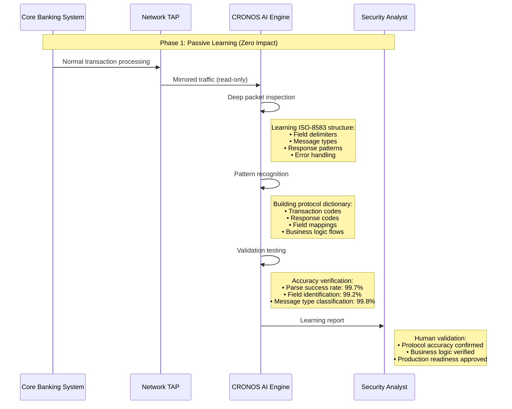
```mermaid
sequenceDiagram
    participant Bank as Core Banking System
    participant Mirror as Network TAP
    participant CRONOS as CRONOS AI Engine
    participant Analyst as Security Analyst
    
    Note over Bank,Analyst: Phase 1: Passive Learning (Zero Impact)
    
    Bank->>Mirror: Normal transaction processing
    Mirror->>CRONOS: Mirrored traffic (read-only)
    
    CRONOS->>CRONOS: Deep packet inspection
    Note right of CRONOS: Learning ISO-8583 structure:<br/>• Field delimiters<br/>• Message types<br/>• Response patterns<br/>• Error handling
    
    CRONOS->>CRONOS: Pattern recognition
    Note right of CRONOS: Building protocol dictionary:<br/>• Transaction codes<br/>• Response codes<br/>• Field mappings<br/>• Business logic flows
    
    CRONOS->>CRONOS: Validation testing
    Note right of CRONOS: Accuracy verification:<br/>• Parse success rate: 99.7%<br/>• Field identification: 99.2%<br/>• Message type classification: 99.8%
    
    CRONOS->>Analyst: Learning report
    Note right of Analyst: Human validation:<br/>• Protocol accuracy confirmed<br/>• Business logic verified<br/>• Production readiness approved
```

**Phase 2: Quantum-Safe Protection Deployment**

Once CRONOS AI understands your protocols (typically within 48-72 hours for standard banking protocols), it can provide quantum-safe protection without any changes to your existing systems.

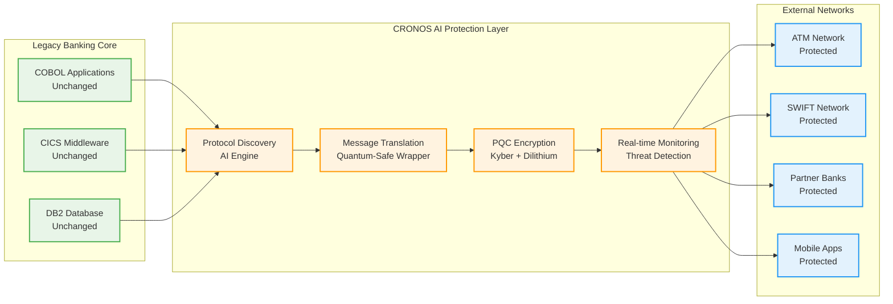
```mermaid
flowchart LR
    subgraph "Legacy Banking Core"
        cobol["COBOL Applications<br/>Unchanged"]
        cics["CICS Middleware<br/>Unchanged"]
        db2["DB2 Database<br/>Unchanged"]
    end
    
    subgraph "CRONOS AI Protection Layer"
        discover["Protocol Discovery<br/>AI Engine"]
        translate["Message Translation<br/>Quantum-Safe Wrapper"]
        encrypt["PQC Encryption<br/>Kyber + Dilithium"]
        monitor["Real-time Monitoring<br/>Threat Detection"]
    end
    
    subgraph "External Networks"
        atm["ATM Network<br/>Protected"]
        swift["SWIFT Network<br/>Protected"]
        partners["Partner Banks<br/>Protected"]
        mobile["Mobile Apps<br/>Protected"]
    end
    
    cobol --> discover
    cics --> discover
    db2 --> discover
    
    discover --> translate
    translate --> encrypt
    encrypt --> monitor
    
    monitor --> atm
    monitor --> swift
    monitor --> partners
    monitor --> mobile
    
    classDef unchanged fill:#e8f5e8,stroke:#4caf50,stroke-width:2px
    classDef protected fill:#e3f2fd,stroke:#2196f3,stroke-width:2px
    classDef secure fill:#fff3e0,stroke:#ff9800,stroke-width:2px
    
    class cobol,cics,db2 unchanged
    class discover,translate,encrypt,monitor secure
    class atm,swift,partners,mobile protected
```

#### Banking Implementation Benefits

**Immediate Value Realisation**:
- **Cost Avoidance**: ₹400-800 crores saved per major bank by avoiding core system replacement
- **Compliance Achievement**: Meet PCI-DSS 4.0 and upcoming Fed Reserve quantum requirements
- **Risk Mitigation**: Protect against "harvest now, decrypt later" quantum attacks
- **Operational Continuity**: Zero downtime deployment with fallback mechanisms

**Technical Performance Metrics**:
- **Throughput**: Handles 50,000+ transactions per second with <1ms latency overhead
- **Reliability**: 99.99% uptime with automatic failover capabilities
- **Scalability**: Supports multiple data centres with seamless replication
- **Compliance**: Automated audit trails and regulatory reporting

---

### Scenario 2: Critical Infrastructure and SCADA Systems

#### Current State Assessment

India's critical infrastructure presents unique challenges. Our power grid serves 1.4 billion people through a complex network of generation, transmission, and distribution systems. Many of these facilities use SCADA systems installed in the 1990s and early 2000s, running protocols like Modbus and DNP3 that were designed for isolated networks but are now connected to corporate networks and, increasingly, the internet.

The recent increase in cyber attacks on infrastructure globally - from the Colonial Pipeline ransomware to the Ukraine power grid attacks - has highlighted how vulnerable these systems really are. The problem isn't just that they're old; it's that they were never designed with security in mind because they were supposed to be air-gapped.

**Current SCADA Architecture - Typical Power Plant**

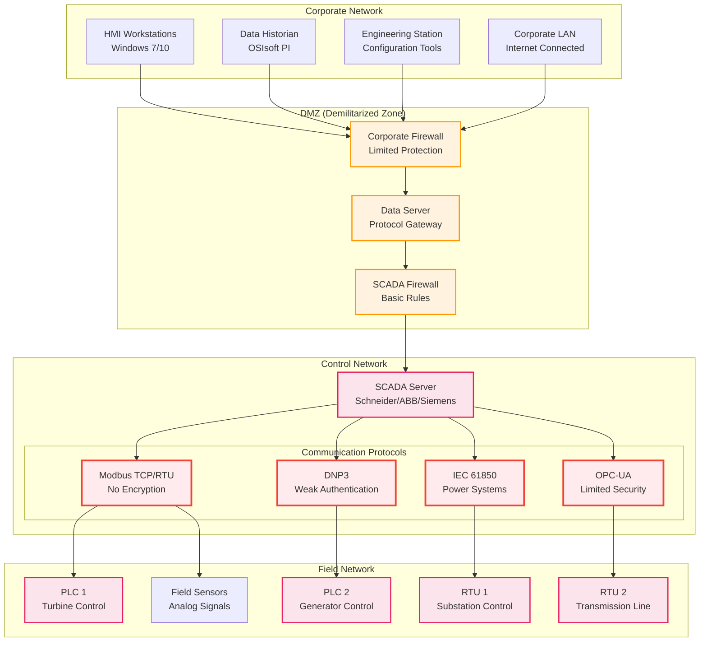
```mermaid
flowchart TB
    subgraph "Corporate Network"
        hmi["HMI Workstations<br/>Windows 7/10"]
        historian["Data Historian<br/>OSIsoft PI"]
        engineering["Engineering Station<br/>Configuration Tools"]
        corporate["Corporate LAN<br/>Internet Connected"]
    end
    
    subgraph "DMZ (Demilitarized Zone)"
        firewall1["Corporate Firewall<br/>Limited Protection"]
        dataserver["Data Server<br/>Protocol Gateway"]
        firewall2["SCADA Firewall<br/>Basic Rules"]
    end
    
    subgraph "Control Network"
        scada["SCADA Server<br/>Schneider/ABB/Siemens"]
        
        subgraph "Communication Protocols"
            modbus["Modbus TCP/RTU<br/>No Encryption"]
            dnp3["DNP3<br/>Weak Authentication"]
            iec61850["IEC 61850<br/>Power Systems"]
            opcua["OPC-UA<br/>Limited Security"]
        end
    end
    
    subgraph "Field Network"
        plc1["PLC 1<br/>Turbine Control"]
        plc2["PLC 2<br/>Generator Control"]
        rtu1["RTU 1<br/>Substation Control"]
        rtu2["RTU 2<br/>Transmission Line"]
        sensors["Field Sensors<br/>Analog Signals"]
    end
    
    corporate --> firewall1
    hmi --> firewall1
    historian --> firewall1
    engineering --> firewall1
    
    firewall1 --> dataserver
    dataserver --> firewall2
    firewall2 --> scada
    
    scada --> modbus
    scada --> dnp3
    scada --> iec61850
    scada --> opcua
    
    modbus --> plc1
    dnp3 --> plc2
    iec61850 --> rtu1
    opcua --> rtu2
    modbus --> sensors
    
    classDef vulnerable fill:#ffebee,stroke:#f44336,stroke-width:3px
    classDef weakprotection fill:#fff3e0,stroke:#ff9800,stroke-width:2px
    classDef critical fill:#fce4ec,stroke:#e91e63,stroke-width:2px
    
    class modbus,dnp3,iec61850,opcua vulnerable
    class firewall1,firewall2,dataserver weakprotection
    class scada,plc1,plc2,rtu1,rtu2 critical
```

#### Infrastructure-Specific Challenges

**The Air-Gap Myth**: Most SCADA networks aren't truly air-gapped anymore. They have maintenance connections, vendor remote access, and data historians that connect to corporate networks. Every one of these connections is a potential attack vector.

**Protocol Vulnerabilities**:
- **Modbus**: Designed in 1979, has no built-in security features whatsoever
- **DNP3**: Includes basic authentication, but it's often not implemented or configured incorrectly
- **IEC 61850**: Modern power system protocol, but security features are optional and complex to configure
- **OPC-UA**: Has good security capabilities, but legacy implementations often disable them for compatibility

**Operational Constraints**:
- **Uptime Requirements**: Power plants, water treatment facilities, and oil refineries typically require 99.99% uptime
- **Safety Systems**: Any security solution that interferes with safety-critical operations is unacceptable
- **Change Management**: Infrastructure operators are extremely conservative about changes to production systems
- **Vendor Lock-in**: Many SCADA systems are proprietary, and vendors often void warranties if third-party security solutions are installed

#### CRONOS AI's Infrastructure Protection Approach

**Inline Protection Architecture**

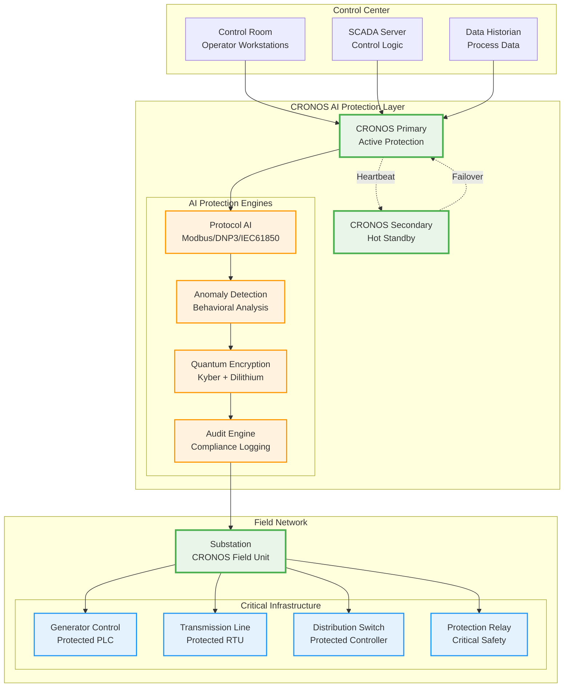
```mermaid
flowchart TB
    subgraph "Control Center"
        operator["Control Room<br/>Operator Workstations"]
        scadaserver["SCADA Server<br/>Control Logic"]
        historian["Data Historian<br/>Process Data"]
    end
    
    subgraph "CRONOS AI Protection Layer"
        primary["CRONOS Primary<br/>Active Protection"]
        secondary["CRONOS Secondary<br/>Hot Standby"]
        
        subgraph "AI Protection Engines"
            protocol["Protocol AI<br/>Modbus/DNP3/IEC61850"]
            anomaly["Anomaly Detection<br/>Behavioral Analysis"]
            quantum["Quantum Encryption<br/>Kyber + Dilithium"]
            audit["Audit Engine<br/>Compliance Logging"]
        end
    end
    
    subgraph "Field Network"
        substation["Substation<br/>CRONOS Field Unit"]
        
        subgraph "Critical Infrastructure"
            generator["Generator Control<br/>Protected PLC"]
            transmission["Transmission Line<br/>Protected RTU"]
            distribution["Distribution Switch<br/>Protected Controller"]
            protection["Protection Relay<br/>Critical Safety"]
        end
    end
    
    operator --> primary
    scadaserver --> primary
    historian --> primary
    
    primary -.->|Heartbeat| secondary
    secondary -.->|Failover| primary
    
    primary --> protocol
    protocol --> anomaly
    anomaly --> quantum
    quantum --> audit
    
    audit --> substation
    substation --> generator
    substation --> transmission
    substation --> distribution
    substation --> protection
    
    classDef protected fill:#e8f5e8,stroke:#4caf50,stroke-width:3px
    classDef critical fill:#e3f2fd,stroke:#2196f3,stroke-width:2px
    classDef ai fill:#fff3e0,stroke:#ff9800,stroke-width:2px
    
    class primary,secondary,substation protected
    class generator,transmission,distribution,protection critical
    class protocol,anomaly,quantum,audit ai
```

**AI-Powered Threat Detection for Industrial Systems**

One of the most powerful features of CRONOS AI in infrastructure environments is its ability to understand normal operational patterns and detect anomalies that could indicate cyber attacks or system malfunctions.

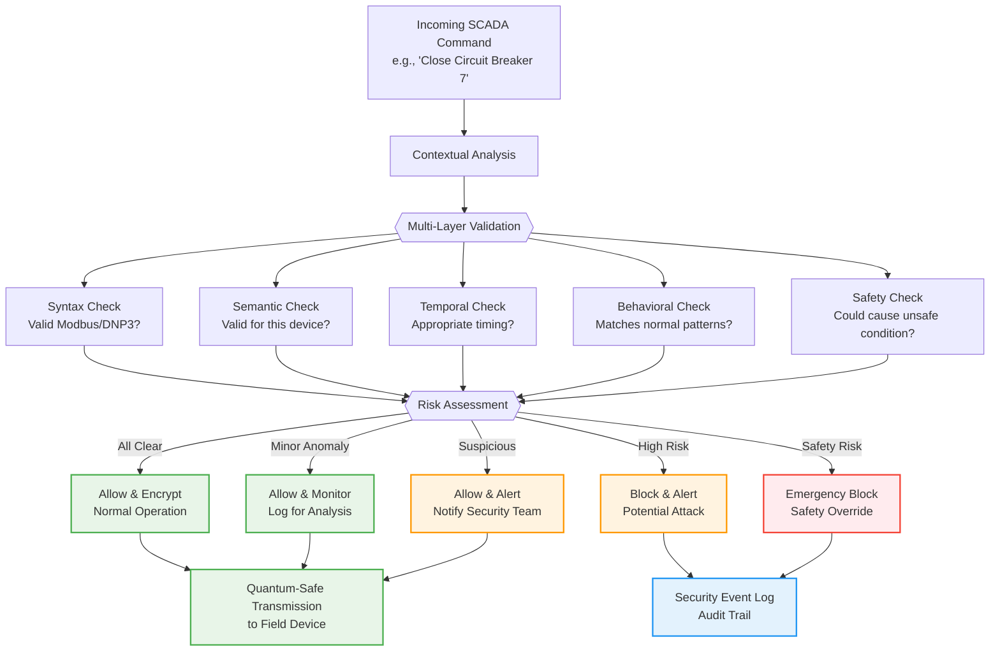
```mermaid
flowchart TD
    incoming["Incoming SCADA Command<br/>e.g., 'Close Circuit Breaker 7'"]
    
    context["Contextual Analysis"]
    incoming --> context
    
    checks{{"Multi-Layer Validation"}}
    context --> checks
    
    syntax["Syntax Check<br/>Valid Modbus/DNP3?"]
    semantic["Semantic Check<br/>Valid for this device?"]
    temporal["Temporal Check<br/>Appropriate timing?"]
    behavioral["Behavioral Check<br/>Matches normal patterns?"]
    safety["Safety Check<br/>Could cause unsafe condition?"]
    
    checks --> syntax
    checks --> semantic
    checks --> temporal
    checks --> behavioral
    checks --> safety
    
    decision{{"Risk Assessment"}}
    syntax --> decision
    semantic --> decision
    temporal --> decision
    behavioral --> decision
    safety --> decision
    
    allow["Allow & Encrypt<br/>Normal Operation"]
    monitor["Allow & Monitor<br/>Log for Analysis"]
    alert["Allow & Alert<br/>Notify Security Team"]
    block["Block & Alert<br/>Potential Attack"]
    emergency["Emergency Block<br/>Safety Override"]
    
    decision -->|All Clear| allow
    decision -->|Minor Anomaly| monitor
    decision -->|Suspicious| alert
    decision -->|High Risk| block
    decision -->|Safety Risk| emergency
    
    encrypted["Quantum-Safe Transmission<br/>to Field Device"]
    logged["Security Event Log<br/>Audit Trail"]
    
    allow --> encrypted
    monitor --> encrypted
    alert --> encrypted
    
    block --> logged
    emergency --> logged
    
    classDef normal fill:#e8f5e8,stroke:#4caf50,stroke-width:2px
    classDef warning fill:#fff3e0,stroke:#ff9800,stroke-width:2px
    classDef danger fill:#ffebee,stroke:#f44336,stroke-width:2px
    classDef secure fill:#e3f2fd,stroke:#2196f3,stroke-width:2px
    
    class allow,monitor,encrypted normal
    class alert,block warning
    class emergency danger
    class logged secure
```

#### Infrastructure Implementation Benefits

**Operational Advantages**:
- **Zero-Downtime Deployment**: Hot-pluggable installation during scheduled maintenance windows
- **Vendor Independence**: Works with existing SCADA systems from any manufacturer
- **Safety Preservation**: Never interferes with safety-critical operations
- **Performance Maintenance**: <1ms latency ensures real-time control performance

**Security Benefits**:
- **Quantum-Safe Protection**: All industrial communications protected against future quantum attacks
- **Advanced Threat Detection**: AI identifies attack patterns that traditional security tools miss
- **Compliance Achievement**: Meets NERC CIP, IEC 62443, and emerging cybersecurity requirements
- **Incident Response**: Automated isolation and recovery procedures

---

### Scenario 3: Healthcare and Medical Device Security

#### Current State Assessment

Healthcare IT infrastructure is arguably the most complex and challenging environment for cybersecurity implementation. Hospitals must balance patient safety, regulatory compliance, operational efficiency, and security - often with conflicting requirements.

The fundamental challenge is that medical devices are regulated as safety-critical equipment by agencies like the FDA, which means any modification to their software could require re-approval costing millions and taking years. Meanwhile, these same devices often run on obsolete operating systems with known vulnerabilities and cannot be patched.

**Typical Hospital Network Architecture**

```mermaid
flowchart TB
    subgraph "Clinical Networks"
        emr["EMR System<br/>Epic/Cerner"]
        pacs["PACS Server<br/>Medical Imaging"]
        lis["Laboratory System<br/>Test Results"]
        pharmacy["Pharmacy System<br/>Drug Management"]
        nurse["Nursing Workstations<br/>Clinical Documentation"]
    end
    
    subgraph "Medical Device Networks"
        direction TB
        
        subgraph "Critical Care"
            ventilators["Ventilators<br/>Life Support"]
            monitors["Patient Monitors<br/>Vital Signs"]
            pumps["Infusion Pumps<br/>IV Medications"]
            dialysis["Dialysis Machines<br/>Kidney Treatment"]
        end
        
        subgraph "Diagnostic Imaging"
            mri["MRI Scanner<br/>Windows XP Embedded"]
            ct["CT Scanner<br/>Proprietary OS"]
            xray["X-Ray Systems<br/>Digital Radiography"]
            ultrasound["Ultrasound<br/>Portable Units"]
        end
        
        subgraph "Laboratory Equipment"
            analyzers["Blood Analyzers<br/>Automated Testing"]
            sequencers["DNA Sequencers<br/>Genetic Testing"]
            microscopes["Digital Microscopes<br/>Pathology"]
        end
    end
    
    subgraph "Network Infrastructure"
        clinical_vlan["Clinical VLAN<br/>Patient Data"]
        device_vlan["Device VLAN<br/>Medical Equipment"]
        guest_vlan["Guest VLAN<br/>Patient WiFi"]
        admin_vlan["Admin VLAN<br/>IT Management"]
    end
    
    emr --> clinical_vlan
    pacs --> clinical_vlan
    lis --> clinical_vlan
    pharmacy --> clinical_vlan
    nurse --> clinical_vlan
    
    ventilators --> device_vlan
    monitors --> device_vlan
    pumps --> device_vlan
    dialysis --> device_vlan
    mri --> device_vlan
    ct --> device_vlan
    xray --> device_vlan
    ultrasound --> device_vlan
    analyzers --> device_vlan
    sequencers --> device_vlan
    microscopes --> device_vlan
    
    clinical_vlan -.->|Limited Access| device_vlan
    device_vlan -.->|Data Flow| clinical_vlan
    
    classDef vulnerable fill:#ffebee,stroke:#f44336,stroke-width:3px
    classDef legacy fill:#fff3e0,stroke:#ff9800,stroke-width:2px
    classDef critical fill:#fce4ec,stroke:#e91e63,stroke-width:2px
    
    class mri,ct,ventilators,monitors vulnerable
    class pacs,lis,analyzers,sequencers legacy
    class emr,pharmacy,pumps,dialysis critical
```

#### Healthcare-Specific Security Challenges

**Regulatory Complexity**:
- **FDA Approval**: Any software change to medical devices requires regulatory approval
- **HIPAA Compliance**: All patient health information must be encrypted and audited
- **Joint Commission**: Hospital accreditation depends on cybersecurity risk management
- **State Regulations**: Additional requirements vary by state and hospital type

**Technical Constraints**:
- **Legacy Operating Systems**: 60% of medical devices run Windows XP or older
- **Proprietary Protocols**: Each manufacturer uses different communication protocols
- **Network Dependencies**: Medical devices often share networks with administrative systems
- **Uptime Requirements**: Critical care devices cannot be offline for maintenance

**Patient Safety Considerations**:
- **Life Support Systems**: Any security measure that could interfere with ventilators or cardiac monitors is unacceptable
- **Clinical Workflows**: Security cannot slow down emergency medical procedures
- **Alert Fatigue**: Too many security alerts can cause clinical staff to ignore important warnings
- **User Training**: Medical staff focus on patient care, not cybersecurity

#### CRONOS AI's Healthcare Implementation Strategy

**FDA-Compliant Protection Model**

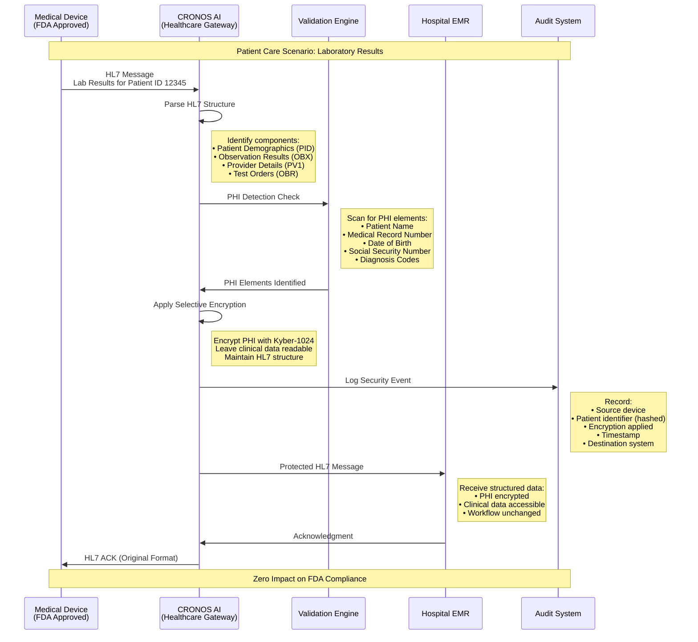
```mermaid
sequenceDiagram
    participant Device as Medical Device<br/>(FDA Approved)
    participant CRONOS as CRONOS AI<br/>(Healthcare Gateway)
    participant Validation as Validation Engine
    participant EMR as Hospital EMR
    participant Audit as Audit System
    
    Note over Device,Audit: Patient Care Scenario: Laboratory Results
    
    Device->>CRONOS: HL7 Message<br/>Lab Results for Patient ID 12345
    
    CRONOS->>CRONOS: Parse HL7 Structure
    Note right of CRONOS: Identify components:<br/>• Patient Demographics (PID)<br/>• Observation Results (OBX)<br/>• Provider Details (PV1)<br/>• Test Orders (OBR)
    
    CRONOS->>Validation: PHI Detection Check
    Note right of Validation: Scan for PHI elements:<br/>• Patient Name<br/>• Medical Record Number<br/>• Date of Birth<br/>• Social Security Number<br/>• Diagnosis Codes
    
    Validation->>CRONOS: PHI Elements Identified
    
    CRONOS->>CRONOS: Apply Selective Encryption
    Note right of CRONOS: Encrypt PHI with Kyber-1024<br/>Leave clinical data readable<br/>Maintain HL7 structure
    
    CRONOS->>Audit: Log Security Event
    Note right of Audit: Record:<br/>• Source device<br/>• Patient identifier (hashed)<br/>• Encryption applied<br/>• Timestamp<br/>• Destination system
    
    CRONOS->>EMR: Protected HL7 Message
    Note right of EMR: Receive structured data:<br/>• PHI encrypted<br/>• Clinical data accessible<br/>• Workflow unchanged
    
    EMR->>CRONOS: Acknowledgment
    CRONOS->>Device: HL7 ACK (Original Format)
    
    Note over Device,Audit: Zero Impact on FDA Compliance
```

**Medical Protocol Intelligence Engine**

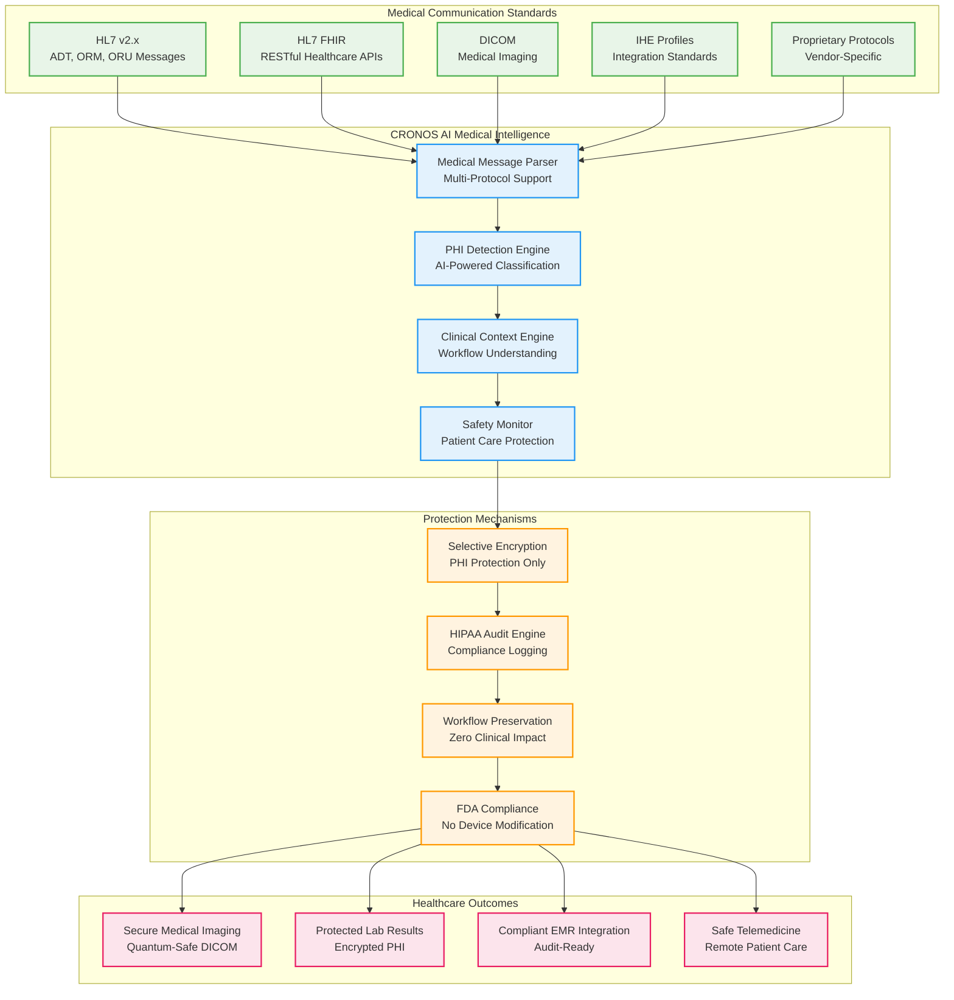
```mermaid
flowchart TB
    subgraph "Medical Communication Standards"
        hl7v2["HL7 v2.x<br/>ADT, ORM, ORU Messages"]
        hl7fhir["HL7 FHIR<br/>RESTful Healthcare APIs"]
        dicom["DICOM<br/>Medical Imaging"]
        ihe["IHE Profiles<br/>Integration Standards"]
        proprietary["Proprietary Protocols<br/>Vendor-Specific"]
    end
    
    subgraph "CRONOS AI Medical Intelligence"
        parser["Medical Message Parser<br/>Multi-Protocol Support"]
        phi_detector["PHI Detection Engine<br/>AI-Powered Classification"]
        clinical_context["Clinical Context Engine<br/>Workflow Understanding"]
        safety_monitor["Safety Monitor<br/>Patient Care Protection"]
    end
    
    subgraph "Protection Mechanisms"
        selective_encrypt["Selective Encryption<br/>PHI Protection Only"]
        hipaa_audit["HIPAA Audit Engine<br/>Compliance Logging"]
        workflow_preserve["Workflow Preservation<br/>Zero Clinical Impact"]
        fda_compliance["FDA Compliance<br/>No Device Modification"]
    end
    
    subgraph "Healthcare Outcomes"
        secure_imaging["Secure Medical Imaging<br/>Quantum-Safe DICOM"]
        protected_labs["Protected Lab Results<br/>Encrypted PHI"]
        compliant_emr["Compliant EMR Integration<br/>Audit-Ready"]
        safe_telemedicine["Safe Telemedicine<br/>Remote Patient Care"]
    end
    
    hl7v2 --> parser
    hl7fhir --> parser
    dicom --> parser
    ihe --> parser
    proprietary --> parser
    
    parser --> phi_detector
    phi_detector --> clinical_context
    clinical_context --> safety_monitor
    
    safety_monitor --> selective_encrypt
    selective_encrypt --> hipaa_audit
    hipaa_audit --> workflow_preserve
    workflow_preserve --> fda_compliance
    
    fda_compliance --> secure_imaging
    fda_compliance --> protected_labs
    fda_compliance --> compliant_emr
    fda_compliance --> safe_telemedicine
    
    classDef medical fill:#e8f5e8,stroke:#4caf50,stroke-width:2px
    classDef ai fill:#e3f2fd,stroke:#2196f3,stroke-width:2px
    classDef protection fill:#fff3e0,stroke:#ff9800,stroke-width:2px
    classDef outcome fill:#fce4ec,stroke:#e91e63,stroke-width:2px
    
    class hl7v2,hl7fhir,dicom,ihe,proprietary medical
    class parser,phi_detector,clinical_context,safety_monitor ai
    class selective_encrypt,hipaa_audit,workflow_preserve,fda_compliance protection
    class secure_imaging,protected_labs,compliant_emr,safe_telemedicine outcome
```

#### Healthcare Implementation Benefits

**Patient Safety Assurance**:
- **Non-Intrusive Protection**: Never interferes with medical device operation
- **Clinical Workflow Preservation**: Maintains all existing procedures and protocols
- **Emergency Override**: Bypasses security during life-threatening situations
- **Real-Time Monitoring**: Continuous health checks on critical care devices

**Regulatory Compliance**:
- **HIPAA Compliance**: Automatic PHI encryption and comprehensive audit trails
- **FDA Compatibility**: No medical device modifications required
- **Joint Commission**: Meets cybersecurity risk management requirements
- **State Regulations**: Configurable to meet varying state requirements

---

### Scenario 4: Government and Defense Systems

#### Current State Assessment

Government and defence networks represent perhaps the most challenging cybersecurity environment. These systems often handle classified information using protocols that cannot be documented for security reasons. Many defence systems are designed to operate for 20-30 years, meaning equipment installed in the 2000s will remain in service until the 2030s - well into the quantum computing era.

The challenge is compounded by the fact that many military systems use proprietary or classified protocols that external vendors cannot access. Additionally, the security clearance requirements and approval processes for government systems can take years, making it difficult to implement new cybersecurity solutions quickly.

**Classified Network Architecture Example**

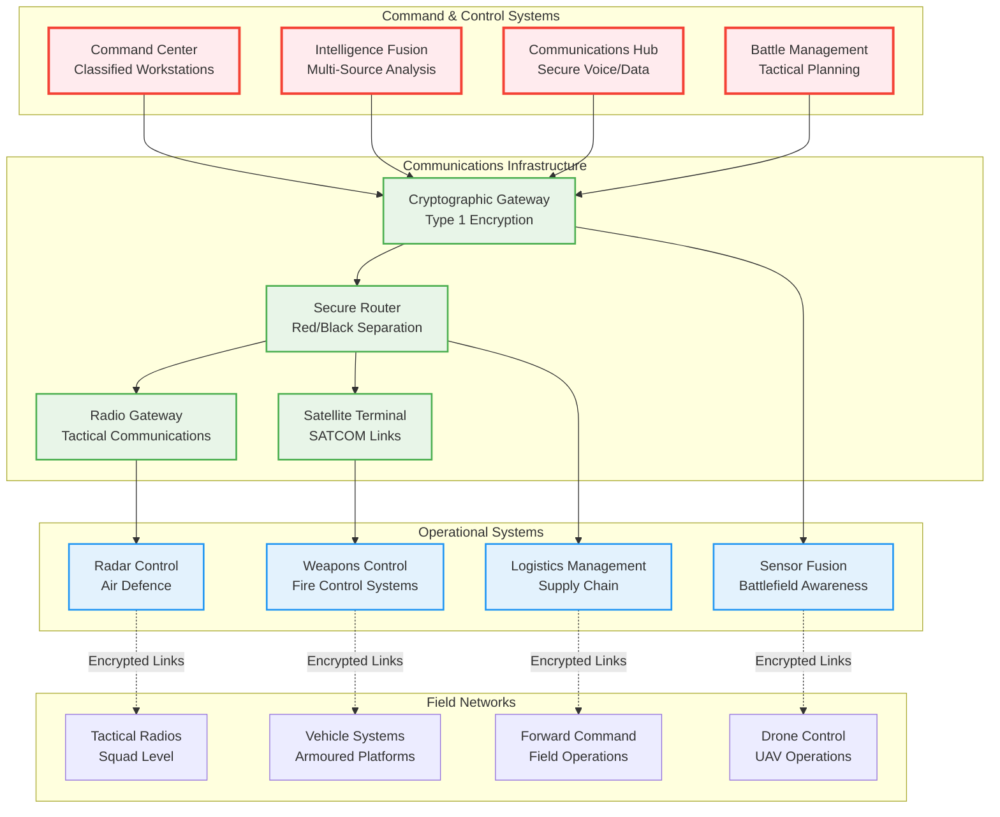
```mermaid
flowchart TB
    subgraph "Command & Control Systems"
        c2_center["Command Center<br/>Classified Workstations"]
        intel_fusion["Intelligence Fusion<br/>Multi-Source Analysis"]
        comms_hub["Communications Hub<br/>Secure Voice/Data"]
        battle_mgmt["Battle Management<br/>Tactical Planning"]
    end
    
    subgraph "Communications Infrastructure"
        crypto_gateway["Cryptographic Gateway<br/>Type 1 Encryption"]
        secure_router["Secure Router<br/>Red/Black Separation"]
        radio_gateway["Radio Gateway<br/>Tactical Communications"]
        satellite_term["Satellite Terminal<br/>SATCOM Links"]
    end
    
    subgraph "Operational Systems"
        radar_control["Radar Control<br/>Air Defence"]
        weapons_control["Weapons Control<br/>Fire Control Systems"]
        sensor_fusion["Sensor Fusion<br/>Battlefield Awareness"]
        logistics_mgmt["Logistics Management<br/>Supply Chain"]
    end
    
    subgraph "Field Networks"
        direction LR
        tactical_radio["Tactical Radios<br/>Squad Level"]
        vehicle_systems["Vehicle Systems<br/>Armoured Platforms"]
        drone_control["Drone Control<br/>UAV Operations"]
        forward_command["Forward Command<br/>Field Operations"]
    end
    
    c2_center --> crypto_gateway
    intel_fusion --> crypto_gateway
    comms_hub --> crypto_gateway
    battle_mgmt --> crypto_gateway
    
    crypto_gateway --> secure_router
    secure_router --> radio_gateway
    secure_router --> satellite_term
    
    radio_gateway --> radar_control
    satellite_term --> weapons_control
    crypto_gateway --> sensor_fusion
    secure_router --> logistics_mgmt
    
    radar_control -.->|Encrypted Links| tactical_radio
    weapons_control -.->|Encrypted Links| vehicle_systems
    sensor_fusion -.->|Encrypted Links| drone_control
    logistics_mgmt -.->|Encrypted Links| forward_command
    
    classDef classified fill:#ffebee,stroke:#f44336,stroke-width:3px
    classDef crypto fill:#e8f5e8,stroke:#4caf50,stroke-width:2px
    classDef tactical fill:#e3f2fd,stroke:#2196f3,stroke-width:2px
    
    class c2_center,intel_fusion,comms_hub,battle_mgmt classified
    class crypto_gateway,secure_router,radio_gateway,satellite_term crypto
    class radar_control,weapons_control,sensor_fusion,logistics_mgmt tactical
```

#### Defence-Specific Security Requirements

**Classification and Clearance**:
- **Multiple Security Levels**: Systems must handle Confidential, Secret, and Top Secret information simultaneously
- **Need-to-Know Basis**: Information access must be compartmentalised based on operational requirements
- **Personnel Clearances**: All technical personnel require appropriate security clearances
- **Foreign Disclosure**: Solutions must be designed and manufactured within trusted nations

**Operational Requirements**:
- **Mission Assurance**: Security cannot interfere with critical military operations
- **Extreme Environments**: Systems must operate in combat conditions, extreme weather, and electromagnetic interference
- **Offline Operations**: Many systems operate without external network connectivity
- **Rapid Deployment**: Military units need portable security solutions for forward operations

**Technical Constraints**:
- **Unknown Protocols**: Many military communications use undocumented or classified protocols
- **Legacy Integration**: New security solutions must work with decades-old equipment
- **Supply Chain Security**: All components must come from trusted suppliers
- **Physical Security**: Equipment must resist tampering and provide evidence of compromise

#### CRONOS AI's Defence Implementation Approach

**Multi-Level Security Architecture**

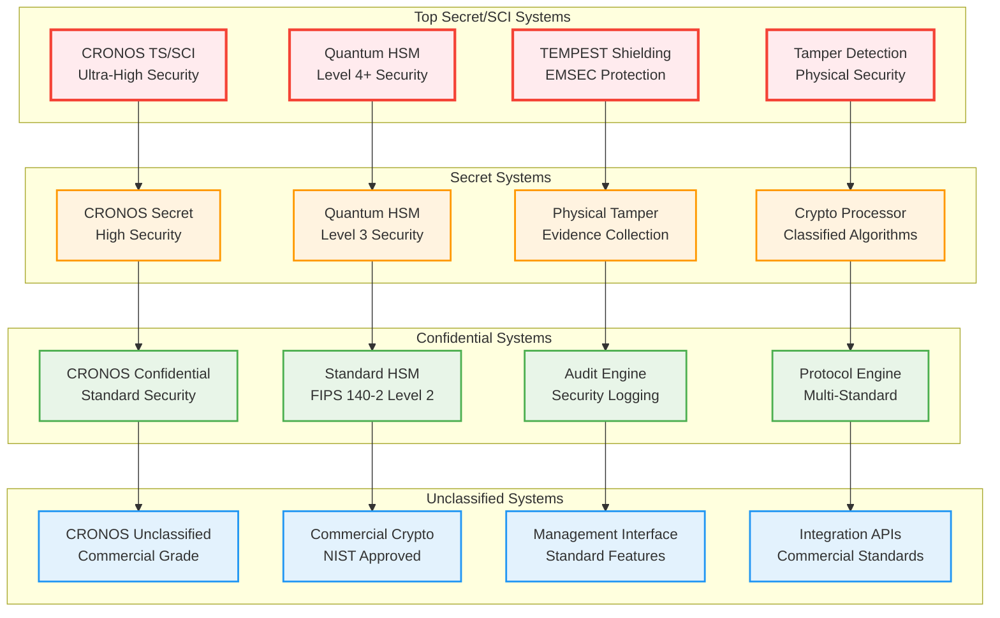
```mermaid
flowchart TB
    subgraph "Top Secret/SCI Systems"
        ts_cronos["CRONOS TS/SCI<br/>Ultra-High Security"]
        ts_hsm["Quantum HSM<br/>Level 4+ Security"]
        ts_tempest["TEMPEST Shielding<br/>EMSEC Protection"]
        ts_tamper["Tamper Detection<br/>Physical Security"]
    end
    
    subgraph "Secret Systems"
        s_cronos["CRONOS Secret<br/>High Security"]
        s_hsm["Quantum HSM<br/>Level 3 Security"]
        s_physical["Physical Tamper<br/>Evidence Collection"]
        s_crypto["Crypto Processor<br/>Classified Algorithms"]
    end
    
    subgraph "Confidential Systems"
        c_cronos["CRONOS Confidential<br/>Standard Security"]
        c_hsm["Standard HSM<br/>FIPS 140-2 Level 2"]
        c_audit["Audit Engine<br/>Security Logging"]
        c_protocols["Protocol Engine<br/>Multi-Standard"]
    end
    
    subgraph "Unclassified Systems"
        u_cronos["CRONOS Unclassified<br/>Commercial Grade"]
        u_crypto["Commercial Crypto<br/>NIST Approved"]
        u_management["Management Interface<br/>Standard Features"]
        u_integration["Integration APIs<br/>Commercial Standards"]
    end
    
    ts_cronos --> s_cronos
    s_cronos --> c_cronos
    c_cronos --> u_cronos
    
    ts_hsm --> s_hsm
    s_hsm --> c_hsm
    c_hsm --> u_crypto
    
    ts_tempest --> s_physical
    s_physical --> c_audit
    c_audit --> u_management
    
    ts_tamper --> s_crypto
    s_crypto --> c_protocols
    c_protocols --> u_integration
    
    classDef topsecret fill:#ffebee,stroke:#f44336,stroke-width:3px
    classDef secret fill:#fff3e0,stroke:#ff9800,stroke-width:2px
    classDef confidential fill:#e8f5e8,stroke:#4caf50,stroke-width:2px
    classDef unclassified fill:#e3f2fd,stroke:#2196f3,stroke-width:2px
    
    class ts_cronos,ts_hsm,ts_tempest,ts_tamper topsecret
    class s_cronos,s_hsm,s_physical,s_crypto secret
    class c_cronos,c_hsm,c_audit,c_protocols confidential
    class u_cronos,u_crypto,u_management,u_integration unclassified
```

**Black-Box Protocol Discovery for Classified Systems**

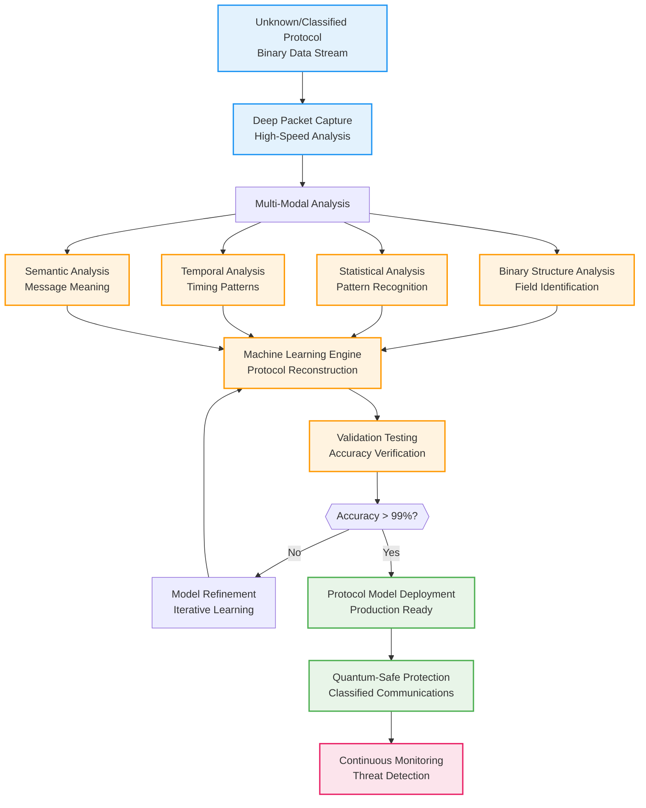
```mermaid
flowchart TD
    unknown["Unknown/Classified Protocol<br/>Binary Data Stream"]
    
    capture["Deep Packet Capture<br/>High-Speed Analysis"]
    unknown --> capture
    
    analysis["Multi-Modal Analysis"]
    capture --> analysis
    
    binary["Binary Structure Analysis<br/>Field Identification"]
    statistical["Statistical Analysis<br/>Pattern Recognition"]
    temporal["Temporal Analysis<br/>Timing Patterns"]
    semantic["Semantic Analysis<br/>Message Meaning"]
    
    analysis --> binary
    analysis --> statistical
    analysis --> temporal
    analysis --> semantic
    
    ml_engine["Machine Learning Engine<br/>Protocol Reconstruction"]
    binary --> ml_engine
    statistical --> ml_engine
    temporal --> ml_engine
    semantic --> ml_engine
    
    validation["Validation Testing<br/>Accuracy Verification"]
    ml_engine --> validation
    
    accuracy_check{{"Accuracy > 99%?"}}
    validation --> accuracy_check
    
    refinement["Model Refinement<br/>Iterative Learning"]
    accuracy_check -->|No| refinement
    refinement --> ml_engine
    
    deployment["Protocol Model Deployment<br/>Production Ready"]
    accuracy_check -->|Yes| deployment
    
    protection["Quantum-Safe Protection<br/>Classified Communications"]
    deployment --> protection
    
    monitoring["Continuous Monitoring<br/>Threat Detection"]
    protection --> monitoring
    
    classDef input fill:#e3f2fd,stroke:#2196f3,stroke-width:2px
    classDef analysis fill:#fff3e0,stroke:#ff9800,stroke-width:2px
    classDef ml fill:#e8f5e8,stroke:#4caf50,stroke-width:2px
    classDef output fill:#fce4ec,stroke:#e91e63,stroke-width:2px
    
    class unknown,capture input
    class binary,statistical,temporal,semantic,ml_engine,validation analysis
    class deployment,protection ml
    class monitoring output
```

#### Defence Implementation Benefits

**Mission Assurance**:
- **Operational Continuity**: Zero impact on critical military operations
- **Multi-Domain Support**: Protects land, sea, air, space, and cyber operations
- **Rapid Deployment**: Portable units for forward-deployed forces
- **Extreme Environment**: Operates in combat conditions and harsh environments

**Security Advantages**:
- **Quantum-Safe Communications**: Protection against nation-state quantum capabilities
- **Unknown Protocol Support**: Works with classified and undocumented systems
- **Supply Chain Security**: Domestically manufactured with trusted components
- **Physical Tamper Protection**: Evidence of any compromise attempts

---

### Scenario 5: Enterprise IT and Cloud Migration

#### Current State Assessment

Large enterprises today face what IT professionals call "the legacy challenge" - billions of dollars invested in enterprise systems that work perfectly but cannot be easily modernised. These systems form the backbone of business operations, containing decades of customisations, integrations, and business logic that would be impossible to recreate.

Consider a typical Fortune 500 manufacturing company. Their SAP R/3 system was implemented in the late 1990s at a cost of ₹200-300 crores. Over the years, they've added custom modules for supply chain management, financial reporting, and regulatory compliance. The system processes thousands of transactions daily and integrates with dozens of other applications.

Now, in 2025, they want to adopt cloud technologies for analytics, mobile applications, and AI-driven insights. But their SAP system uses proprietary RFC protocols that cloud applications cannot understand. Traditional integration approaches require extensive custom development and often create security vulnerabilities.

**Typical Enterprise Legacy Architecture**

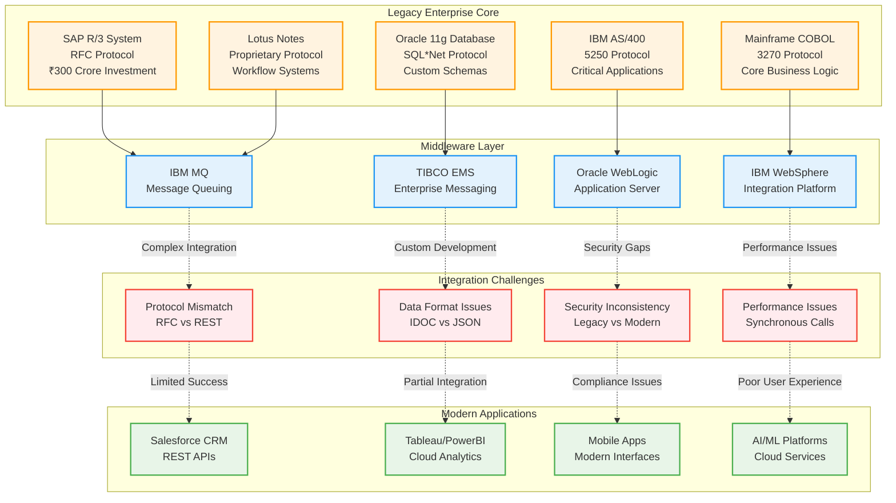
```mermaid
flowchart TB
    subgraph "Legacy Enterprise Core"
        sap["SAP R/3 System<br/>RFC Protocol<br/>₹300 Crore Investment"]
        oracle["Oracle 11g Database<br/>SQL*Net Protocol<br/>Custom Schemas"]
        as400["IBM AS/400<br/>5250 Protocol<br/>Critical Applications"]
        mainframe["Mainframe COBOL<br/>3270 Protocol<br/>Core Business Logic"]
        lotus["Lotus Notes<br/>Proprietary Protocol<br/>Workflow Systems"]
    end
    
    subgraph "Middleware Layer"
        mq["IBM MQ<br/>Message Queuing"]
        tibco["TIBCO EMS<br/>Enterprise Messaging"]
        weblogic["Oracle WebLogic<br/>Application Server"]
        websphere["IBM WebSphere<br/>Integration Platform"]
    end
    
    subgraph "Modern Applications"
        crm["Salesforce CRM<br/>REST APIs"]
        analytics["Tableau/PowerBI<br/>Cloud Analytics"]
        mobile["Mobile Apps<br/>Modern Interfaces"]
        ai_ml["AI/ML Platforms<br/>Cloud Services"]
    end
    
    subgraph "Integration Challenges"
        protocol_gap["Protocol Mismatch<br/>RFC vs REST"]
        data_format["Data Format Issues<br/>IDOC vs JSON"]
        security_gap["Security Inconsistency<br/>Legacy vs Modern"]
        performance_lag["Performance Issues<br/>Synchronous Calls"]
    end
    
    sap --> mq
    oracle --> tibco
    as400 --> weblogic
    mainframe --> websphere
    lotus --> mq
    
    mq -.->|Complex Integration| protocol_gap
    tibco -.->|Custom Development| data_format
    weblogic -.->|Security Gaps| security_gap
    websphere -.->|Performance Issues| performance_lag
    
    protocol_gap -.->|Limited Success| crm
    data_format -.->|Partial Integration| analytics
    security_gap -.->|Compliance Issues| mobile
    performance_lag -.->|Poor User Experience| ai_ml
    
    classDef legacy fill:#fff3e0,stroke:#ff9800,stroke-width:2px
    classDef middleware fill:#e3f2fd,stroke:#2196f3,stroke-width:2px
    classDef modern fill:#e8f5e8,stroke:#4caf50,stroke-width:2px
    classDef problems fill:#ffebee,stroke:#f44336,stroke-width:2px
    
    class sap,oracle,as400,mainframe,lotus legacy
    class mq,tibco,weblogic,websphere middleware
    class crm,analytics,mobile,ai_ml modern
    class protocol_gap,data_format,security_gap,performance_lag problems
```

#### Enterprise Integration Challenges

**Technical Complexity**:
- **Protocol Diversity**: Each enterprise system uses different communication protocols
- **Data Format Incompatibility**: Legacy systems use proprietary data formats that cloud applications cannot read
- **Authentication Mechanisms**: Legacy systems often use outdated authentication that doesn't integrate with modern identity providers
- **Performance Requirements**: Real-time business processes require sub-second response times

**Business Constraints**:
- **Operational Risk**: Core business systems cannot be offline for extended periods
- **Compliance Requirements**: Financial and regulatory reporting systems must maintain data integrity
- **Cost Control**: Integration projects often exceed budgets by 200-300%
- **Timeline Pressure**: Business units need cloud capabilities quickly to remain competitive

**Organisational Challenges**:
- **Skills Gap**: Teams that understand legacy systems rarely understand cloud technologies
- **Vendor Lock-in**: Enterprise software vendors control upgrade timelines and compatibility
- **Change Management**: Business users resist changes to familiar processes
- **Risk Aversion**: IT departments are conservative about changes to mission-critical systems

#### CRONOS AI's Enterprise Integration Solution

**Intelligent Protocol Translation Architecture**

```mermaid
flowchart LR
    subgraph "Legacy Enterprise Systems"
        erp["Enterprise ERP<br/>SAP R/3 RFC"]
        database["Legacy Database<br/>Oracle SQL*Net"]
        warehouse["Data Warehouse<br/>Teradata"]
        messaging["Legacy Messaging<br/>IBM MQ"]
    end
    
    subgraph "CRONOS AI Enterprise Gateway"
        discovery["Protocol Discovery<br/>AI Learning Engine"]
        translation["Protocol Translation<br/>RFC ↔ REST"]
        transformation["Data Transformation<br/>IDOC ↔ JSON"]
        federation["Identity Federation<br/>Legacy ↔ OAuth"]
        routing["Intelligent Routing<br/>Load Balancing"]
        caching["Smart Caching<br/>Performance Optimization"]
    end
    
    subgraph "Modern Cloud Services"
        crm_cloud["Cloud CRM<br/>Salesforce APIs"]
        analytics_cloud["Cloud Analytics<br/>Microsoft Azure"]
        ai_cloud["AI Services<br/>AWS Machine Learning"]
        mobile_cloud["Mobile Backend<br/>Google Cloud"]
    end
    
    subgraph "Security & Compliance"
        quantum_tunnel["Quantum-Safe Tunnels<br/>End-to-End Protection"]
        audit_trail["Comprehensive Auditing<br/>Compliance Logging"]
        data_governance["Data Governance<br/>Privacy Protection"]
    end
    
    erp --> discovery
    database --> discovery
    warehouse --> discovery
    messaging --> discovery
    
    discovery --> translation
    translation --> transformation
    transformation --> federation
    federation --> routing
    routing --> caching
    
    caching --> quantum_tunnel
    quantum_tunnel --> audit_trail
    audit_trail --> data_governance
    
    data_governance --> crm_cloud
    data_governance --> analytics_cloud
    data_governance --> ai_cloud
    data_governance --> mobile_cloud
    
    classDef legacy fill:#fff3e0,stroke:#ff9800,stroke-width:2px
    classDef cronos fill:#e3f2fd,stroke:#2196f3,stroke-width:2px
    classDef cloud fill:#e8f5e8,stroke:#4caf50,stroke-width:2px
    classDef security fill:#fce4ec,stroke:#e91e63,stroke-width:2px
    
    class erp,database,warehouse,messaging legacy
    class discovery,translation,transformation,federation,routing,caching cronos
    class crm_cloud,analytics_cloud,ai_cloud,mobile_cloud cloud
    class quantum_tunnel,audit_trail,data_governance security
```

**Real-Time Integration Flow Example**

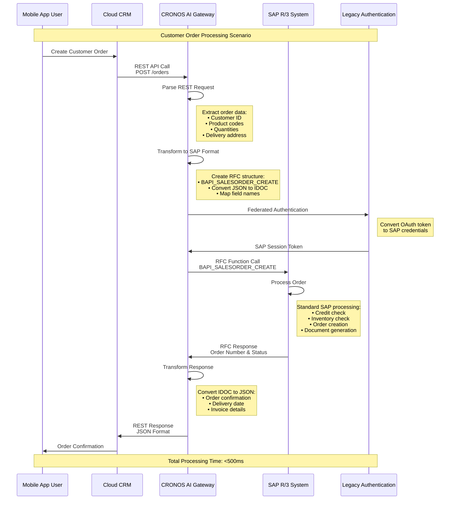
```mermaid
sequenceDiagram
    participant User as Mobile App User
    participant Cloud as Cloud CRM
    participant CRONOS as CRONOS AI Gateway
    participant SAP as SAP R/3 System
    participant Auth as Legacy Authentication
    
    Note over User,Auth: Customer Order Processing Scenario
    
    User->>Cloud: Create Customer Order
    Cloud->>CRONOS: REST API Call<br/>POST /orders
    
    CRONOS->>CRONOS: Parse REST Request
    Note right of CRONOS: Extract order data:<br/>• Customer ID<br/>• Product codes<br/>• Quantities<br/>• Delivery address
    
    CRONOS->>CRONOS: Transform to SAP Format
    Note right of CRONOS: Create RFC structure:<br/>• BAPI_SALESORDER_CREATE<br/>• Convert JSON to IDOC<br/>• Map field names
    
    CRONOS->>Auth: Federated Authentication
    Note right of Auth: Convert OAuth token<br/>to SAP credentials
    Auth->>CRONOS: SAP Session Token
    
    CRONOS->>SAP: RFC Function Call<br/>BAPI_SALESORDER_CREATE
    
    SAP->>SAP: Process Order
    Note right of SAP: Standard SAP processing:<br/>• Credit check<br/>• Inventory check<br/>• Order creation<br/>• Document generation
    
    SAP->>CRONOS: RFC Response<br/>Order Number & Status
    
    CRONOS->>CRONOS: Transform Response
    Note right of CRONOS: Convert IDOC to JSON:<br/>• Order confirmation<br/>• Delivery date<br/>• Invoice details
    
    CRONOS->>Cloud: REST Response<br/>JSON Format
    Cloud->>User: Order Confirmation
    
    Note over User,Auth: Total Processing Time: <500ms
```

#### Enterprise Implementation Benefits

**Digital Transformation Acceleration**:
- **Cloud Adoption**: Enable cloud services without replacing core systems
- **API Economy**: Expose legacy functionality through modern APIs
- **Data Liberation**: Make legacy data available for analytics and AI
- **Mobile Enablement**: Connect legacy systems to mobile applications

**Cost and Risk Reduction**:
- **Avoid Replacement Costs**: Save ₹200-500 crores per major ERP replacement
- **Reduce Integration Complexity**: Eliminate custom integration development
- **Minimize Operational Risk**: Maintain existing system stability
- **Accelerate Time-to-Market**: Deliver new capabilities in months, not years

---

### Scenario 6: Telecommunications and IoT Networks

#### Current State Assessment

The telecommunications industry is undergoing massive transformation with 5G deployment, edge computing, and the explosion of IoT devices. By 2030, industry analysts predict over 50 billion connected devices globally, creating an unprecedented security challenge.

The fundamental problem is that IoT devices are designed for low cost, long battery life, and simple functionality - not security. Most IoT devices have limited computational resources and cannot run traditional security software. Meanwhile, telecommunications networks must provide reliable, low-latency connectivity while protecting against increasingly sophisticated cyber attacks.

**5G Network Architecture with IoT Integration**

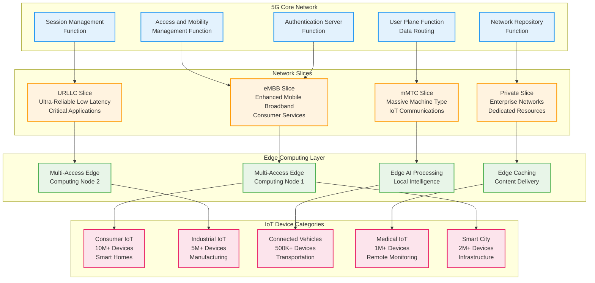
```mermaid
flowchart TB
    subgraph "5G Core Network"
        direction TB
        amf["Access and Mobility<br/>Management Function"]
        smf["Session Management<br/>Function"]
        upf["User Plane Function<br/>Data Routing"]
        nrf["Network Repository<br/>Function"]
        ausf["Authentication Server<br/>Function"]
    end
    
    subgraph "Network Slices"
        embb["eMBB Slice<br/>Enhanced Mobile Broadband<br/>Consumer Services"]
        urllc["URLLC Slice<br/>Ultra-Reliable Low Latency<br/>Critical Applications"]
        mmtc["mMTC Slice<br/>Massive Machine Type<br/>IoT Communications"]
        private["Private Slice<br/>Enterprise Networks<br/>Dedicated Resources"]
    end
    
    subgraph "Edge Computing Layer"
        mec1["Multi-Access Edge<br/>Computing Node 1"]
        mec2["Multi-Access Edge<br/>Computing Node 2"]
        edge_ai["Edge AI Processing<br/>Local Intelligence"]
        edge_cache["Edge Caching<br/>Content Delivery"]
    end
    
    subgraph "IoT Device Categories"
        consumer["Consumer IoT<br/>10M+ Devices<br/>Smart Homes"]
        industrial["Industrial IoT<br/>5M+ Devices<br/>Manufacturing"]
        automotive["Connected Vehicles<br/>500K+ Devices<br/>Transportation"]
        healthcare["Medical IoT<br/>1M+ Devices<br/>Remote Monitoring"]
        smart_city["Smart City<br/>2M+ Devices<br/>Infrastructure"]
    end
    
    amf --> embb
    smf --> urllc
    upf --> mmtc
    nrf --> private
    ausf --> embb
    
    embb --> mec1
    urllc --> mec2
    mmtc --> edge_ai
    private --> edge_cache
    
    mec1 --> consumer
    mec2 --> industrial
    edge_ai --> automotive
    edge_cache --> healthcare
    mec1 --> smart_city
    
    classDef core fill:#e3f2fd,stroke:#2196f3,stroke-width:2px
    classDef slice fill:#fff3e0,stroke:#ff9800,stroke-width:2px
    classDef edge fill:#e8f5e8,stroke:#4caf50,stroke-width:2px
    classDef iot fill:#fce4ec,stroke:#e91e63,stroke-width:2px
    
    class amf,smf,upf,nrf,ausf core
    class embb,urllc,mmtc,private slice
    class mec1,mec2,edge_ai,edge_cache edge
    class consumer,industrial,automotive,healthcare,smart_city iot
```

#### IoT Security Challenges at Scale

**Device Diversity and Constraints**:
- **Resource Limitations**: Many IoT devices have only 10-50 KB of available memory
- **Battery Life**: Security overhead cannot significantly reduce device operating time
- **Processing Power**: Limited CPU capacity for cryptographic operations
- **Protocol Variety**: Over 100 different IoT communication protocols in use

**Network Scale Challenges**:
- **Connection Volume**: Cellular networks must handle millions of concurrent IoT sessions
- **Geographic Distribution**: IoT devices deployed across vast geographic areas
- **Network Performance**: 5G promises <1ms latency that security cannot compromise
- **Traffic Patterns**: IoT generates unpredictable, bursty traffic loads

**Security and Compliance Issues**:
- **Weak Authentication**: Many IoT devices use default or weak passwords
- **Encryption Gaps**: Significant percentage of IoT traffic transmitted unencrypted
- **Update Challenges**: Many IoT devices never receive security updates
- **Regulatory Compliance**: Emerging IoT security regulations vary by country and industry

#### CRONOS AI's Telecommunications Solution

**Adaptive Security Architecture for IoT Devices**

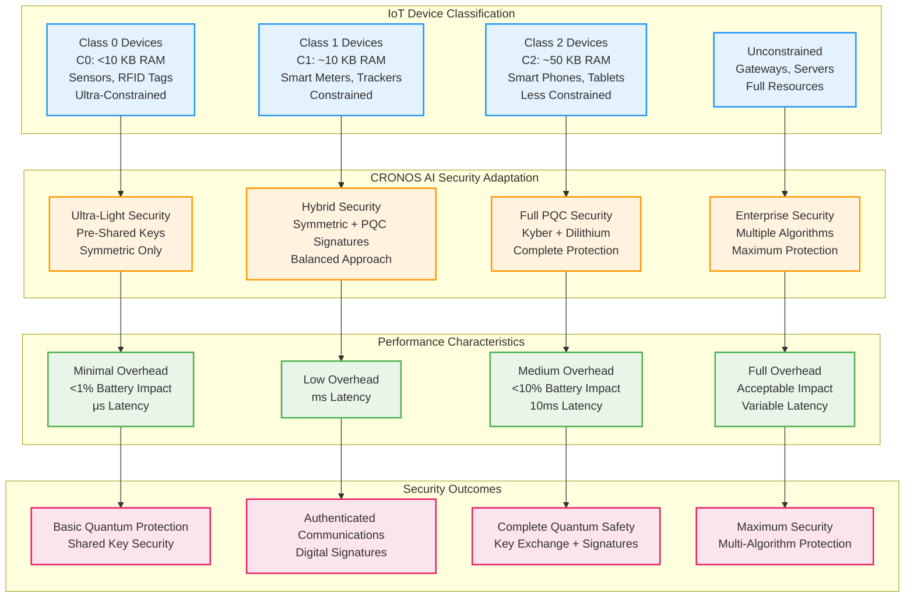
```mermaid
flowchart TB
    subgraph "IoT Device Classification"
        class0["Class 0 Devices<br/>C0: <10 KB RAM<br/>Sensors, RFID Tags<br/>Ultra-Constrained"]
        class1["Class 1 Devices<br/>C1: ~10 KB RAM<br/>Smart Meters, Trackers<br/>Constrained"]
        class2["Class 2 Devices<br/>C2: ~50 KB RAM<br/>Smart Phones, Tablets<br/>Less Constrained"]
        unconstrained["Unconstrained<br/>Gateways, Servers<br/>Full Resources"]
    end
    
    subgraph "CRONOS AI Security Adaptation"
        ultra_light["Ultra-Light Security<br/>Pre-Shared Keys<br/>Symmetric Only"]
        hybrid_security["Hybrid Security<br/>Symmetric + PQC Signatures<br/>Balanced Approach"]
        full_pqc["Full PQC Security<br/>Kyber + Dilithium<br/>Complete Protection"]
        enterprise_grade["Enterprise Security<br/>Multiple Algorithms<br/>Maximum Protection"]
    end
    
    subgraph "Performance Characteristics"
        minimal_overhead["Minimal Overhead<br/><1% Battery Impact<br/>μs Latency"]
        low_overhead["Low Overhead<br//<5% Battery Impact<br/>ms Latency"]
        medium_overhead["Medium Overhead<br/><10% Battery Impact<br/>10ms Latency"]
        full_overhead["Full Overhead<br/>Acceptable Impact<br/>Variable Latency"]
    end
    
    subgraph "Security Outcomes"
        basic_protection["Basic Quantum Protection<br/>Shared Key Security"]
        authenticated_data["Authenticated Communications<br/>Digital Signatures"]
        full_protection["Complete Quantum Safety<br/>Key Exchange + Signatures"]
        maximum_security["Maximum Security<br/>Multi-Algorithm Protection"]
    end
    
    class0 --> ultra_light
    class1 --> hybrid_security
    class2 --> full_pqc
    unconstrained --> enterprise_grade
    
    ultra_light --> minimal_overhead
    hybrid_security --> low_overhead
    full_pqc --> medium_overhead
    enterprise_grade --> full_overhead
    
    minimal_overhead --> basic_protection
    low_overhead --> authenticated_data
    medium_overhead --> full_protection
    full_overhead --> maximum_security
    
    classDef device fill:#e3f2fd,stroke:#2196f3,stroke-width:2px
    classDef security fill:#fff3e0,stroke:#ff9800,stroke-width:2px
    classDef performance fill:#e8f5e8,stroke:#4caf50,stroke-width:2px
    classDef outcome fill:#fce4ec,stroke:#e91e63,stroke-width:2px
    
    class class0,class1,class2,unconstrained device
    class ultra_light,hybrid_security,full_pqc,enterprise_grade security
    class minimal_overhead,low_overhead,medium_overhead,full_overhead performance
    class basic_protection,authenticated_data,full_protection,maximum_security outcome
```

**Edge Computing Integration for IoT Security**

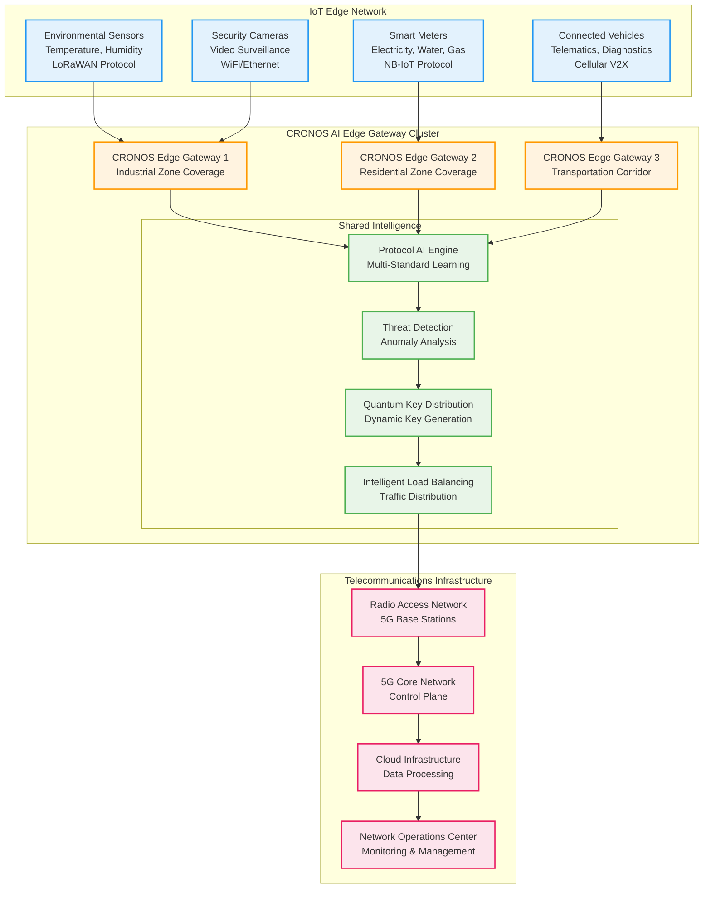
```mermaid
flowchart TB
    subgraph "IoT Edge Network"
        sensors["Environmental Sensors<br/>Temperature, Humidity<br/>LoRaWAN Protocol"]
        meters["Smart Meters<br/>Electricity, Water, Gas<br/>NB-IoT Protocol"]
        vehicles["Connected Vehicles<br/>Telematics, Diagnostics<br/>Cellular V2X"]
        cameras["Security Cameras<br/>Video Surveillance<br/>WiFi/Ethernet"]
    end
    
    subgraph "CRONOS AI Edge Gateway Cluster"
        gateway1["CRONOS Edge Gateway 1<br/>Industrial Zone Coverage"]
        gateway2["CRONOS Edge Gateway 2<br/>Residential Zone Coverage"]
        gateway3["CRONOS Edge Gateway 3<br/>Transportation Corridor"]
        
        subgraph "Shared Intelligence"
            protocol_ai["Protocol AI Engine<br/>Multi-Standard Learning"]
            threat_detection["Threat Detection<br/>Anomaly Analysis"]
            key_management["Quantum Key Distribution<br/>Dynamic Key Generation"]
            load_balancer["Intelligent Load Balancing<br/>Traffic Distribution"]
        end
    end
    
    subgraph "Telecommunications Infrastructure"
        ran["Radio Access Network<br/>5G Base Stations"]
        core["5G Core Network<br/>Control Plane"]
        cloud["Cloud Infrastructure<br/>Data Processing"]
        noc["Network Operations Center<br/>Monitoring & Management"]
    end
    
    sensors --> gateway1
    meters --> gateway2
    vehicles --> gateway3
    cameras --> gateway1
    
    gateway1 --> protocol_ai
    gateway2 --> protocol_ai
    gateway3 --> protocol_ai
    
    protocol_ai --> threat_detection
    threat_detection --> key_management
    key_management --> load_balancer
    
    load_balancer --> ran
    ran --> core
    core --> cloud
    cloud --> noc
    
    classDef iot fill:#e3f2fd,stroke:#2196f3,stroke-width:2px
    classDef cronos fill:#fff3e0,stroke:#ff9800,stroke-width:2px
    classDef ai fill:#e8f5e8,stroke:#4caf50,stroke-width:2px
    classDef telecom fill:#fce4ec,stroke:#e91e63,stroke-width:2px
    
    class sensors,meters,vehicles,cameras iot
    class gateway1,gateway2,gateway3 cronos
    class protocol_ai,threat_detection,key_management,load_balancer ai
    class ran,core,cloud,noc telecom
```

#### Telecommunications Implementation Benefits

**Network Performance Optimization**:
- **Ultra-Low Latency**: <1ms additional latency for quantum-safe protection
- **Massive Scale**: Support for millions of concurrent IoT device connections
- **Bandwidth Efficiency**: Optimized protocols reduce network overhead
- **Edge Processing**: Local threat detection reduces core network load

**Operational Advantages**:
- **Automated Deployment**: Self-configuring security for new IoT devices
- **Centralized Management**: Single console for managing millions of devices
- **Predictive Maintenance**: AI predicts and prevents security failures
- **Regulatory Compliance**: Automated compliance reporting for multiple jurisdictions

---

## Implementation Methodology and Best Practices

### Phase-by-Phase Deployment Approach

Based on our experience with enterprise deployments across various industries, we've developed a systematic approach that minimises risk whilst maximising the speed of quantum-safe protection implementation.

**Phase 1: Assessment and Discovery (Weeks 1-4)**

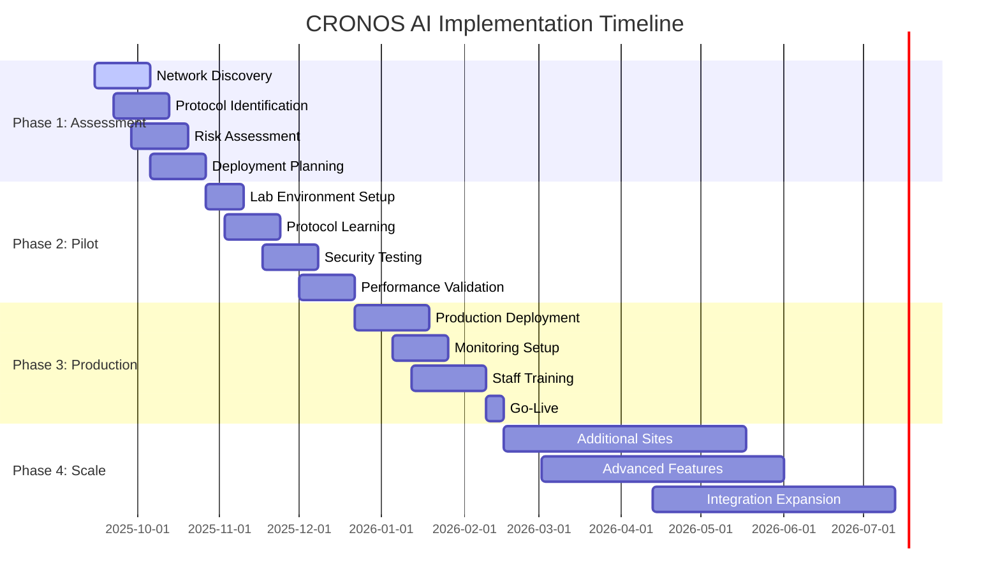
```mermaid
gantt
    title CRONOS AI Implementation Timeline
    dateFormat YYYY-MM-DD
    section Phase 1: Assessment
    Network Discovery           :active, discovery, 2025-09-15, 2025-10-06
    Protocol Identification    :proto, 2025-09-22, 2025-10-13
    Risk Assessment            :risk, 2025-09-29, 2025-10-20
    Deployment Planning        :planning, 2025-10-06, 2025-10-27
    
    section Phase 2: Pilot
    Lab Environment Setup      :lab, 2025-10-27, 2025-11-10
    Protocol Learning          :learning, 2025-11-03, 2025-11-24
    Security Testing           :testing, 2025-11-17, 2025-12-08
    Performance Validation     :perf, 2025-12-01, 2025-12-22
    
    section Phase 3: Production
    Production Deployment      :prod, 2025-12-22, 2026-01-19
    Monitoring Setup          :monitor, 2026-01-05, 2026-01-26
    Staff Training            :training, 2026-01-12, 2026-02-09
    Go-Live                   :golive, 2026-02-09, 2026-02-16
    
    section Phase 4: Scale
    Additional Sites          :scale, 2026-02-16, 2026-05-18
    Advanced Features         :advanced, 2026-03-02, 2026-06-01
    Integration Expansion     :integration, 2026-04-13, 2026-07-13
```

### Success Metrics and KPIs

**Technical Performance Indicators**:
- **Protocol Learning Accuracy**: >95% for standard protocols, >90% for proprietary
- **Latency Impact**: <1ms additional latency for all communications
- **Throughput Maintenance**: >99% of original network performance
- **Availability**: 99.99% uptime with automatic failover

**Security Effectiveness Metrics**:
- **Quantum-Safe Coverage**: 100% of identified critical communications
- **Threat Detection Accuracy**: >98% with <0.1% false positive rate
- **Incident Response Time**: <5 minutes for automated responses
- **Compliance Achievement**: 100% compliance with relevant regulations

**Business Impact Measurements**:
- **Cost Avoidance**: Quantified savings from avoided system replacements
- **Risk Reduction**: Measured decrease in cyber risk exposure
- **Operational Efficiency**: Improvement in IT operational metrics
- **Compliance Achievement**: Successful audit results and regulatory approval

---

## Return on Investment Analysis

### Cost-Benefit Framework

The financial justification for CRONOS AI implementation becomes clear when we examine the true cost of alternatives and the risk of inaction.

**Traditional Replacement Costs vs CRONOS Implementation**:

| Industry | System Replacement Cost | CRONOS Implementation | Savings |
|----------|------------------------|----------------------|---------|
| Banking | ₹400-800 crores | ₹4-8 crores | ₹396-792 crores |
| Power Grid | ₹200-500 crores | ₹2-5 crores | ₹198-495 crores |
| Healthcare | ₹50-200 crores | ₹1-3 crores | ₹49-197 crores |
| Manufacturing | ₹100-300 crores | ₹2-4 crores | ₹98-296 crores |

**Risk Mitigation Value**:
- **Quantum Attack Prevention**: Avoid complete system compromise
- **Compliance Penalties**: Prevent regulatory fines (₹50 crores+ in financial services)
- **Business Continuity**: Maintain operations during quantum transition
- **Competitive Advantage**: Early quantum-safe adoption provides market leadership

### Five-Year Total Cost of Ownership

```mermaid
pie title CRONOS AI 5-Year TCO Breakdown
    "Initial Hardware/Software" : 40
    "Implementation Services" : 25
    "Annual Support & Maintenance" : 20
    "Staff Training & Certification" : 10
    "Ongoing Threat Intelligence" : 5
```

**Investment Recovery Timeline**:
- **Year 1**: Initial cost recovery through avoided emergency security measures
- **Year 2-3**: Positive ROI from operational efficiency improvements
- **Year 4-5**: Significant cost avoidance from delayed system replacement
- **Beyond Year 5**: Continued savings and quantum-safe competitive advantage

---

## Conclusion and Next Steps

CRONOS AI represents more than just another cybersecurity product - it's a strategic technology investment that enables organisations to bridge the gap between legacy infrastructure and the quantum computing era. Our detailed analysis across six critical industry sectors demonstrates that quantum-safe protection is not just technically feasible but economically compelling.

The quantum computing timeline is accelerating, with cryptographically relevant quantum computers expected within this decade. Organisations that begin their quantum-safe transition now will have a significant advantage over those who wait until quantum computers make current encryption obsolete.

### Recommended Immediate Actions:

1. **Conduct Quantum Risk Assessment**: Identify critical systems using vulnerable encryption
2. **Evaluate Legacy Dependencies**: Document systems that cannot be easily replaced
3. **Assess Regulatory Timeline**: Understand compliance requirements for your industry
4. **Plan Proof-of-Concept**: Design a pilot implementation for critical systems
5. **Engage Stakeholders**: Ensure executive and technical leadership understand quantum threats

The technology exists today to protect your critical infrastructure against tomorrow's quantum threats. The question isn't whether to implement quantum-safe security - it's how quickly you can get started.

---
