# CRONOS AI - Technical Use Cases & Implementation Guide

## Executive Summary

CRONOS AI is a quantum-safe encryption appliance that uses AI-powered protocol discovery to protect legacy infrastructure without requiring any system modifications. It acts as an intelligent bridge, learning undocumented protocols and applying post-quantum cryptography (PQC) to secure communications against future quantum computing threats.

## Core Technology Overview

### Protocol Discovery Engine
- **AI-Powered Learning**: Deep neural networks analyze packet flows to reverse-engineer unknown protocols
- **Pattern Recognition**: Identifies message structures, field boundaries, and communication patterns
- **Zero Documentation Required**: Works with black-box systems and undocumented protocols
- **Learning Time**: 24-48 hours for basic protocols, up to 2 weeks for complex proprietary systems

### Quantum-Safe Encryption Module
- **NIST-Approved Algorithms**: Kyber-1024, Dilithium-5, SPHINCS+, Falcon-1024
- **Crypto-Agility**: Hot-swappable algorithms via firmware updates
- **Hardware Acceleration**: FPGA-optimized implementation for line-rate performance
- **Key Management**: HSM integration with automatic key rotation

### Performance Specifications
- **Throughput**: 10-100 Gbps depending on configuration
- **Latency**: <1ms additional overhead
- **Concurrent Sessions**: 10K-1M depending on hardware tier
- **Availability**: 99.99% with HA configuration

---

## Use Case 1: Banking & Financial Systems

### Problem Statement
Core banking systems running on IBM Z-series mainframes with COBOL/CICS applications process millions of transactions daily. These systems use legacy encryption (RSA-2048, 3DES) that quantum computers will break. Replacement costs exceed $50M and take 3-5 years.

**Zero-Disruption Quantum Protection**

**Phase 1: Passive Learning (48 Hours)**
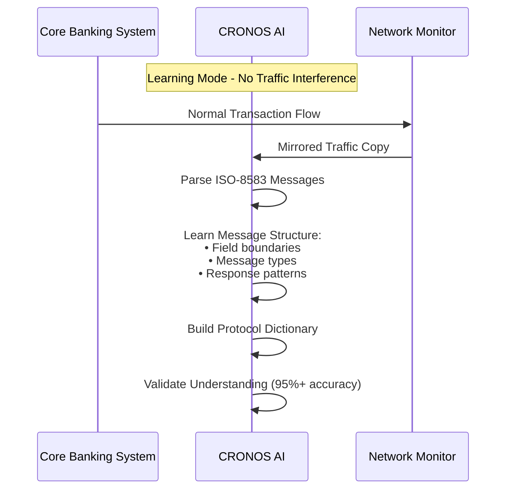
```mermaid
sequenceDiagram
    participant Bank as Core Banking System
    participant CRONOS as CRONOS AI
    participant Monitor as Network Monitor
    
    Note over CRONOS: Learning Mode - No Traffic Interference
    Bank->>Monitor: Normal Transaction Flow
    Monitor->>CRONOS: Mirrored Traffic Copy
    CRONOS->>CRONOS: Parse ISO-8583 Messages
    CRONOS->>CRONOS: Learn Message Structure:<br/>• Field boundaries<br/>• Message types<br/>• Response patterns
    CRONOS->>CRONOS: Build Protocol Dictionary
    CRONOS->>CRONOS: Validate Understanding (95%+ accuracy)
```

**Phase 2: Transparent Protection (Production)**
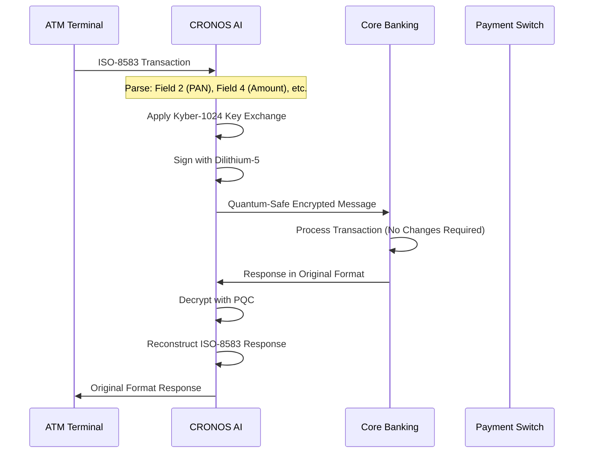
```mermaid
sequenceDiagram
    participant ATM as ATM Terminal
    participant CRONOS as CRONOS AI
    participant Bank as Core Banking
    participant Switch as Payment Switch
    
    ATM->>CRONOS: ISO-8583 Transaction
    Note over CRONOS: Parse: Field 2 (PAN), Field 4 (Amount), etc.
    CRONOS->>CRONOS: Apply Kyber-1024 Key Exchange
    CRONOS->>CRONOS: Sign with Dilithium-5
    CRONOS->>Bank: Quantum-Safe Encrypted Message
    
    Bank->>Bank: Process Transaction (No Changes Required)
    Bank->>CRONOS: Response in Original Format
    CRONOS->>CRONOS: Decrypt with PQC
    CRONOS->>CRONOS: Reconstruct ISO-8583 Response
    CRONOS->>ATM: Original Format Response
```

**Specific Problem Solutions**

**1. COBOL/Mainframe Protection**
- **Problem**: Cannot modify 40-year-old COBOL code
- **Solution**: Intercepts CICS transactions at network level, zero code changes
- **Result**: Mainframe continues normal operation with quantum-safe tunnels

**2. Regulatory Compliance**
- **Problem**: PCI-DSS 4.0 requires PQC by 2024
- **Solution**: Automatic compliance reporting with quantum algorithm certificates
- **Result**: Pass audits without system replacement

**3. Performance Requirements**
- **Problem**: Sub-millisecond transaction processing required
- **Solution**: Hardware-accelerated PQC with <1ms latency overhead
- **Result**: No impact on SLA requirements

**4. Multi-Protocol Support**
- **Problem**: Banks use 20+ different protocols (SWIFT, FIX, ISO-20022)
- **Solution**: AI learns all protocols simultaneously
- **Result**: Unified quantum protection across entire banking ecosystem

**Financial Benefits for Banking**
- **Cost Avoidance**: $50-100M mainframe replacement avoided
- **Revenue Protection**: $5M/hour downtime risk eliminated
- **Compliance**: Avoid $50M+ regulatory fines
- **Competitive Advantage**: First-to-market with quantum-safe banking

---

## Use Case 2: SCADA / Critical Infrastructure

### Why Critical Infrastructure Needs CRONOS AI

**National Security Imperative**
- **Grid Vulnerability**: 3,000+ power plants using 30-year-old SCADA systems
- **Water Safety**: 150,000 water treatment facilities with zero cybersecurity
- **Transportation**: Air traffic control, rail systems running Windows 98/XP
- **Economic Impact**: Cyberattack on infrastructure costs $50B+ (Colonial Pipeline: $5B)

**Infrastructure-Specific Threats**
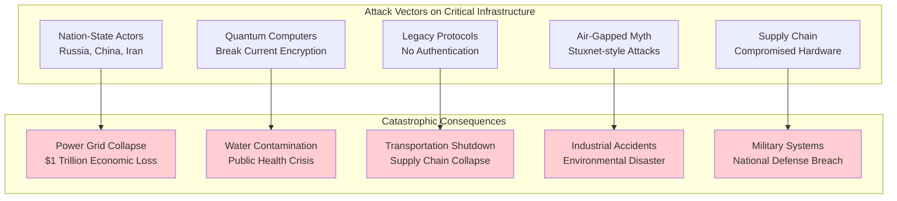
```mermaid
graph TB
    subgraph "Attack Vectors on Critical Infrastructure"
        A[Nation-State Actors<br/>Russia, China, Iran]
        B[Quantum Computers<br/>Break Current Encryption]
        C[Legacy Protocols<br/>No Authentication]
        D[Air-Gapped Myth<br/>Stuxnet-style Attacks]
        E[Supply Chain<br/>Compromised Hardware]
    end
    
    subgraph "Catastrophic Consequences"
        F[Power Grid Collapse<br/>$1 Trillion Economic Loss]
        G[Water Contamination<br/>Public Health Crisis]
        H[Transportation Shutdown<br/>Supply Chain Collapse]
        I[Industrial Accidents<br/>Environmental Disaster]
        J[Military Systems<br/>National Defense Breach]
    end
    
    A --> F
    B --> G
    C --> H
    D --> I
    E --> J
    
    style F fill:#ffcdd2
    style G fill:#ffcdd2
    style H fill:#ffcdd2
    style I fill:#ffcdd2
    style J fill:#ffcdd2
```

**Critical Infrastructure Pain Points**
1. **Unmaintainable Systems**: Original vendors out of business, no support contracts
2. **Regulatory Compliance**: NERC CIP, ICS-CERT mandates impossible to meet
3. **Operational Criticality**: Cannot shut down for upgrades (99.99% uptime required)
4. **Skills Gap**: OT engineers don't understand cybersecurity, IT teams don't understand industrial systems
5. **Procurement Constraints**: Government approval processes take 5+ years

**Why Traditional Solutions Fail**
- **Network Segmentation**: Attackers already inside networks (Triton, Stuxnet)
- **Antivirus/EDR**: Doesn't work on industrial protocols
- **Firewall Rules**: Block legitimate operations, create availability issues
- **System Replacement**: $100M+ per facility, 10+ year timeline

### How CRONOS AI Solves Infrastructure Problems

**Industrial Protocol Mastery**
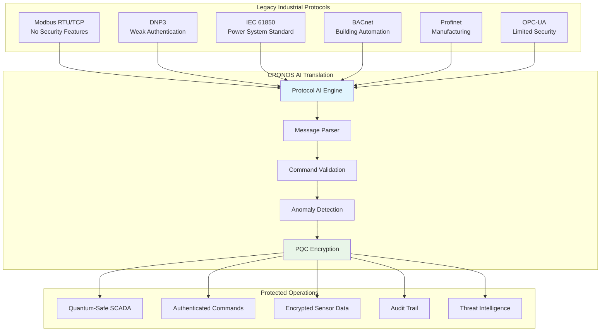
```mermaid
graph TB
    subgraph "Legacy Industrial Protocols"
        A[Modbus RTU/TCP<br/>No Security Features]
        B[DNP3<br/>Weak Authentication]
        C[IEC 61850<br/>Power System Standard]
        D[BACnet<br/>Building Automation]
        E[Profinet<br/>Manufacturing]
        F[OPC-UA<br/>Limited Security]
    end
    
    subgraph "CRONOS AI Translation"
        G[Protocol AI Engine]
        H[Message Parser]
        I[Command Validation]
        J[Anomaly Detection]
        K[PQC Encryption]
    end
    
    subgraph "Protected Operations"
        L[Quantum-Safe SCADA]
        M[Authenticated Commands]
        N[Encrypted Sensor Data]
        O[Audit Trail]
        P[Threat Intelligence]
    end
    
    A --> G
    B --> G
    C --> G
    D --> G
    E --> G
    F --> G
    
    G --> H
    H --> I
    I --> J
    J --> K
    
    K --> L
    K --> M
    K --> N
    K --> O
    K --> P
    
    style G fill:#e1f5fe
    style K fill:#e8f5e8
```

**AI-Powered Threat Detection**
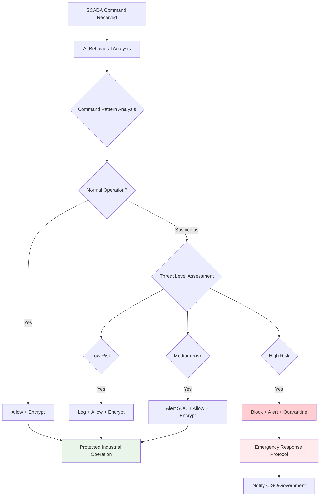
```mermaid
flowchart TD
    A[SCADA Command Received] --> B[AI Behavioral Analysis]
    B --> C{Command Pattern Analysis}
    
    C --> D{Normal Operation?}
    D -->|Yes| E[Allow + Encrypt]
    
    D -->|Suspicious| F{Threat Level Assessment}
    F --> G{Low Risk}
    G -->|Yes| H[Log + Allow + Encrypt]
    
    F --> I{Medium Risk}
    I -->|Yes| J[Alert SOC + Allow + Encrypt]
    
    F --> K{High Risk}
    K -->|Yes| L[Block + Alert + Quarantine]
    
    L --> M[Emergency Response Protocol]
    M --> N[Notify CISO/Government]
    
    E --> O[Protected Industrial Operation]
    H --> O
    J --> O
    
    style L fill:#ffcdd2
    style M fill:#ffebee
    style O fill:#e8f5e8
```

**Specific Problem Solutions**

**1. Legacy SCADA Security**
- **Problem**: Modbus has no authentication, commands sent in plaintext
- **Solution**: CRONOS wraps every Modbus command in quantum-safe encryption
- **Result**: 30-year-old PLCs get military-grade security without firmware changes

**2. Air-Gap Protection**
- **Problem**: "Air-gapped" networks still have maintenance connections, USB ports
- **Solution**: AI detects unusual commands that indicate lateral movement
- **Result**: Stuxnet-style attacks detected and blocked in real-time

**3. Operational Continuity**
- **Problem**: Cannot shut down power plant for security upgrades
- **Solution**: Hot-pluggable deployment, maintains 99.99% uptime during installation
- **Result**: Zero operational disruption during quantum security implementation

**4. Multi-Site Coordination**
- **Problem**: Power grid requires coordination between 1000+ generation/distribution sites
- **Solution**: Quantum-safe mesh networking between all CRONOS appliances
- **Result**: Grid-wide security without central point of failure

**Infrastructure Benefits**
- **National Security**: Protected against nation-state quantum attacks
- **Regulatory Compliance**: Meet NERC CIP requirements without system replacement
- **Economic Protection**: Avoid $1T economic loss from grid collapse
- **Public Safety**: Prevent water contamination, transportation accidents

---

## Use Case 3: Healthcare Systems

### Why Healthcare Needs CRONOS AI

**Healthcare Cybersecurity Crisis**
- **Attack Frequency**: Healthcare breaches up 300% since 2020
- **Data Value**: Medical records worth $250 each (vs $5 for credit cards)
- **Life Safety Risk**: Ransomware attacks shut down hospitals, delay surgeries
- **Regulatory Penalties**: HIPAA fines average $10M per breach

**Medical Device Vulnerabilities**

```mermaid
graph TB
    subgraph "Vulnerable Medical Infrastructure"
        A[MRI Scanners<br/>Windows XP Embedded]
        B[CT Scanners<br/>Proprietary OS]
        C[Infusion Pumps<br/>Unencrypted WiFi]
        D[Patient Monitors<br/>Hardcoded Passwords]
        E[Ventilators<br/>No Security Updates]
        F[Pacemakers<br/>Wireless Programmable]
    end
    
    subgraph "Healthcare Network Risks"
        G[EMR Systems<br/>Unpatched Vulnerabilities]
        H[PACS Servers<br/>Medical Imaging]
        I[Laboratory Systems<br/>Test Results]
        J[Pharmacy Robots<br/>Drug Dispensing]
        K[Building Systems<br/>HVAC, Access Control]
    end
    
    subgraph "Patient Safety Impact"
        L[Surgery Delays<br/>Life-Threatening]
        M[Incorrect Dosing<br/>Medication Errors]
        N[Data Breaches<br/>Identity Theft]
        O[System Shutdowns<br/>Emergency Diversion]
        P[Device Malfunction<br/>Direct Patient Harm]
    end
    
    A --> L
    B --> M
    C --> N
    D --> O
    E --> P
    F --> P
    G --> M
    H --> N
    I --> N
    J --> M
    K --> O
    
    style L fill:#ffcdd2
    style M fill:#ffcdd2
    style N fill:#ffcdd2
    style O fill:#ffcdd2
    style P fill:#ffcdd2
```

**Healthcare-Specific Challenges**
1. **FDA Regulations**: Cannot modify medical device software without re-approval ($10M, 2-3 years)
2. **Legacy Systems**: 60% of medical devices run Windows XP or older
3. **Life Safety**: Security measures cannot interfere with patient care
4. **HIPAA Compliance**: $50K-$1.5M fines per PHI record exposed
5. **Vendor Lock-in**: Medical device manufacturers control all updates

**Why Traditional Solutions Fail**
- **Endpoint Security**: Cannot install agents on FDA-approved devices
- **Network Segmentation**: Breaks clinical workflows, impacts patient care
- **Device Replacement**: $5-10M per imaging system, insurance won't cover
- **Patch Management**: Vendors void warranties if devices are modified

### How CRONOS AI Solves Healthcare Problems

**FDA-Compliant Device Protection**
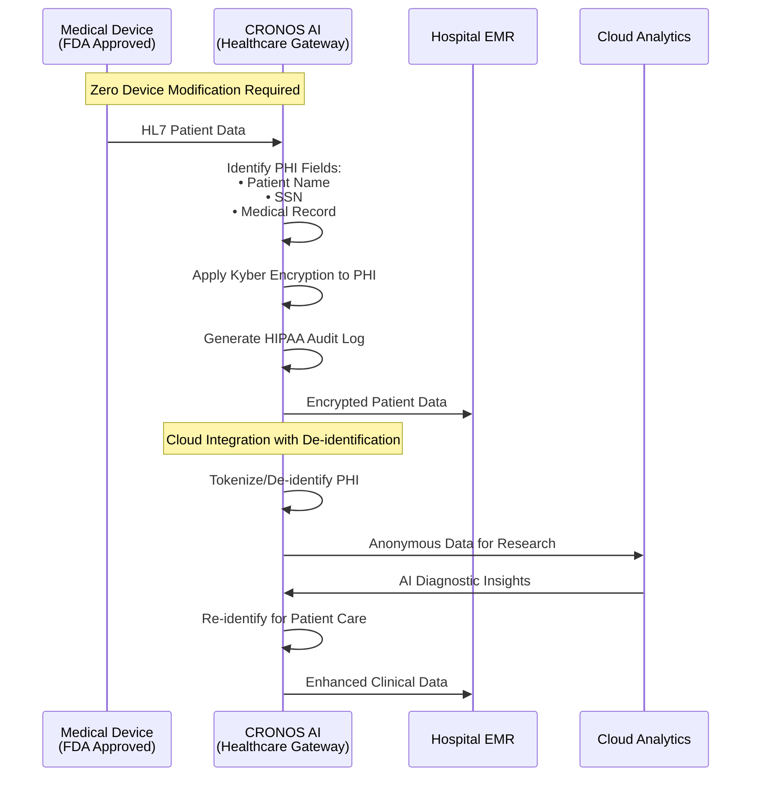
```mermaid
sequenceDiagram
    participant Device as Medical Device<br/>(FDA Approved)
    participant CRONOS as CRONOS AI<br/>(Healthcare Gateway)
    participant EMR as Hospital EMR
    participant Cloud as Cloud Analytics
    
    Note over Device,CRONOS: Zero Device Modification Required
    Device->>CRONOS: HL7 Patient Data
    CRONOS->>CRONOS: Identify PHI Fields:<br/>• Patient Name<br/>• SSN<br/>• Medical Record #<br/>• Test Results
    
    CRONOS->>CRONOS: Apply Kyber Encryption to PHI
    CRONOS->>CRONOS: Generate HIPAA Audit Log
    CRONOS->>EMR: Encrypted Patient Data
    
    Note over CRONOS: Cloud Integration with De-identification
    CRONOS->>CRONOS: Tokenize/De-identify PHI
    CRONOS->>Cloud: Anonymous Data for Research
    Cloud->>CRONOS: AI Diagnostic Insights
    CRONOS->>CRONOS: Re-identify for Patient Care
    CRONOS->>EMR: Enhanced Clinical Data
```

**Medical Protocol Intelligence**
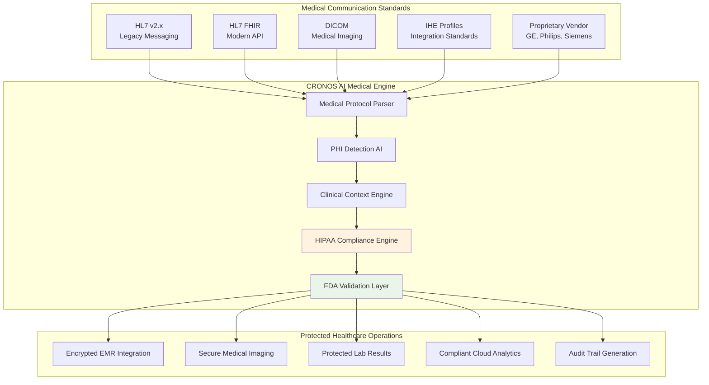
```mermaid
graph TB
    subgraph "Medical Communication Standards"
        A[HL7 v2.x<br/>Legacy Messaging]
        B[HL7 FHIR<br/>Modern API]
        C[DICOM<br/>Medical Imaging]
        D[IHE Profiles<br/>Integration Standards]
        E[Proprietary Vendor<br/>GE, Philips, Siemens]
    end
    
    subgraph "CRONOS AI Medical Engine"
        F[Medical Protocol Parser]
        G[PHI Detection AI]
        H[Clinical Context Engine]
        I[HIPAA Compliance Engine]
        J[FDA Validation Layer]
    end
    
    subgraph "Protected Healthcare Operations"
        K[Encrypted EMR Integration]
        L[Secure Medical Imaging]
        M[Protected Lab Results]
        N[Compliant Cloud Analytics]
        O[Audit Trail Generation]
    end
    
    A --> F
    B --> F
    C --> F
    D --> F
    E --> F
    
    F --> G
    G --> H
    H --> I
    I --> J
    
    J --> K
    J --> L
    J --> M
    J --> N
    J --> O
    
    style I fill:#fff3e0
    style J fill:#e8f5e8
```

**Specific Problem Solutions**

**1. FDA Device Protection**
- **Problem**: Cannot modify FDA-approved medical device software
- **Solution**: Network-level protection, zero device modifications required
- **Result**: Maintain FDA compliance while achieving quantum-safe security

**2. PHI Encryption**
- **Problem**: Patient data transmitted in plaintext between devices
- **Solution**: AI automatically identifies and encrypts all PHI fields
- **Result**: HIPAA compliance without breaking clinical workflows

**3. Legacy Device Integration**
- **Problem**: $10M MRI scanner running Windows XP cannot be upgraded
- **Solution**: CRONOS learns proprietary medical protocols, adds security layer
- **Result**: 20-year-old medical equipment gets modern security

**4. Clinical Workflow Preservation**
- **Problem**: Security solutions often break doctor-nurse communication
- **Solution**: Transparent operation maintains all existing workflows
- **Result**: Enhanced security with zero impact on patient care

**Healthcare Benefits**
- **Patient Safety**: Prevent ransomware attacks that delay surgeries
- **Compliance**: HIPAA compliance without device replacement
- **Cost Savings**: Avoid $10M medical device replacement costs
- **Research**: Enable secure cloud analytics for medical research

---

## Use Case 4: Government & Defense Systems

### Why Government/Defense Needs CRONOS AI

**National Security Quantum Threat**
- **Timeline**: China investing $15B in quantum computing for military advantage
- **Classification**: Many defense systems use undocumented/classified protocols
- **Legacy Dependency**: Military systems designed for 30-50 year lifespan
- **Replacement Cost**: $500B+ to replace all vulnerable defense systems

**Defense System Vulnerabilities**
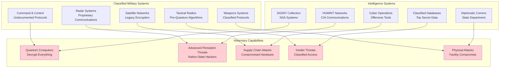
```mermaid
graph TB
    subgraph "Classified Military Systems"
        A[Command & Control<br/>Undocumented Protocols]
        B[Radar Systems<br/>Proprietary Communications]
        C[Satellite Networks<br/>Legacy Encryption]
        D[Tactical Radios<br/>Pre-Quantum Algorithms]
        E[Weapons Systems<br/>Classified Protocols]
    end
    
    subgraph "Intelligence Systems"
        F[SIGINT Collection<br/>NSA Systems]
        G[HUMINT Networks<br/>CIA Communications]
        H[Cyber Operations<br/>Offensive Tools]
        I[Classified Databases<br/>Top Secret Data]
        J[Diplomatic Comms<br/>State Department]
    end
    
    subgraph "Adversary Capabilities"
        K[Quantum Computers<br/>Decrypt Everything]
        L[Advanced Persistent Threats<br/>Nation-State Hackers]
        M[Supply Chain Attacks<br/>Compromised Hardware]
        N[Insider Threats<br/>Classified Access]
        O[Physical Attacks<br/>Facility Compromise]
    end
    
    A --> K
    B --> L
    C --> M
    D --> N
    E --> O
    F --> K
    G --> L
    H --> M
    I --> N
    J --> O
    
    style K fill:#ffcdd2
    style L fill:#ffcdd2
    style M fill:#ffcdd2
    style N fill:#ffcdd2
    style O fill:#ffcdd2
```

**Defense-Specific Challenges**
1. **Classification Levels**: Cannot share protocol details with external vendors
2. **Supply Chain Security**: All components must be US-manufactured
3. **Offline Operations**: Many systems are air-gapped by design
4. **Tamper Resistance**: Hardware must detect physical compromise
5. **Multi-Domain Operations**: Coordinate land, sea, air, space, cyber

**Why Traditional Solutions Fail**
- **Commercial Solutions**: Cannot handle classified protocols
- **Vendor Dependencies**: Foreign vendors pose national security risk
- **Standardization**: Each military branch uses different systems
- **Certification Time**: Security approvals take 5+ years

### How CRONOS AI Solves Defense Problems

**Classified Protocol Discovery**
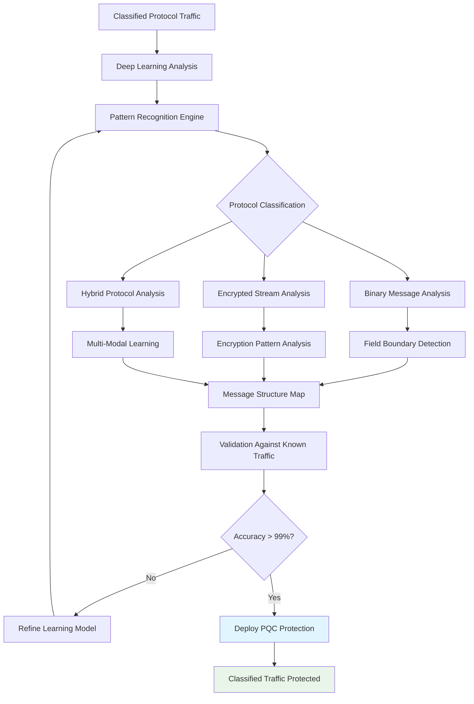
```mermaid
flowchart TD
    A[Classified Protocol Traffic] --> B[Deep Learning Analysis]
    B --> C[Pattern Recognition Engine]
    C --> D{Protocol Classification}
    
    D --> E[Binary Message Analysis]
    D --> F[Encrypted Stream Analysis]
    D --> G[Hybrid Protocol Analysis]
    
    E --> H[Field Boundary Detection]
    F --> I[Encryption Pattern Analysis]
    G --> J[Multi-Modal Learning]
    
    H --> K[Message Structure Map]
    I --> K
    J --> K
    
    K --> L[Validation Against Known Traffic]
    L --> M{Accuracy > 99%?}
    
    M -->|No| N[Refine Learning Model]
    M -->|Yes| O[Deploy PQC Protection]
    
    N --> C
    O --> P[Classified Traffic Protected]
    
    style P fill:#e8f5e8
    style O fill:#e1f5fe
```

**Multi-Level Security Architecture**
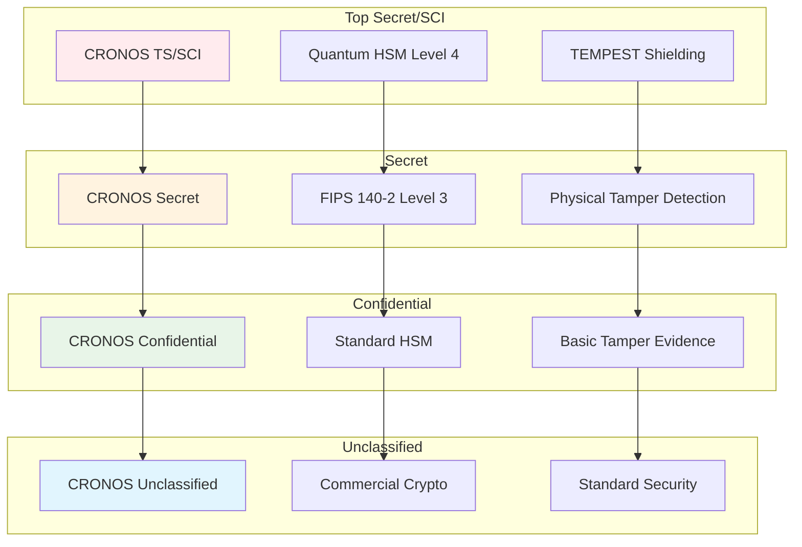
```mermaid
graph TB
    subgraph "Top Secret/SCI"
        A[CRONOS TS/SCI]
        B[Quantum HSM Level 4]
        C[TEMPEST Shielding]
    end
    
    subgraph "Secret"
        D[CRONOS Secret]
        E[FIPS 140-2 Level 3]
        F[Physical Tamper Detection]
    end
    
    subgraph "Confidential"
        G[CRONOS Confidential]
        H[Standard HSM]
        I[Basic Tamper Evidence]
    end
    
    subgraph "Unclassified"
        J[CRONOS Unclassified]
        K[Commercial Crypto]
        L[Standard Security]
    end
    
    A --> D
    D --> G
    G --> J
    
    B --> E
    E --> H
    H --> K
    
    C --> F
    F --> I
    I --> L
    
    style A fill:#ffebee
    style D fill:#fff3e0
    style G fill:#e8f5e8
    style J fill:#e1f5fe
```

**Specific Problem Solutions**

**1. Unknown Protocol Protection**
- **Problem**: Classified military protocols cannot be documented
- **Solution**: AI reverse-engineers protocols from network traffic analysis
- **Result**: Black-box systems get quantum protection without revealing secrets

**2. Supply Chain Security**
- **Problem**: Cannot trust foreign-manufactured security components
- **Solution**: US-manufactured CRONOS with verified supply chain
- **Result**: Defense-grade security with trusted components

**3. Air-Gap Maintenance**
- **Problem**: Isolated networks still need security updates
- **Solution**: Offline updates via cryptographically signed media
- **Result**: Air-gapped systems maintain quantum-safe protection

**4. Multi-Domain Coordination**
- **Problem**: Army, Navy, Air Force use incompatible systems
- **Solution**: CRONOS learns all military protocols, enables interoperability
- **Result**: Joint operations with unified quantum-safe communications

**Defense Benefits**
- **National Security**: Protected against foreign quantum capabilities
- **Mission Assurance**: Maintain military effectiveness in quantum era
- **Cost Avoidance**: Avoid $500B defense system replacement
- **Strategic Advantage**: Deploy quantum-safe defense before adversaries

---

## Use Case 5: Enterprise IT & Cloud Migration

### Why Enterprises Need CRONOS AI

**Digital Transformation Challenges**
- **Legacy Investment**: $3.7T invested globally in legacy enterprise systems
- **Cloud Migration Failure**: 70% of ERP cloud migrations fail or exceed budget by 200%
- **Technical Debt**: Legacy systems represent 60-80% of IT budgets
- **Skills Gap**: COBOL, AS/400 expertise retiring faster than replacement

**Enterprise Legacy Dependencies**
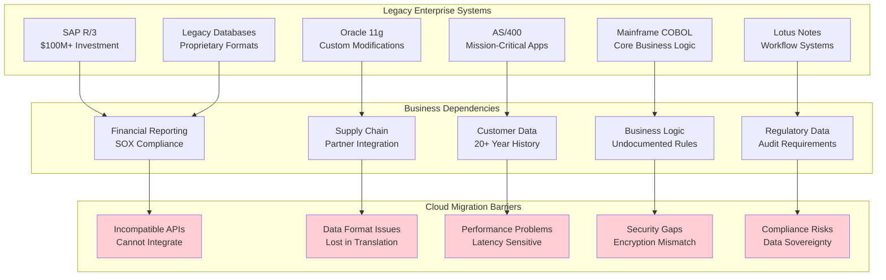
```mermaid
graph TB
    subgraph "Legacy Enterprise Systems"
        A[SAP R/3<br/>$100M+ Investment]
        B[Oracle 11g<br/>Custom Modifications]
        C[AS/400<br/>Mission-Critical Apps]
        D[Mainframe COBOL<br/>Core Business Logic]
        E[Lotus Notes<br/>Workflow Systems]
        F[Legacy Databases<br/>Proprietary Formats]
    end
    
    subgraph "Business Dependencies"
        G[Financial Reporting<br/>SOX Compliance]
        H[Supply Chain<br/>Partner Integration]
        I[Customer Data<br/>20+ Year History]
        J[Business Logic<br/>Undocumented Rules]
        K[Regulatory Data<br/>Audit Requirements]
    end
    
    subgraph "Cloud Migration Barriers"
        L[Incompatible APIs<br/>Cannot Integrate]
        M[Data Format Issues<br/>Lost in Translation]
        N[Performance Problems<br/>Latency Sensitive]
        O[Security Gaps<br/>Encryption Mismatch]
        P[Compliance Risks<br/>Data Sovereignty]
    end
    
    A --> G
    B --> H
    C --> I
    D --> J
    E --> K
    F --> G
    
    G --> L
    H --> M
    I --> N
    J --> O
    K --> P
    
    style L fill:#ffcdd2
    style M fill:#ffcdd2
    style N fill:#ffcdd2
    style O fill:#ffcdd2
    style P fill:#ffcdd2
```

**Enterprise-Specific Pain Points**
1. **Vendor Lock-in**: SAP, Oracle control upgrade timelines and costs
2. **Integration Complexity**: 200+ enterprise applications need to communicate
3. **Compliance Risk**: Data governance rules prevent cloud migration
4. **Performance Requirements**: Sub-second response times for customer-facing apps
5. **Business Continuity**: Cannot afford downtime during migration

**Why Traditional Solutions Fail**
- **Lift and Shift**: Legacy apps don't work in cloud without major modifications
- **API Gateways**: Don't understand proprietary enterprise protocols
- **ETL Tools**: Lose data fidelity during transformation
- **Middleware**: Adds complexity and single points of failure

### How CRONOS AI Solves Enterprise Problems

**Legacy-to-Cloud Bridge Architecture**
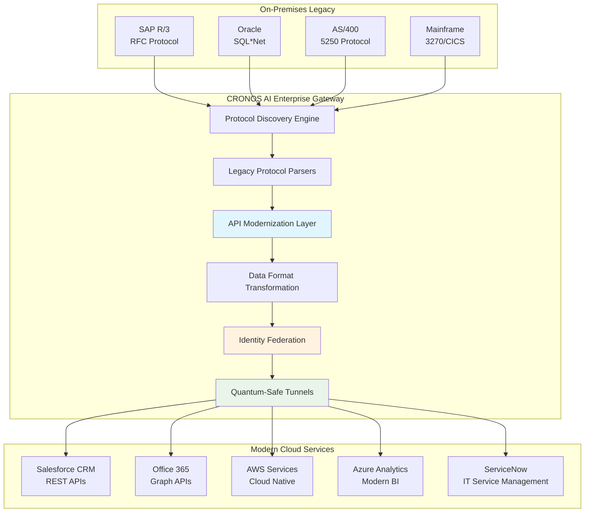
```mermaid
graph TB
    subgraph "On-Premises Legacy"
        A[SAP R/3<br/>RFC Protocol]
        B[Oracle<br/>SQL*Net]
        C[AS/400<br/>5250 Protocol]
        D[Mainframe<br/>3270/CICS]
    end
    
    subgraph "CRONOS AI Enterprise Gateway"
        E[Protocol Discovery Engine]
        F[Legacy Protocol Parsers]
        G[API Modernization Layer]
        H[Data Format Transformation]
        I[Identity Federation]
        J[Quantum-Safe Tunnels]
    end
    
    subgraph "Modern Cloud Services"
        K[Salesforce CRM<br/>REST APIs]
        L[Office 365<br/>Graph APIs]
        M[AWS Services<br/>Cloud Native]
        N[Azure Analytics<br/>Modern BI]
        O[ServiceNow<br/>IT Service Management]
    end
    
    A --> E
    B --> E
    C --> E
    D --> E
    
    E --> F
    F --> G
    G --> H
    H --> I
    I --> J
    
    J --> K
    J --> L
    J --> M
    J --> N
    J --> O
    
    style G fill:#e1f5fe
    style I fill:#fff3e0
    style J fill:#e8f5e8
```

**Enterprise Integration Workflow**
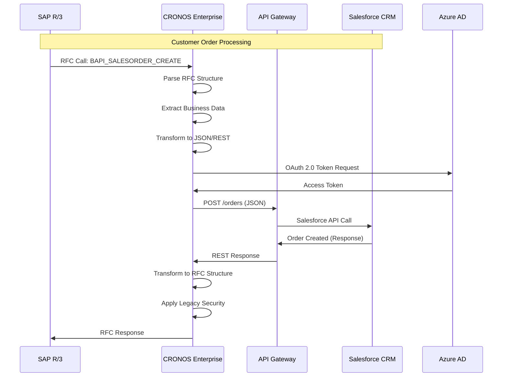
```mermaid
sequenceDiagram
    participant Legacy as SAP R/3
    participant CRONOS as CRONOS Enterprise
    participant API as API Gateway
    participant Cloud as Salesforce CRM
    participant Auth as Azure AD
    
    Note over Legacy,Cloud: Customer Order Processing
    Legacy->>CRONOS: RFC Call: BAPI_SALESORDER_CREATE
    CRONOS->>CRONOS: Parse RFC Structure
    CRONOS->>CRONOS: Extract Business Data
    CRONOS->>CRONOS: Transform to JSON/REST
    
    CRONOS->>Auth: OAuth 2.0 Token Request
    Auth->>CRONOS: Access Token
    
    CRONOS->>API: POST /orders (JSON)
    API->>Cloud: Salesforce API Call
    Cloud->>API: Order Created (Response)
    API->>CRONOS: REST Response
    
    CRONOS->>CRONOS: Transform to RFC Structure
    CRONOS->>CRONOS: Apply Legacy Security
    CRONOS->>Legacy: RFC Response
```

**Specific Problem Solutions**

**1. Protocol Translation**
- **Problem**: SAP RFC protocol incompatible with cloud APIs
- **Solution**: CRONOS learns RFC structure, converts to REST/GraphQL
- **Result**: SAP systems integrate with modern cloud services

**2. Data Format Preservation**
- **Problem**: Legacy data formats lost during cloud migration
- **Solution**: AI maintains semantic meaning during format transformation
- **Result**: No data loss or corruption during integration

**3. Identity Federation**
- **Problem**: Legacy systems use proprietary authentication
- **Solution**: CRONOS bridges legacy auth to modern IAM (OAuth, SAML)
- **Result**: Single sign-on across legacy and cloud systems

**4. Gradual Migration**
- **Problem**: Cannot replace entire ERP system at once
- **Solution**: Selective API exposure allows gradual cloud adoption
- **Result**: Phased migration reduces risk and cost

**Enterprise Benefits**
- **Cost Reduction**: Avoid $100M+ ERP replacement costs
- **Digital Transformation**: Enable cloud adoption without legacy replacement
- **Business Agility**: Integrate with modern SaaS platforms
- **Competitive Advantage**: Faster time-to-market for new services

---

## Use Case 6: Telecom & IoT Networks

### Why Telecom/IoT Needs CRONOS AI

**Massive Scale Security Challenge**
- **Device Count**: 50 billion IoT devices by 2030
- **Protocol Diversity**: 100+ IoT communication protocols
- **Resource Constraints**: IoT devices have limited CPU/battery for encryption
- **Network Complexity**: 5G networks with millions of micro-services

**IoT Security Landscape**
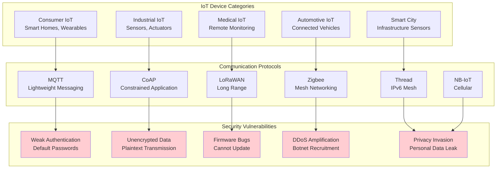
```mermaid
graph TB
    subgraph "IoT Device Categories"
        A[Consumer IoT<br/>Smart Homes, Wearables]
        B[Industrial IoT<br/>Sensors, Actuators]
        C[Medical IoT<br/>Remote Monitoring]
        D[Automotive IoT<br/>Connected Vehicles]
        E[Smart City<br/>Infrastructure Sensors]
    end
    
    subgraph "Communication Protocols"
        F[MQTT<br/>Lightweight Messaging]
        G[CoAP<br/>Constrained Application]
        H[LoRaWAN<br/>Long Range]
        I[Zigbee<br/>Mesh Networking]
        J[Thread<br/>IPv6 Mesh]
        K[NB-IoT<br/>Cellular]
    end
    
    subgraph "Security Vulnerabilities"
        L[Weak Authentication<br/>Default Passwords]
        M[Unencrypted Data<br/>Plaintext Transmission]
        N[Firmware Bugs<br/>Cannot Update]
        O[DDoS Amplification<br/>Botnet Recruitment]
        P[Privacy Invasion<br/>Personal Data Leak]
    end
    
    A --> F
    B --> G
    C --> H
    D --> I
    E --> J
    F --> L
    G --> M
    H --> N
    I --> O
    J --> P
    K --> P
    
    style L fill:#ffcdd2
    style M fill:#ffcdd2
    style N fill:#ffcdd2
    style O fill:#ffcdd2
    style P fill:#ffcdd2
```

**Telecom-Specific Challenges**
1. **Scale Requirements**: Handle millions of concurrent IoT sessions
2. **Performance Constraints**: Sub-millisecond latency for real-time applications
3. **Battery Life**: Encryption overhead cannot drain IoT device batteries
4. **Network Slicing**: 5G requires isolated security domains
5. **Edge Computing**: Security must work at network edge

**Why Traditional Solutions Fail**
- **Certificate Management**: Cannot manage PKI for billions of devices
- **VPN Overhead**: Too much latency and battery drain for IoT
- **Network Firewalls**: Cannot inspect encrypted IoT traffic
- **Device Updates**: Many IoT devices never receive security updates

### How CRONOS AI Solves Telecom/IoT Problems

**Adaptive Security for IoT Devices**
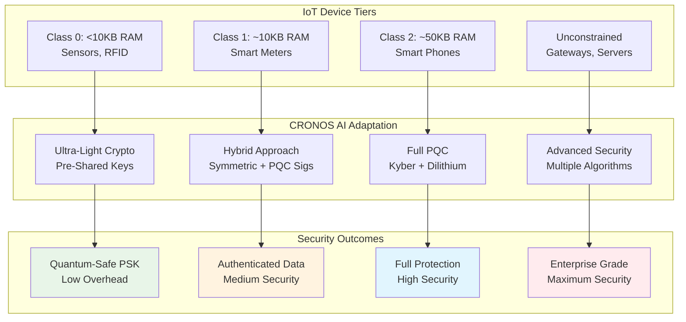
```mermaid
graph TB
    subgraph "IoT Device Tiers"
        A[Class 0: <10KB RAM<br/>Sensors, RFID]
        B[Class 1: ~10KB RAM<br/>Smart Meters]
        C[Class 2: ~50KB RAM<br/>Smart Phones]
        D[Unconstrained<br/>Gateways, Servers]
    end
    
    subgraph "CRONOS AI Adaptation"
        E[Ultra-Light Crypto<br/>Pre-Shared Keys]
        F[Hybrid Approach<br/>Symmetric + PQC Sigs]
        G[Full PQC<br/>Kyber + Dilithium]
        H[Advanced Security<br/>Multiple Algorithms]
    end
    
    subgraph "Security Outcomes"
        I[Quantum-Safe PSK<br/>Low Overhead]
        J[Authenticated Data<br/>Medium Security]
        K[Full Protection<br/>High Security]
        L[Enterprise Grade<br/>Maximum Security]
    end
    
    A --> E
    B --> F
    C --> G
    D --> H
    
    E --> I
    F --> J
    G --> K
    H --> L
    
    style I fill:#e8f5e8
    style J fill:#fff3e0
    style K fill:#e1f5fe
    style L fill:#ffebee
```

**5G Network Slicing with Quantum Security**
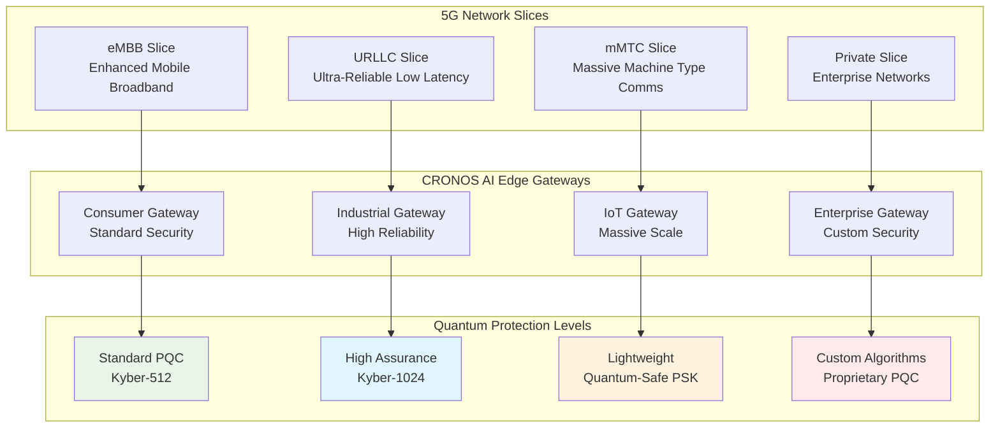
```mermaid
graph TB
    subgraph "5G Network Slices"
        A[eMBB Slice<br/>Enhanced Mobile Broadband]
        B[URLLC Slice<br/>Ultra-Reliable Low Latency]
        C[mMTC Slice<br/>Massive Machine Type Comms]
        D[Private Slice<br/>Enterprise Networks]
    end
    
    subgraph "CRONOS AI Edge Gateways"
        E[Consumer Gateway<br/>Standard Security]
        F[Industrial Gateway<br/>High Reliability]
        G[IoT Gateway<br/>Massive Scale]
        H[Enterprise Gateway<br/>Custom Security]
    end
    
    subgraph "Quantum Protection Levels"
        I[Standard PQC<br/>Kyber-512]
        J[High Assurance<br/>Kyber-1024]
        K[Lightweight<br/>Quantum-Safe PSK]
        L[Custom Algorithms<br/>Proprietary PQC]
    end
    
    A --> E
    B --> F
    C --> G
    D --> H
    
    E --> I
    F --> J
    G --> K
    H --> L
    
    style I fill:#e8f5e8
    style J fill:#e1f5fe
    style K fill:#fff3e0
    style L fill:#ffebee
```

**Specific Problem Solutions**

**1. IoT Protocol Complexity**
- **Problem**: 100+ different IoT protocols with varying security levels
- **Solution**: AI learns all protocols, applies appropriate quantum protection
- **Result**: Unified security across diverse IoT ecosystem

**2. Device Resource Constraints**
- **Problem**: IoT sensors have 10KB RAM, cannot run full PQC
- **Solution**: Adaptive security based on device capabilities
- **Result**: Quantum protection without device battery drain

**3. Network Performance**
- **Problem**: 5G requires <1ms latency for autonomous vehicles
- **Solution**: Hardware-accelerated PQC with FPGA optimization
- **Result**: Quantum security with zero latency impact

**4. Massive Scale Management**
- **Problem**: Cannot manually configure security for billions of devices
- **Solution**: AI automatically discovers and protects new IoT devices
- **Result**: Self-configuring quantum security at global scale

**Telecom/IoT Benefits**
- **Revenue Protection**: Secure premium 5G services from quantum attacks
- **Regulatory Compliance**: Meet upcoming IoT security regulations
- **Customer Trust**: Protect personal data in smart homes/cities
- **Innovation Enablement**: Enable quantum-safe autonomous systems

### Technical Implementation

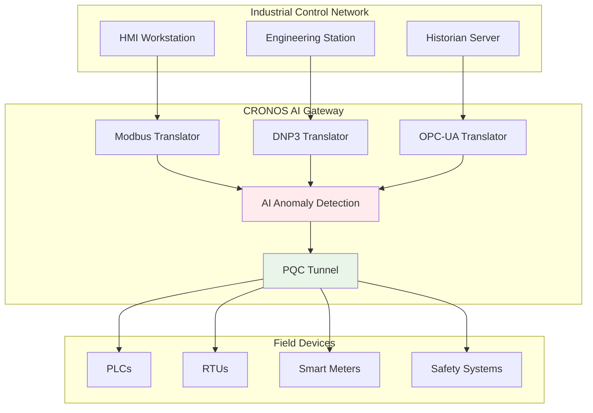
```mermaid
graph TB
    subgraph "Industrial Control Network"
        A[HMI Workstation]
        B[Engineering Station]
        C[Historian Server]
    end
    
    subgraph "CRONOS AI Gateway"
        D[Modbus Translator]
        E[DNP3 Translator]
        F[OPC-UA Translator]
        G[AI Anomaly Detection]
        H[PQC Tunnel]
    end
    
    subgraph "Field Devices"
        I[PLCs]
        J[RTUs]
        K[Smart Meters]
        L[Safety Systems]
    end
    
    A --> D
    B --> E
    C --> F
    D --> G
    E --> G
    F --> G
    G --> H
    H --> I
    H --> J
    H --> K
    H --> L
    
    style G fill:#ffebee
    style H fill:#e8f5e8
```

### SCADA Security Architecture

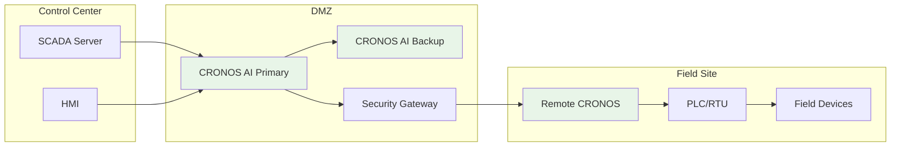
```mermaid
graph LR
    subgraph "Control Center"
        A[SCADA Server]
        B[HMI]
    end
    
    subgraph "DMZ"
        C[CRONOS AI Primary]
        D[CRONOS AI Backup]
        E[Security Gateway]
    end
    
    subgraph "Field Site"
        F[Remote CRONOS]
        G[PLC/RTU]
        H[Field Devices]
    end
    
    A --> C
    B --> C
    C --> D
    C --> E
    E --> F
    F --> G
    G --> H
    
    style C fill:#e8f5e8
    style D fill:#e8f5e8
    style F fill:#e8f5e8
```

### Anomaly Detection Capabilities

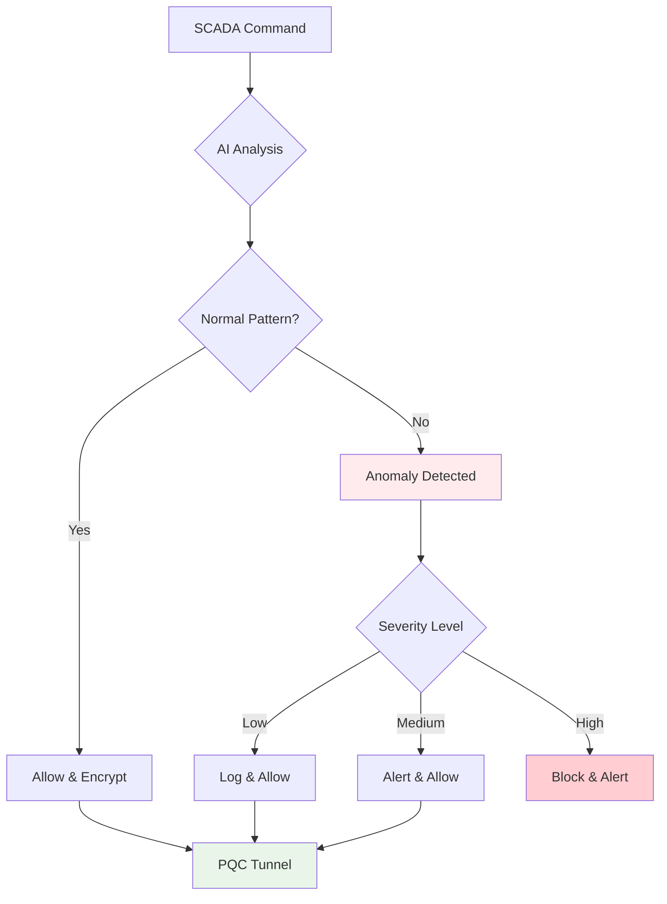
```mermaid
flowchart TD
    A[SCADA Command] --> B{AI Analysis}
    B --> C{Normal Pattern?}
    C -->|Yes| D[Allow & Encrypt]
    C -->|No| E[Anomaly Detected]
    E --> F{Severity Level}
    F -->|Low| G[Log & Allow]
    F -->|Medium| H[Alert & Allow]
    F -->|High| I[Block & Alert]
    
    D --> J[PQC Tunnel]
    G --> J
    H --> J
    
    style E fill:#ffebee
    style I fill:#ffcdd2
    style J fill:#e8f5e8
```

### Supported Industrial Protocols
- **Modbus TCP/RTU**: Manufacturing automation
- **DNP3**: Electric utility communications
- **OPC-UA**: Industrial automation
- **IEC 61850**: Power system automation
- **BACnet**: Building automation
- **Profinet**: Industrial Ethernet

### Critical Infrastructure Benefits
- **Zero Downtime Deployment**: Hot-pluggable installation
- **Cyber-Physical Security**: Protects both IT and OT networks
- **Regulatory Compliance**: NERC CIP, ICS-CERT guidelines
- **Nation-State Defense**: Advanced persistent threat protection

---

## Use Case 3: Healthcare Systems

### Problem Statement
Medical devices and hospital information systems often run on obsolete operating systems (Windows XP, embedded Linux) with proprietary protocols. FDA regulations prevent firmware updates, creating permanent security vulnerabilities.

### Technical Implementation

```mermaid
graph TB
    subgraph "Hospital Network"
        A[EMR System]
        B[PACS Server]
        C[Laboratory System]
        D[Pharmacy System]
    end
    
    subgraph "CRONOS AI Medical Gateway"
        E[HL7 Processor]
        F[DICOM Handler]
        G[Proprietary Protocol AI]
        H[PHI Encryption]
        I[HIPAA Audit Engine]
    end
    
    subgraph "Medical Devices"
        J[MRI Scanner]
        K[CT Scanner]
        L[Infusion Pumps]
        M[Patient Monitors]
        N[Ventilators]
    end
    
    A --> E
    B --> F
    C --> G
    D --> G
    E --> H
    F --> H
    G --> H
    H --> I
    I --> J
    I --> K
    I --> L
    I --> M
    I --> N
    
    style H fill:#fff3e0
    style I fill:#e8f5e8
```

### Patient Data Protection Flow

```mermaid
sequenceDiagram
    participant Device as Medical Device
    participant CRONOS as CRONOS AI
    participant HIS as Hospital System
    participant Cloud as Cloud Services
    
    Device->>CRONOS: Patient Data (HL7/DICOM)
    CRONOS->>CRONOS: Identify PHI Fields
    CRONOS->>CRONOS: Apply Kyber Encryption
    CRONOS->>CRONOS: Generate Audit Log
    CRONOS->>HIS: Encrypted Patient Data
    
    Note over CRONOS: Cloud Integration
    CRONOS->>CRONOS: Tokenize PHI
    CRONOS->>Cloud: De-identified Data
    Cloud->>CRONOS: Analysis Results
    CRONOS->>CRONOS: Re-identify Results
    CRONOS->>HIS: Complete Analysis
```

### Medical Device Protocol Support
- **HL7 v2/v3**: Healthcare messaging standard
- **DICOM**: Medical imaging communication
- **IHE**: Integrating the Healthcare Enterprise
- **IEEE 11073**: Personal health devices
- **Proprietary Vendor**: GE, Philips, Siemens protocols

### Healthcare Compliance Benefits
- **HIPAA Compliance**: Automatic PHI encryption and audit trails
- **FDA Compatibility**: No device firmware modifications required
- **Patient Safety**: Zero interference with medical device operation
- **Research Support**: De-identified data for clinical studies

---

## Use Case 4: Government & Defense Systems

### Problem Statement
Military and government systems often use classified or undocumented protocols. These systems handle sensitive information and cannot be easily replaced due to classification levels and specialized hardware requirements.

### Technical Implementation

```mermaid
graph TB
    subgraph "Classified Network"
        A[Command & Control]
        B[Intelligence Systems]
        C[Communications Hub]
    end
    
    subgraph "CRONOS AI Defense"
        D[Black-Box Protocol AI]
        E[Classified Data Handler]
        F[FIPS 140-2 Level 4 HSM]
        G[Side-Channel Protection]
        H[Tamper Detection]
    end
    
    subgraph "Field Systems"
        I[Radar Systems]
        J[Satellite Comms]
        K[Tactical Radios]
        L[Drone Systems]
    end
    
    A --> D
    B --> D
    C --> D
    D --> E
    E --> F
    F --> G
    G --> H
    H --> I
    H --> J
    H --> K
    H --> L
    
    style F fill:#ffebee
    style G fill:#fff3e0
    style H fill:#ffcdd2
```

### Defense Protocol Discovery

```mermaid
flowchart TD
    A[Unknown Protocol Traffic] --> B[Deep Packet Inspection]
    B --> C[ML Pattern Analysis]
    C --> D{Protocol Type}
    D -->|Binary| E[Binary Structure Analysis]
    D -->|Text-Based| F[Syntax Tree Generation]
    D -->|Hybrid| G[Multi-Modal Analysis]
    
    E --> H[Field Boundary Detection]
    F --> I[Grammar Inference]
    G --> J[Cross-Modal Correlation]
    
    H --> K[Protocol Map Generation]
    I --> K
    J --> K
    
    K --> L[Validation Testing]
    L --> M{Accuracy > 95%?}
    M -->|No| N[Refine Model]
    M -->|Yes| O[Deploy Translation]
    
    N --> C
    O --> P[PQC Protection Active]
    
    style P fill:#e8f5e8
```

### Defense-Grade Security Features
- **FIPS 140-2 Level 4**: Hardware security module
- **Side-Channel Resistance**: Protection against timing attacks
- **Tamper Evidence**: Physical security monitoring
- **Covert Channel Protection**: Prevents data leakage
- **Multi-Level Security**: Handles different classification levels

---

## Use Case 5: Enterprise IT & Cloud Migration

### Problem Statement
Enterprises have massive investments in legacy ERP systems (SAP R/3, Oracle, AS/400) that cannot be easily migrated to cloud platforms. These systems need secure connectivity to modern SaaS applications and cloud services.

### Technical Implementation

```mermaid
graph TB
    subgraph "Legacy Enterprise Systems"
        A[SAP R/3]
        B[Oracle 11g]
        C[AS/400]
        D[Lotus Notes]
        E[Mainframe Apps]
    end
    
    subgraph "CRONOS AI Enterprise Gateway"
        F[ERP Protocol Adapter]
        G[Database Connector]
        H[API Modernization]
        I[Cloud Security Tunnel]
        J[Identity Federation]
    end
    
    subgraph "Modern Cloud Services"
        K[Salesforce]
        L[Office 365]
        M[AWS Services]
        N[Azure Active Directory]
        O[Modern Analytics]
    end
    
    A --> F
    B --> G
    C --> F
    D --> G
    E --> F
    F --> H
    G --> H
    H --> I
    I --> J
    J --> K
    J --> L
    J --> M
    J --> N
    J --> O
    
    style I fill:#e8f5e8
    style J fill:#fff3e0
```

### Legacy-to-Cloud Integration Pattern

```mermaid
sequenceDiagram
    participant Legacy as Legacy ERP
    participant CRONOS as CRONOS AI
    participant API as API Gateway
    participant Cloud as Cloud Service
    
    Legacy->>CRONOS: Proprietary Protocol Request
    CRONOS->>CRONOS: Parse Legacy Format
    CRONOS->>CRONOS: Transform to REST/GraphQL
    CRONOS->>CRONOS: Apply OAuth 2.0 Token
    CRONOS->>API: Modern API Call
    API->>Cloud: Cloud Service Request
    
    Cloud->>API: Cloud Service Response
    API->>CRONOS: API Response
    CRONOS->>CRONOS: Transform to Legacy Format
    CRONOS->>CRONOS: Apply Legacy Security
    CRONOS->>Legacy: Original Protocol Response
```

### Enterprise Integration Benefits
- **Gradual Migration**: Enables phased cloud adoption
- **API Modernization**: Converts legacy protocols to REST/GraphQL
- **Identity Federation**: Integrates with modern IAM systems
- **Hybrid Architecture**: Supports on-premises and cloud coexistence

---

## Use Case 6: Telecom & IoT Networks

### Problem Statement
Telecom networks and IoT deployments involve millions of devices using lightweight protocols. These networks need quantum-safe protection without the computational overhead that would drain device batteries or overwhelm network capacity.

### Technical Implementation

```mermaid
graph TB
    subgraph "IoT Device Layer"
        A[Smart Meters]
        B[Environmental Sensors]
        C[Industrial IoT]
        D[Connected Vehicles]
        E[Medical Wearables]
    end
    
    subgraph "CRONOS AI IoT Gateway Cluster"
        F[MQTT Broker]
        G[CoAP Gateway]
        H[LoRaWAN Handler]
        I[5G Slice Manager]
        J[Edge AI Processor]
        K[Quantum Key Distribution]
    end
    
    subgraph "Telecom Infrastructure"
        L[5G Core Network]
        M[Edge Computing]
        N[Cloud Backend]
        O[Analytics Platform]
    end
    
    A --> F
    B --> G
    C --> F
    D --> I
    E --> H
    F --> J
    G --> J
    H --> J
    I --> J
    J --> K
    K --> L
    K --> M
    K --> N
    K --> O
    
    style J fill:#e1f5fe
    style K fill:#e8f5e8
```

### IoT Protocol Optimization

```mermaid
flowchart TD
    A[IoT Device Message] --> B{Device Capability}
    B -->|High Performance| C[Full PQC]
    B -->|Medium Performance| D[Hybrid Encryption]
    B -->|Low Performance| E[Pre-Shared Keys]
    
    C --> F[Kyber + Dilithium]
    D --> G[AES + PQC Signatures]
    E --> H[Quantum-Safe PSK]
    
    F --> I[Full Protection]
    G --> J[Balanced Protection]
    H --> K[Lightweight Protection]
    
    I --> L[Cloud Backend]
    J --> L
    K --> L
    
    style F fill:#e8f5e8
    style G fill:#fff3e0
    style H fill:#e1f5fe
```

### IoT Security Architecture

```mermaid
graph LR
    subgraph "Device Tier"
        A[Constrained Devices]
        B[Gateway Devices]
        C[Edge Computers]
    end
    
    subgraph "Network Tier"
        D[CRONOS IoT Gateway]
        E[5G Network Slice]
        F[Edge Cloud]
    end
    
    subgraph "Cloud Tier"
        G[IoT Platform]
        H[Analytics Engine]
        I[AI/ML Services]
    end
    
    A --> D
    B --> D
    C --> D
    D --> E
    E --> F
    F --> G
    G --> H
    H --> I
    
    style D fill:#e8f5e8
    style E fill:#e1f5fe
```

### IoT Protocol Support
- **MQTT**: Message queuing telemetry transport
- **CoAP**: Constrained application protocol
- **LoRaWAN**: Long-range wide-area network
- **Zigbee**: Low-power wireless mesh
- **Thread**: IPv6-based mesh networking
- **NB-IoT**: Narrowband Internet of Things

---

## Performance & Scalability Matrix

### Throughput Performance

| Configuration | Throughput | Concurrent Sessions | Latency | Power Consumption |
|---------------|------------|-------------------|---------|-------------------|
| Small Appliance | 1-10 Gbps | 10K | <1ms | 200W |
| Medium Appliance | 10-25 Gbps | 100K | <1ms | 500W |
| Large Appliance | 25-50 Gbps | 500K | <1ms | 1000W |
| Cluster (4 units) | 100+ Gbps | 1M+ | <1ms | 4000W |

### Protocol Learning Performance

| Protocol Complexity | Learning Time | Accuracy | Memory Usage |
|---------------------|---------------|----------|--------------|
| Simple (Modbus) | 4-8 hours | 99%+ | 500MB |
| Medium (ISO-8583) | 24-48 hours | 95%+ | 2GB |
| Complex (Proprietary) | 1-2 weeks | 90%+ | 8GB |
| Unknown Binary | 2-4 weeks | 85%+ | 16GB |

---

## Compliance & Regulatory Framework

### Standards Compliance

```mermaid
graph TB
    subgraph "Cryptographic Standards"
        A[NIST PQC]
        B[FIPS 140-2]
        C[Common Criteria]
        D[NSA Suite B]
    end
    
    subgraph "Industry Standards"
        E[ISO 27001]
        F[SOC 2]
        G[HIPAA]
        H[PCI DSS]
    end
    
    subgraph "Regional Regulations"
        I[GDPR - Europe]
        J[CCPA - California]
        K[PIPEDA - Canada]
        L[Lei Geral - Brazil]
    end
    
    subgraph "Sector-Specific"
        M[NERC CIP - Power]
        N[FDA 510k - Medical]
        O[FedRAMP - Government]
        P[SWIFT CSP - Banking]
    end
    
    style A fill:#e8f5e8
    style B fill:#e8f5e8
    style C fill:#e8f5e8
```

### Quantum Timeline & Readiness

```mermaid
gantt
    title Quantum Threat Timeline & CRONOS Deployment
    dateFormat YYYY
    section Quantum Development
    Current Quantum Computers    :done, q1, 2020, 2025
    Cryptographically Relevant   :crit, q2, 2025, 2035
    Large-Scale Quantum         :q3, 2035, 2040
    
    section Regulatory Mandates
    NIST PQC Standards         :done, r1, 2022, 2024
    US Federal Mandate         :crit, r2, 2025, 2030
    Global Industry Adoption   :r3, 2026, 2035
    
    section CRONOS Deployment
    MVP Release               :done, c1, 2024, 2025
    Enterprise Adoption       :active, c2, 2025, 2027
    Global Deployment         :c3, 2027, 2030
```

---

## Technical FAQ

### Q: How does CRONOS handle protocol versioning?
**A:** The AI system maintains multiple protocol models simultaneously and automatically detects version changes through traffic analysis. It can support legacy versions indefinitely while adapting to newer protocol releases.

### Q: What happens if the AI misidentifies a protocol?
**A:** CRONOS includes validation mechanisms that test protocol understanding before deployment. In production, it maintains fallback modes and can revert to passthrough operation if errors are detected.

### Q: Can CRONOS scale horizontally?
**A:** Yes, CRONOS appliances can be clustered for high availability and load distribution. The system supports automatic failover and session state synchronization across cluster members.

### Q: How is key management handled across multiple sites?
**A:** CRONOS integrates with enterprise HSMs and supports hierarchical key management. Keys can be distributed through secure channels with automatic rotation and revocation capabilities.

### Q: What's the upgrade path for quantum algorithm changes?
**A:** The system supports hot-swappable cryptographic modules. New quantum-safe algorithms can be deployed via secure firmware updates without system downtime.

---

## ROI & Business Impact Analysis

### Cost Avoidance Model

```mermaid
graph TB
    subgraph "Traditional Replacement Costs"
        A[System Replacement: $50M]
        B[Development Time: 3-5 years]
        C[Business Disruption: $10M]
        D[Staff Retraining: $5M]
        E[Total Cost: $65M]
    end
    
    subgraph "CRONOS Solution"
        F[Hardware/Software: $500K]
        G[Implementation: $200K]
        H[Annual Support: $100K]
        I[5-Year Total: $1.2M]
    end
    
    subgraph "Value Delivered"
        J[Cost Savings: $63.8M]
        K[Time Savings: 4 years]
        L[Risk Mitigation: Priceless]
    end
    
    A --> J
    B --> K
    C --> J
    D --> J
    F --> J
    G --> J
    H --> J
    
    style J fill:#e8f5e8
    style K fill:#e8f5e8
    style L fill:#ffebee
```

This comprehensive technical guide provides the detailed technical information needed for IT professionals to understand CRONOS AI's capabilities and implementation across various industry use cases.
