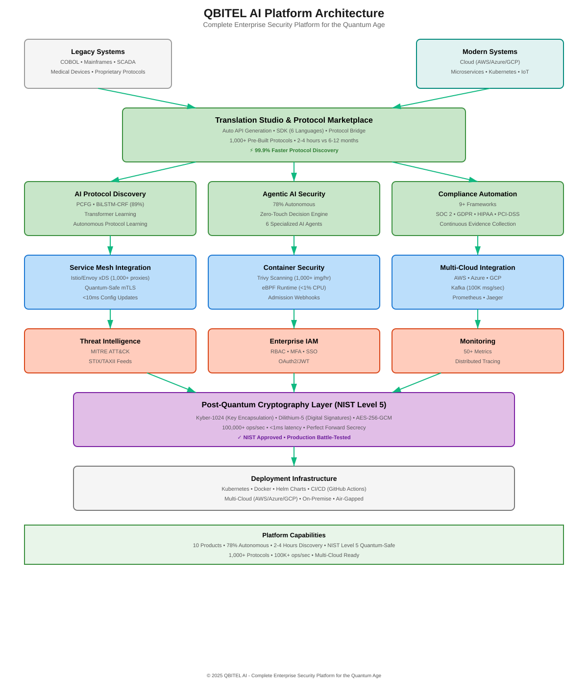

<p align="center">
  
</p>

<h1 align="center">QBITEL Bridge</h1>

<h3 align="center">Critical Systems Intelligence and Protection Platform</h3>

<p align="center">
  <em>Discover, understand, modernize, protect, and prove control over the critical systems enterprises cannot easily replace.</em>
</p>

<p align="center">
  <a href="https://opensource.org/licenses/Apache-2.0"></a>
  
  <a href="https://www.python.org/downloads/"></a>
  <a href="https://www.rust-lang.org/"></a>
  <a href="https://go.dev/"></a>
  <a href="https://kubernetes.io"></a>
  
  
  
</p>

<br>

<p align="center">
  <a href="https://bridge.qbitel.com">Website</a> &nbsp;&bull;&nbsp;
  <a href="docs/">Documentation</a> &nbsp;&bull;&nbsp;
  <a href="QUICKSTART.md">Quick Start</a> &nbsp;&bull;&nbsp;
  <a href="docs/API.md">API Reference</a> &nbsp;&bull;&nbsp;
  <a href="https://bridge.qbitel.com/resources">Resources</a> &nbsp;&bull;&nbsp;
  <a href="mailto:enterprise@qbitel.com">Enterprise Support</a>
</p>

---

<table>
<tr>
<td align="center"><h3>89%+</h3><sub>Discovery Accuracy</sub></td>
<td align="center"><h3>NIST Level 5</h3><sub>Quantum Security</sub></td>
<td align="center"><h3>&lt;1ms</h3><sub>Encryption Overhead</sub></td>
<td align="center"><h3>5</h3><sub>Linked Product Modules</sub></td>
<td align="center"><h3>9</h3><sub>Compliance Frameworks</sub></td>
<td align="center"><h3>100K+</h3><sub>msg/sec Throughput</sub></td>
</tr>
</table>

<p align="center">
  <strong>100% Open Source</strong> &nbsp;·&nbsp; Apache 2.0 Licensed &nbsp;·&nbsp; No Open-Core &nbsp;·&nbsp; No Feature Gating &nbsp;·&nbsp; Production-Ready
</p>

---

## The Problem

Enterprises run critical operations on systems that were never designed for today's threat, fraud, compliance, and quantum-risk environment. These systems process payments, route calls, run devices, operate factories, support defense missions, move telecom traffic, and manage patient records. They share three structural weaknesses:

<table>
<tr>
<td width="33%">

### Unknown Systems
Undocumented protocols, unmanaged devices, call-flow dependencies, mission links, mainframe interfaces, and operational workflows with no reliable system of record.

</td>
<td width="33%">

### Unexplained Behavior
Teams can see traffic moving, but cannot reliably explain business meaning, fraud patterns, failure indicators, ownership, or blast radius.

</td>
<td width="33%">

### Future Exposure
Weak crypto, fragile integrations, fraud pressure, AI-accelerated attacks, and harvest-now-decrypt-later risk are converging faster than replacement programs can move.

</td>
</tr>
</table>

**QBITEL Bridge provides the intelligence and protection layer for systems that cannot be ripped out.** No forced replacement. No blind automation. Evidence for every critical change.

---

## How It Works

```
  Legacy System                    QBITEL Bridge                         Modern Infrastructure
                        ┌──────────────────────────────────┐
  BPO / Voice           │                                  │          Cloud APIs
  Mainframes       ───► │  1. DISCOVER  assets and flows   │ ───►     Microservices
  IoT / OT / SCADA      │  2. UNDERSTAND behavior and risk │          Dashboards
  Defense Networks      │  3. MODERNIZE adapters and APIs  │          Event Streams
  Healthcare / Telecom  │  4. PROTECT   with policy + PQC  │          Evidence Packs
                        │  5. PROVE     control and lineage│
                        └──────────────────────────────────┘
                                 2-4 hours to first results
```

| Step | What Happens | Traditional Approach | With QBITEL |
|------|-------------|---------------------|-------------|
| **Discover** | Builds asset, protocol, dependency, and crypto inventory | 6-12 months, $2-10M | **Hours to days**, automated |
| **Understand** | Explains behavior, risk, fraud, and failure patterns | Tribal knowledge | **Evidence-backed intelligence** |
| **Modernize** | Generates specs, APIs, adapters, SDKs, and replay harnesses | Weeks/months of manual coding | **Repeatable delivery assets** |
| **Protect** | Applies policy controls, fraud/threat defenses, and PQC overlays | Fragmented tools | **Governed runtime controls** |
| **Prove** | Produces audit, board, client, and change-control evidence | Manual audit prep | **Evidence pack in the workflow** |

---

## Platform Capabilities

<table>
<tr>
<td width="50%">

### AI Protocol Discovery
Reverse-engineers unknown protocols from raw network traffic using PCFG grammar inference, Transformer classification, and BiLSTM-CRF field detection. No source code needed.

[Learn more](docs/products/01_AI_PROTOCOL_DISCOVERY.md) &bull; [Architecture](diagrams/03_protocol_discovery_pipeline.svg)

</td>
<td width="50%">

### Post-Quantum Cryptography
NIST Level 5 protection with **ML-KEM** (Kyber-1024) and **ML-DSA** (Dilithium-5). Domain-optimized for banking (10K+ TPS), healthcare (64KB devices), automotive (<10ms V2X), and aviation (600bps links).

[Learn more](docs/products/05_POST_QUANTUM_CRYPTOGRAPHY.md) &bull; [Architecture](diagrams/06_quantum_cryptography.svg)

</td>
</tr>
<tr>
<td width="50%">

### Governed Protection Engine
Policy-led protection for fraud, threat, and quantum-risk workflows. Critical actions require approval gates, rollback paths, simulation, and audit evidence.

[Learn more](docs/products/04_AGENTIC_AI_SECURITY.md) &bull; [Architecture](diagrams/04_zero_touch_decision_engine.svg)

</td>
<td width="50%">

### Legacy System Whisperer
Deep analysis for undocumented legacy systems: COBOL copybook parsing, JCL analysis, mainframe dataset discovery, business rule extraction, and predictive failure analysis.

[Learn more](docs/LEGACY_SYSTEM_WHISPERER.md)

</td>
</tr>
<tr>
<td width="50%">

### Translation Studio
Point at any protocol, get a REST API with OpenAPI 3.0 spec + SDKs in Python, TypeScript, Go, Java, Rust, and C#. Auto-generated, fully documented, production-ready.

[Learn more](docs/products/02_TRANSLATION_STUDIO.md) &bull; [Architecture](diagrams/05_translation_studio_workflow.svg)

</td>
<td width="50%">

### Vertical Solution Packs
Industry-specific protocols, templates, risk models, and evidence packs for BPO/call centers, IoT, defense, banking, OT, healthcare, telecom, aviation, and automotive.

[Learn more](docs/products/03_PROTOCOL_MARKETPLACE.md)

</td>
</tr>
<tr>
<td width="50%">

### Critical System Intelligence
AI-assisted analysis of system behavior, ownership, business meaning, fraud indicators, failure signals, and modernization readiness across critical estates.

[Architecture](diagrams/02_ai_agent_ecosystem.svg)

</td>
<td width="50%">

### Enterprise Compliance
Automated reporting for **SOC 2, GDPR, HIPAA, PCI-DSS, ISO 27001, NIST 800-53, BASEL-III, NERC-CIP, FDA 21 CFR Part 11**. Continuous monitoring. Blockchain-backed audit trails.

[Learn more](docs/products/07_ENTERPRISE_COMPLIANCE.md)

</td>
</tr>
<tr>
<td width="50%">

### Cloud-Native Security
Kubernetes admission webhooks, Istio/Envoy service mesh with quantum-safe mTLS, eBPF runtime monitoring, container image scanning, and secure Kafka event streaming.

[Learn more](docs/products/06_CLOUD_NATIVE_SECURITY.md)

</td>
<td width="50%">

### Threat Intelligence
MITRE ATT&CK technique mapping, STIX/TAXII feed integration, proactive threat hunting, and continuous learning from global threat landscape.

[Learn more](docs/products/09_THREAT_INTELLIGENCE.md)

</td>
</tr>
</table>

---

## Architecture

Four-layer polyglot architecture — each layer built in the language optimized for its job:

```
┌──────────────────────────────────────────────────────────────────────────┐
│                        UI Console  (React / TypeScript)                  │
│               Admin Dashboard  ·  Protocol Copilot  ·  Marketplace       │
├──────────────────────────────────────────────────────────────────────────┤
│                        Go Control Plane                                  │
│          Service Orchestration  ·  OPA Policy Engine  ·  Vault Secrets   │
│          Device Agent (TPM 2.0)  ·  gRPC + REST Gateway                  │
├──────────────────────────────────────────────────────────────────────────┤
│                        Python AI Engine  (FastAPI)                       │
│   Protocol Discovery  ·  Multi-Agent System  ·  LLM/RAG (Ollama-first)   │
│   Compliance Automation  ·  Anomaly Detection  ·  Security Orchestrator  │
│   Legacy Whisperer  ·  Marketplace  ·  Protocol Copilot                  │
├──────────────────────────────────────────────────────────────────────────┤
│                        Rust Data Plane                                   │
│     PQC-TLS (ML-KEM / ML-DSA)  ·  DPDK Packet Processing                 │
│     Wire-Speed Encryption  ·  DPI Engine  ·  Protocol Adapters           │
│     K8s Operator  ·  HA Clustering  ·  AI Bridge (PyO3)                  │
└──────────────────────────────────────────────────────────────────────────┘
```

| Layer | Language | What It Does |
|-------|----------|-------------|
| **Data Plane** | Rust | PQC-TLS termination, wire-speed encryption, DPDK packet processing, protocol adapters (ISO-8583, Modbus, HL7, TN3270e) |
| **AI Engine** | Python | Protocol discovery, LLM inference, compliance automation, anomaly detection, multi-agent orchestration |
| **Control Plane** | Go | Service orchestration, OPA policy evaluation, Vault secrets, device management, gRPC gateway |
| **UI Console** | React/TS | Admin dashboard, protocol copilot, marketplace, real-time monitoring |

[Detailed architecture](architecture.md) &bull; [Architecture diagrams](diagrams/)

---

## What Only QBITEL Does

No other platform combines these capabilities:

| Capability | QBITEL | CrowdStrike | Palo Alto | Fortinet | Claroty | IBM Quantum Safe |
|------------|:------:|:-----------:|:---------:|:--------:|:-------:|:----------------:|
| AI protocol discovery (2-4 hrs) | **Yes** | No | No | No | No | No |
| NIST Level 5 post-quantum crypto | **Yes** | No | No | No | No | Yes |
| Legacy system protection (40+ yr) | **Yes** | No | No | No | Partial | No |
| Autonomous security response (78%) | **Yes** | Playbooks | Playbooks | Playbooks | Alerts | No |
| Air-gapped on-premise LLM | **Yes** | Cloud-only | Cloud-only | Cloud-only | Cloud-only | No |
| Domain-optimized PQC | **Yes** | N/A | N/A | N/A | N/A | Generic |
| Auto-generated APIs + 6 SDKs | **Yes** | No | No | No | No | No |
| 9 compliance frameworks | **Yes** | Basic | Basic | Basic | OT only | Crypto only |
| Protocol marketplace (1000+) | **Yes** | No | No | No | No | No |

> *QBITEL occupies a new category: AI-powered quantum-safe security for the legacy and constrained systems that traditional vendors cannot protect.*

---

## Industry Solutions

| Industry | Protocols | Key Use Case | Business Impact |
|----------|-----------|-------------|-----------------|
| **Banking & Finance** | ISO-8583, SWIFT, SEPA, FIX | Mainframe transaction protection, HSM migration | Protect $10T+ daily transactions |
| **Healthcare** | HL7, DICOM, FHIR | Medical device security without FDA recertification | Secure 500K+ connected devices |
| **Critical Infrastructure** | Modbus, DNP3, IEC 61850 | SCADA/PLC protection with zero downtime | Protect power grids serving 100M+ |
| **Automotive** | V2X, IEEE 1609.2, CAN | Quantum-safe vehicle-to-everything | <10ms latency constraint |
| **Aviation** | ADS-B, ACARS, ARINC 429 | Air traffic and avionics data security | 600bps bandwidth-optimized PQC |
| **Telecommunications** | SS7, Diameter, SIP | 5G core and IoT infrastructure protection | Billion-device scale |

[Industry brochures](docs/brochures/) &bull; [Industry infographics](infographics/) &bull; [Audio walkthroughs](audio-walkthrough/)

---

## Performance

| Component | Metric | Value |
|-----------|--------|-------|
| Protocol Discovery | Time to first results | **2-4 hours** (vs 6-12 months manual) |
| Protocol Discovery | Classification accuracy | **89%+** |
| Protocol Discovery | P95 latency | **150ms** |
| PQC Encryption | Overhead | **<1ms** (AES-256-GCM + Kyber hybrid) |
| Kafka Streaming | Throughput | **100,000+ msg/sec** (encrypted) |
| Parser Generation | Parse throughput | **50,000+ msg/sec** |
| Security Engine | Decision time | **<1 second** (900x faster than manual SOC) |
| xDS Server | Proxy capacity | **1,000+ concurrent** |
| eBPF Monitor | Container capacity | **10,000+** containers at <1% CPU |
| API Gateway | P99 latency | **<25ms** |
| Translation Studio | SDK generation | **6 languages**, minutes not months |

---

## Get Started

### Prerequisites

- Python 3.10+ &bull; Rust 1.70+ &bull; Go 1.21+
- Docker & Docker Compose
- 4GB+ RAM (16GB+ recommended for production)

### Option 1: Docker Compose (Fastest)

```bash
git clone https://github.com/yazhsab/qbitel-bridge.git
cd qbitel-bridge
docker compose -f docker/docker-compose.yml up -d

# API available at http://localhost:8000/docs
# UI Console at http://localhost:3000
```

### Option 2: Python AI Engine

```bash
git clone https://github.com/yazhsab/qbitel-bridge.git
cd qbitel-bridge

python -m venv venv && source venv/bin/activate
pip install -e ".[all]"
python -m ai_engine

# Swagger UI at http://localhost:8000/docs
```

### Option 3: Kubernetes (Production)

```bash
helm install qbitel-bridge ./helm/qbitel-bridge \
  --namespace qbitel-bridge \
  --create-namespace \
  --wait

# Includes: AI Engine, Control Plane, xDS Server, Admission Webhook
# Pre-configured: Prometheus, Grafana, OpenTelemetry, Jaeger
```

### Option 4: Air-Gapped Deployment

```bash
# Install Ollama for on-premise LLM inference (no cloud required)
curl -fsSL https://ollama.ai/install.sh | sh
ollama pull llama3.2:8b

# Run in fully air-gapped mode
export QBITEL_LLM_PROVIDER=ollama
export QBITEL_AIRGAPPED_MODE=true
python -m ai_engine --airgapped
```

[Detailed setup guide](QUICKSTART.md) &bull; [Production deployment](DEPLOYMENT.md) &bull; [Developer guide](DEVELOPMENT.md)

---

## Technology Stack

| Category | Technologies |
|----------|-------------|
| **AI / ML** | PyTorch, Transformers, Scikit-learn, SHAP, LIME, LangGraph |
| **Post-Quantum Crypto** | liboqs, kyber-py, dilithium-py, oqs-rs (Rust), Falcon, SLH-DSA |
| **LLM** | Ollama (primary), vLLM, Anthropic Claude, OpenAI (optional fallback) |
| **RAG** | ChromaDB, Sentence-Transformers, hybrid search, semantic caching |
| **Service Mesh** | Istio, Envoy xDS (gRPC), quantum-safe mTLS |
| **Container Security** | Trivy, eBPF/BCC, Kubernetes admission webhooks, cosign |
| **Event Streaming** | Kafka with AES-256-GCM message encryption |
| **Observability** | Prometheus, Grafana, OpenTelemetry, Jaeger, Sentry |
| **Cloud Integrations** | AWS Security Hub, Azure Sentinel, GCP Security Command Center |
| **Storage** | PostgreSQL / TimescaleDB, Redis, ChromaDB (vectors) |
| **Policy Engine** | Open Policy Agent (OPA / Rego) |
| **Secrets** | HashiCorp Vault, TPM 2.0 sealing |
| **CI/CD** | GitHub Actions, ArgoCD (GitOps), Helm |

---

## Project Structure

```
qbitel-bridge/
├── ai_engine/                # Python AI Engine (FastAPI)
│   ├── agents/               #   Multi-agent orchestration (16+ agents)
│   ├── anomaly/              #   Anomaly detection (VAE, LSTM, Isolation Forest)
│   ├── compliance/           #   Compliance automation (9 frameworks)
│   ├── copilot/              #   Protocol intelligence copilot
│   ├── crypto/               #   Post-quantum cryptography
│   ├── discovery/            #   Protocol discovery (PCFG, Transformers, BiLSTM-CRF)
│   ├── llm/                  #   LLM gateway (Ollama, RAG, guardrails)
│   ├── marketplace/          #   Protocol marketplace
│   ├── security/             #   Zero-touch security engine
│   ├── cloud_native/         #   Service mesh, container security
│   └── threat_intelligence/  #   MITRE ATT&CK, STIX/TAXII
├── rust/dataplane/           # Rust Data Plane
│   └── crates/
│       ├── pqc_tls/          #   ML-KEM / ML-DSA TLS implementation
│       ├── dpdk_engine/      #   DPDK packet processing
│       ├── dpi_engine/       #   Deep packet inspection
│       ├── ai_bridge/        #   Python-Rust FFI (PyO3)
│       └── k8s_operator/     #   Kubernetes operator
├── go/                       # Go Services
│   ├── controlplane/         #   gRPC + REST, OPA policies, Vault
│   ├── mgmtapi/              #   Device & certificate management
│   └── agents/device-agent/  #   Edge agent with TPM 2.0
├── ui/console/               # React Admin Console (TypeScript)
├── helm/qbitel-bridge/       # Production Helm chart
├── ops/                      # Grafana dashboards, Prometheus rules, runbooks
├── diagrams/                 # SVG architecture diagrams
├── infographics/             # Industry infographics (8 visual overviews)
├── audio-walkthrough/        # Audio deep dives (9 walkthroughs)
├── pdf-documents/            # Whitepapers and technical PDFs
├── samples/cobol/            # 500+ COBOL sample programs
├── docs/                     # 73+ documentation files
│   ├── products/             #   10 product guides
│   └── brochures/            #   9 industry brochures
└── tests/                    # Integration, load, chaos, smoke tests
```

---

## Documentation

| Document | Description |
|----------|-------------|
| **[QUICKSTART.md](QUICKSTART.md)** | Get running in under 10 minutes |
| **[architecture.md](architecture.md)** | System architecture and design decisions |
| **[DEPLOYMENT.md](DEPLOYMENT.md)** | Production deployment guide |
| **[DEVELOPMENT.md](DEVELOPMENT.md)** | Developer setup and contribution workflow |
| **[docs/API.md](docs/API.md)** | REST and Python API reference |
| **[SECURITY.md](SECURITY.md)** | Security policy and vulnerability reporting |
| **[CONTRIBUTING.md](CONTRIBUTING.md)** | Contribution guidelines |
| **[CHANGELOG.md](CHANGELOG.md)** | Release notes and version history |

### Product Guides

| # | Product | Guide |
|---|---------|-------|
| 1 | AI Protocol Discovery | [docs/products/01_AI_PROTOCOL_DISCOVERY.md](docs/products/01_AI_PROTOCOL_DISCOVERY.md) |
| 2 | Translation Studio | [docs/products/02_TRANSLATION_STUDIO.md](docs/products/02_TRANSLATION_STUDIO.md) |
| 3 | Protocol Marketplace | [docs/products/03_PROTOCOL_MARKETPLACE.md](docs/products/03_PROTOCOL_MARKETPLACE.md) |
| 4 | Agentic AI Security | [docs/products/04_AGENTIC_AI_SECURITY.md](docs/products/04_AGENTIC_AI_SECURITY.md) |
| 5 | Post-Quantum Cryptography | [docs/products/05_POST_QUANTUM_CRYPTOGRAPHY.md](docs/products/05_POST_QUANTUM_CRYPTOGRAPHY.md) |
| 6 | Cloud-Native Security | [docs/products/06_CLOUD_NATIVE_SECURITY.md](docs/products/06_CLOUD_NATIVE_SECURITY.md) |
| 7 | Enterprise Compliance | [docs/products/07_ENTERPRISE_COMPLIANCE.md](docs/products/07_ENTERPRISE_COMPLIANCE.md) |
| 8 | Zero Trust Architecture | [docs/products/08_ZERO_TRUST_ARCHITECTURE.md](docs/products/08_ZERO_TRUST_ARCHITECTURE.md) |
| 9 | Threat Intelligence | [docs/products/09_THREAT_INTELLIGENCE.md](docs/products/09_THREAT_INTELLIGENCE.md) |
| 10 | IAM & Monitoring | [docs/products/10_ENTERPRISE_IAM_MONITORING.md](docs/products/10_ENTERPRISE_IAM_MONITORING.md) |

### Industry Brochures

[Banking](docs/brochures/01_BANKING_FINANCIAL_SERVICES.md) &bull; [Healthcare](docs/brochures/02_HEALTHCARE.md) &bull; [Critical Infrastructure](docs/brochures/03_CRITICAL_INFRASTRUCTURE_SCADA.md) &bull; [Automotive](docs/brochures/04_AUTOMOTIVE.md) &bull; [Aviation](docs/brochures/05_AVIATION.md) &bull; [Telecommunications](docs/brochures/06_TELECOMMUNICATIONS.md) &bull; [BPOs & Call Centers](docs/brochures/10_BPO_CALL_CENTERS.md) &bull; [Executive Overview](docs/brochures/08_EXECUTIVE_OVERVIEW.md)

### Resources

#### Infographics

| Infographic | Description |
|-------------|-------------|
| [QBITEL Bridge Overview](infographics/qbitel-bridge-infographic.png) | The 5-stage journey from legacy crisis to autonomous quantum-safe defense |
| [4 Industries Shield](infographics/4-industries-infographics.png) | Protecting healthcare, aviation, SCADA/ICS, and telecom infrastructure |
| [Banking & Financial Services](infographics/qbitel-bridge-bfsi-infographics.png) | Quantum-safe banking: COBOL mainframe modernization and HSM integration |
| [Insurance](infographics/qbitel-bridge-insurance-infographics.png) | Modernizing the insurance fortress with 2,000x faster connectivity |
| [BPOs & Call Centers](infographics/qbitel-bridge-BPO-infographics.png) | Quantum-safe protection for voice, terminal, and remote security |
| [Sovereign Defense](infographics/qbitel-bridge-defense-infographics.png) | Air-gapped networks, sovereign AI, and military-grade cryptography |
| [Telecommunications](infographics/qbitel-bridge-telecom-infographics.png) | SS7 defense, 5G core migration, and massive IoT virtual shield |
| [Critical Infrastructure & OT](infographics/qbitel-bridge-critical-infrastructure-infographics.png) | SCADA/ICS and telecom quantum-safe overlays |

#### Audio Walkthroughs

| Topic | Audio |
|-------|-------|
| QBITEL Bridge Overview | [Listen](audio-walkthrough/qbitel_bridge_quantum-proofs_legacy_infrastructure.m4a) |
| COBOL Mainframes | [Listen](audio-walkthrough/quantum-proofing_cobol_mainframes_without_rewriting_code.m4a) |
| Insurance Mainframes | [Listen](audio-walkthrough/quantum-proofing_ancient_insurance_mainframes.m4a) |
| Legacy Call Centers | [Listen](audio-walkthrough/quantum-safe_security_for_legacy_call_centers.m4a) |
| 5G Networks | [Listen](audio-walkthrough/quantum-proofing_5g_with_network_overlays.m4a) |
| Air-Gapped Networks | [Listen](audio-walkthrough/quantum-proofing_air-gapped_networks_with_overlays.m4a) |
| Unpatchable Legacy Tech | [Listen](audio-walkthrough/non-invasive_quantum_shields_for_unpatchable_legacy_tech.m4a) |
| Aging Infrastructure | [Listen](audio-walkthrough/quantum-proofing_aging_infrastructure_with_qbitel.m4a) |
| Legacy Infrastructure | [Listen](audio-walkthrough/securing_legacy_infrastructure_with_quantum_overlays.m4a) |

#### Whitepapers (PDF)

| Document | Pages | Description |
|----------|-------|-------------|
| [Legacy Systems Quantum Safe](pdf-documents/legacy_systems_quantum_safe.pdf) | 15 | Comprehensive guide to making legacy systems quantum-safe without replacement |
| [Autonomous Quantum Safety](pdf-documents/qbitel_bridge_autonomous_quantum_safety.pdf) | 13 | AI-driven protocol discovery, zero-touch security, and multi-agent orchestration |

Browse all resources on the [website](https://bridge.qbitel.com/resources).

---

## Contributing

We welcome contributions from the community. See [CONTRIBUTING.md](CONTRIBUTING.md) for guidelines.

```bash
# Fork, clone, and set up
git clone https://github.com/YOUR_USERNAME/qbitel-bridge.git
cd qbitel-bridge && make bootstrap

# Run tests for each component
pytest ai_engine/tests/ -v                     # Python
cd rust/dataplane && cargo test                # Rust
cd go/controlplane && go test ./...            # Go
cd ui/console && npm test                      # React
```

---

## Security

QBITEL Bridge follows responsible disclosure practices. If you discover a security vulnerability, please report it to **security@qbitel.com**.

See [SECURITY.md](SECURITY.md) for our full security policy.

---

## Enterprise Open Source

QBITEL Bridge is **100% open source** under the **Apache License 2.0** — the same license trusted by Kubernetes, Kafka, Spark, and Airflow.

<table>
<tr>
<td width="50%">

### Community Edition (Free & Open Source)

- Full AI protocol discovery pipeline
- Post-quantum cryptography (ML-KEM, ML-DSA)
- Zero-touch security decision engine
- Multi-agent orchestration (16+ agents)
- 9 compliance frameworks
- Translation Studio (6 SDKs)
- Protocol marketplace access
- Community support via GitHub Issues

</td>
<td width="50%">

### Enterprise Support

- Dedicated support engineering team
- SLA-backed response times
- Production deployment assistance
- Custom protocol adapter development
- On-site training and enablement
- Architecture review and optimization
- Priority feature requests
- **Contact: [enterprise@qbitel.com](mailto:enterprise@qbitel.com)**

</td>
</tr>
</table>

> **No open-core. No feature gating. No bait-and-switch.** Every capability — from protocol discovery to post-quantum cryptography to autonomous security — is in the open-source release. Enterprise support provides the team, SLAs, and expertise to run it in production.

See [LICENSE](LICENSE) for full license details.

---

<p align="center">
  <strong>Built by <a href="https://qbitel.com">QBITEL</a></strong> &nbsp;|&nbsp; <strong>Enterprise-Grade Open Source &nbsp;|&nbsp; Securing the Quantum Future</strong>
</p>

<p align="center">
  <a href="https://bridge.qbitel.com">Website</a> &nbsp;&bull;&nbsp;
  <a href="docs/">Documentation</a> &nbsp;&bull;&nbsp;
  <a href="https://github.com/yazhsab/qbitel-bridge">GitHub</a> &nbsp;&bull;&nbsp;
  <a href="mailto:enterprise@qbitel.com">Enterprise Support</a>
</p>

<p align="center">
  <sub>Discover &bull; Protect &bull; Defend &bull; Autonomously</sub>
</p>
