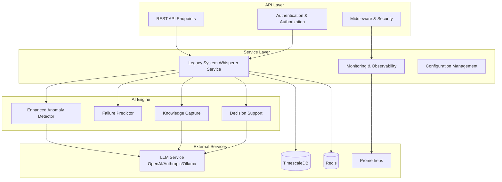

# Legacy System Whisperer

## Overview

The **Legacy System Whisperer** is an enterprise-grade AI-powered solution for managing, monitoring, and optimizing legacy systems. It combines advanced machine learning, Large Language Model (LLM) integration, and expert knowledge capture to provide predictive maintenance, intelligent decision support, and proactive system management.

## Key Features

### 🔍 Enhanced Anomaly Detection
- **VAE-based Detection**: Advanced Variational Autoencoder models tuned for legacy systems
- **LLM-Enhanced Analysis**: Contextual analysis using state-of-the-art language models
- **Pattern Recognition**: Historical pattern matching with expert knowledge integration
- **Real-time Monitoring**: Continuous system health assessment

### 📊 Predictive Analytics
- **Failure Prediction**: Multi-horizon failure probability analysis (1-180 days)
- **Performance Monitoring**: Trend analysis and degradation detection
- **Maintenance Scheduling**: Optimization-based maintenance planning
- **Time Series Analysis**: LSTM, ARIMA, and Prophet model support

### 🧠 Tribal Knowledge Capture
- **Expert Interviews**: Structured knowledge extraction from domain experts
- **Documentation Mining**: Automated extraction from legacy documentation
- **Knowledge Validation**: Peer review and confidence scoring
- **Semantic Search**: Intelligent knowledge retrieval

### 💡 Intelligent Decision Support
- **Multi-dimensional Analysis**: Financial, operational, compliance, and risk assessment
- **Action Planning**: Detailed implementation roadmaps with resource allocation
- **Impact Assessment**: Business impact analysis across stakeholder groups
- **Recommendation Engine**: Context-aware recommendations with confidence scoring

### 🛠 System Management
- **System Registration**: Centralized legacy system inventory
- **Health Dashboards**: Comprehensive system health visualization
- **Alert Management**: Intelligent alerting with escalation policies
- **Bulk Operations**: Scalable multi-system analysis

## Architecture



## Supported System Types

- **Mainframes**: IBM z/OS, z/VSE, z/TPF
- **COBOL Systems**: Legacy business applications
- **SCADA**: Industrial control systems
- **Medical Devices**: Healthcare equipment and systems
- **PLCs**: Programmable Logic Controllers
- **DCS**: Distributed Control Systems
- **Legacy Databases**: Historical database systems
- **Embedded Systems**: Real-time control systems
- **Proprietary Protocols**: Custom communication protocols

## Quick Start

### Prerequisites

- Python 3.10+
- Docker and Docker Compose
- Kubernetes cluster (for production)
- PostgreSQL/TimescaleDB
- Redis
- Access to LLM services (OpenAI, Anthropic, or Ollama)

### Installation

1. **Clone the repository**
```bash
git clone <repository-url>
cd qbitel/ai_engine/legacy
```

2. **Install dependencies**
```bash
pip install -r requirements.txt
```

3. **Configure environment**
```bash
cp .env.example .env
# Edit .env with your configuration
```

4. **Initialize database**
```bash
python -m legacy.scripts.init_database
```

5. **Start services**
```bash
# Development
python -m legacy.run_dev

# Production (Docker)
docker-compose up -d
```

### Configuration

Create a configuration file `config/legacy_config.yaml`:

```yaml
legacy_system_whisperer:
  enabled: true
  service_name: "legacy-system-whisperer"
  max_registered_systems: 1000
  
  anomaly_detection:
    anomaly_threshold: 0.95
    llm_analysis_enabled: true
    detection_interval_seconds: 300
    
  predictive_analytics:
    failure_prediction_enabled: true
    min_historical_data_days: 30
    prediction_confidence_threshold: 0.75
    
  knowledge_capture:
    llm_processing_enabled: true
    session_timeout_minutes: 120
    peer_review_required: true
    
  decision_support:
    recommendation_enabled: true
    max_recommendations: 10
    llm_recommendation_enhancement: true
    
  llm_integration:
    primary_provider: "openai"
    fallback_providers: ["anthropic", "ollama"]
    max_tokens: 4000
    temperature: 0.1
    
  monitoring:
    metrics_collection_enabled: true
    prometheus_enabled: true
    health_check_enabled: true
    
  security:
    encrypt_sensitive_data: true
    audit_logging: true
    gdpr_compliance: true
```

## API Reference

### Authentication

All API endpoints require JWT authentication:

```bash
# Get access token
curl -X POST /api/v1/auth/login \
  -H "Content-Type: application/json" \
  -d '{"username": "your_username", "password": "your_password"}'

# Use token in requests
curl -H "Authorization: Bearer <token>" /api/v1/legacy-system-whisperer/health
```

### System Registration

Register a legacy system for monitoring:

```bash
curl -X POST /api/v1/legacy-system-whisperer/systems \
  -H "Authorization: Bearer <token>" \
  -H "Content-Type: application/json" \
  -d '{
    "system_id": "mainframe_001",
    "system_name": "Main Production Mainframe",
    "system_type": "mainframe",
    "criticality": "critical",
    "compliance_requirements": ["sox", "hipaa"],
    "enable_monitoring": true
  }'
```

### Health Analysis

Analyze system health and predict failures:

```bash
curl -X POST /api/v1/legacy-system-whisperer/systems/mainframe_001/analyze \
  -H "Authorization: Bearer <token>" \
  -H "Content-Type: application/json" \
  -d '{
    "current_metrics": {
      "cpu_utilization": 75.5,
      "memory_utilization": 82.0,
      "response_time_ms": 250.0,
      "error_rate": 0.02
    },
    "prediction_horizon": "medium_term",
    "include_recommendations": true
  }'
```

### Knowledge Capture

Capture expert knowledge:

```bash
curl -X POST /api/v1/legacy-system-whisperer/knowledge/capture \
  -H "Authorization: Bearer <token>" \
  -H "Content-Type: application/json" \
  -d '{
    "expert_id": "expert_001",
    "session_type": "maintenance_knowledge",
    "expert_input": "The system requires restart every 6 months to prevent memory fragmentation issues.",
    "system_id": "mainframe_001"
  }'
```

### Decision Support

Get intelligent recommendations:

```bash
curl -X POST /api/v1/legacy-system-whisperer/systems/mainframe_001/decision-support \
  -H "Authorization: Bearer <token>" \
  -H "Content-Type: application/json" \
  -d '{
    "decision_category": "maintenance_planning",
    "current_situation": {
      "performance_degraded": true,
      "error_rate_increasing": true
    },
    "objectives": ["improve_performance", "reduce_downtime"],
    "constraints": {"budget": 100000, "maintenance_window": "weekend"}
  }'
```

## Deployment

### Development

```bash
# Start development server
python -m legacy.dev_server --host 0.0.0.0 --port 8000 --reload

# Run with specific config
python -m legacy.dev_server --config config/development.yaml
```

### Docker

```bash
# Build image
docker build -t qbitel/legacy-whisperer:latest .

# Run container
docker run -d \
  --name legacy-whisperer \
  -p 8000:8000 \
  -e QBITEL_AI_DB_HOST=postgres \
  -e QBITEL_AI_REDIS_HOST=redis \
  qbitel/legacy-whisperer:latest
```

### Kubernetes

```bash
# Deploy using Helm
helm install legacy-whisperer ./helm/legacy-whisperer \
  --namespace qbitel \
  --values values.production.yaml

# Or use kubectl
kubectl apply -f k8s/
```

### Production Checklist

- [ ] Database configured with proper backup
- [ ] Redis configured with persistence
- [ ] LLM service credentials configured
- [ ] Monitoring and alerting setup
- [ ] SSL/TLS certificates configured
- [ ] Resource limits and autoscaling configured
- [ ] Security policies applied
- [ ] Disaster recovery plan in place

## Monitoring & Operations

### Health Checks

```bash
# Service health
curl /api/v1/legacy-system-whisperer/health

# Component status
curl /api/v1/legacy-system-whisperer/service/status
```

### Metrics

Prometheus metrics are exposed at `/metrics`:

- `legacy_whisperer_registered_systems_total`
- `legacy_whisperer_anomalies_detected_total`
- `legacy_whisperer_failure_predictions_total`
- `legacy_whisperer_llm_requests_total`
- `legacy_whisperer_system_health_score`

### Logging

Structured JSON logs with multiple levels:

- **Application logs**: `/var/log/legacy-whisperer/app.log`
- **Audit logs**: `/var/log/legacy-whisperer/audit.log`
- **Security logs**: `/var/log/legacy-whisperer/security.log`
- **Performance logs**: `/var/log/legacy-whisperer/performance.log`

### Alerting

Configure alerts for:

- System failures or high anomaly rates
- LLM service connectivity issues
- High response times or error rates
- Resource usage thresholds
- Security events

## Security

### Authentication & Authorization

- **JWT-based authentication** with configurable expiration
- **Role-based access control** (RBAC) with fine-grained permissions
- **System-level access control** for multi-tenant environments
- **API rate limiting** to prevent abuse

### Data Protection

- **Encryption at rest** for sensitive data
- **Encryption in transit** using TLS 1.3
- **Data anonymization** for privacy compliance
- **Audit trails** for all sensitive operations

### Compliance

- **GDPR compliance** with data retention policies
- **SOX compliance** with audit logging
- **HIPAA compliance** for healthcare systems
- **Industry-specific** compliance frameworks

## Troubleshooting

### Common Issues

**Service won't start**
```bash
# Check configuration
python -m legacy.validate_config --config config/legacy_config.yaml

# Check dependencies
python -m legacy.health_check --component all
```

**High memory usage**
```bash
# Check memory limits
kubectl describe pod legacy-whisperer-xxx

# Monitor memory usage
curl /api/v1/legacy-system-whisperer/metrics | grep memory
```

**LLM service errors**
```bash
# Test LLM connectivity
python -m legacy.test_llm --provider openai

# Check LLM service logs
kubectl logs -f deployment/legacy-whisperer | grep llm
```

### Debug Mode

Enable debug logging:

```bash
export QBITEL_AI_LOG_LEVEL=DEBUG
python -m legacy.dev_server --debug
```

### Performance Tuning

**Database optimization**:
- Configure connection pooling
- Setup read replicas for analytics
- Optimize indexes for time-series queries

**Memory optimization**:
- Adjust VAE model parameters
- Configure LLM token limits
- Optimize caching strategies

**CPU optimization**:
- Configure async workers
- Optimize batch processing sizes
- Use GPU for ML workloads

## Contributing

### Development Setup

1. **Fork and clone the repository**
2. **Create virtual environment**
   ```bash
   python -m venv venv
   source venv/bin/activate
   ```
3. **Install development dependencies**
   ```bash
   pip install -r requirements-dev.txt
   ```
4. **Run tests**
   ```bash
   pytest ai_engine/legacy/tests/ -v
   ```
5. **Code formatting**
   ```bash
   black ai_engine/legacy/
   isort ai_engine/legacy/
   ```

### Testing

```bash
# Unit tests
pytest ai_engine/legacy/tests/unit/ -v

# Integration tests
pytest ai_engine/legacy/tests/integration/ -v

# Performance tests
pytest ai_engine/legacy/tests/performance/ -v

# Security tests
pytest ai_engine/legacy/tests/security/ -v

# Coverage report
pytest --cov=ai_engine/legacy --cov-report=html
```

### Code Quality

- **Type hints**: All code must include type hints
- **Documentation**: Docstrings for all classes and functions
- **Testing**: 90%+ test coverage required
- **Linting**: Pass flake8, black, and mypy checks

## License

Proprietary software. All rights reserved.

## Support

- **Documentation**: [https://docs.qbitel.com/legacy-whisperer](https://docs.qbitel.com/legacy-whisperer)
- **Support Portal**: [https://support.qbitel.com](https://support.qbitel.com)
- **Community**: [https://community.qbitel.com](https://community.qbitel.com)
- **Enterprise Support**: enterprise-support@qbitel.com

## Changelog

### Version 1.0.0 (Current)

- ✅ Enhanced anomaly detection with LLM integration
- ✅ Predictive analytics with multi-horizon forecasting
- ✅ Tribal knowledge capture and management
- ✅ Intelligent decision support system
- ✅ Comprehensive monitoring and observability
- ✅ Enterprise-grade security and compliance
- ✅ Production-ready deployment configurations
- ✅ Comprehensive API and documentation

### Roadmap

- 🔄 **v1.1.0**: Advanced visualization dashboards
- 🔄 **v1.2.0**: Integration with external ITSM systems
- 🔄 **v1.3.0**: Multi-cloud deployment support
- 🔄 **v1.4.0**: Advanced ML model improvements
- 🔄 **v2.0.0**: Next-generation AI capabilities