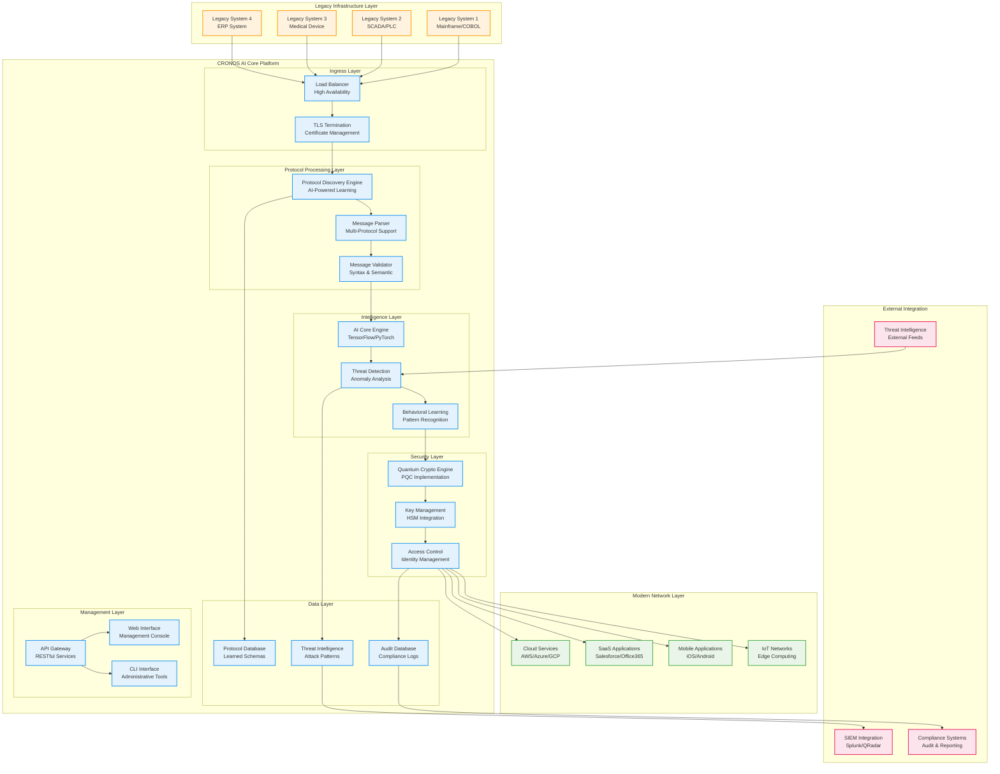
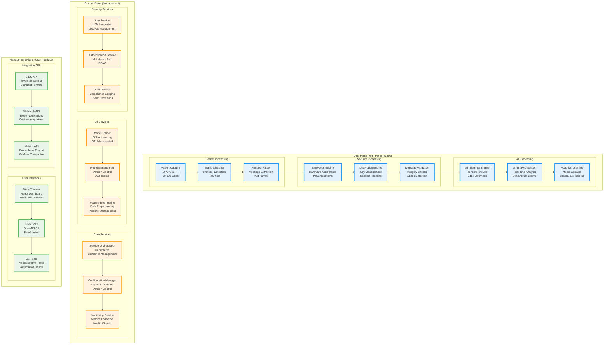
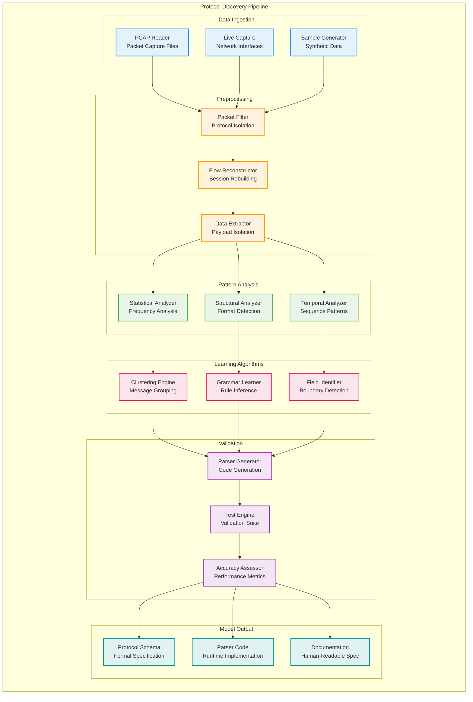
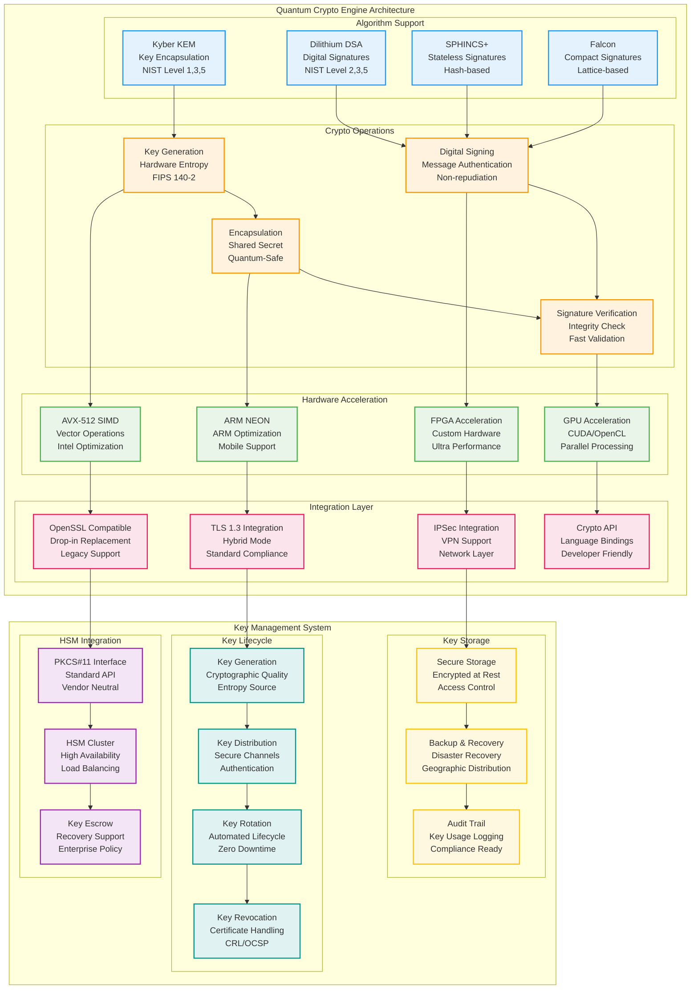

# CRONOS AI - Technical Architecture & Design Document

**Document Classification**: Technical Architecture Specification  
**Target Audience**: Solution Architects, Senior Engineers, Technical Leads  
**Version**: 2.0  
**Date**: September 2025  
**Status**: Under Development (MVP 25% Complete)

---

## Table of Contents

1. [System Architecture Overview](#system-architecture-overview)
2. [Component Architecture](#component-architecture)
3. [AI Engine Design](#ai-engine-design)
4. [Protocol Discovery Architecture](#protocol-discovery-architecture)
5. [Quantum Encryption Module](#quantum-encryption-module)
6. [Data Flow Architecture](#data-flow-architecture)
7. [Security Architecture](#security-architecture)
8. [Performance Architecture](#performance-architecture)
9. [Deployment Architecture](#deployment-architecture)
10. [Integration Architecture](#integration-architecture)
11. [API Specifications](#api-specifications)
12. [Development Architecture](#development-architecture)

---

## System Architecture Overview

### High-Level System Design

CRONOS AI is designed as a distributed, intelligent security appliance that operates as a transparent proxy between legacy systems and modern networks. The architecture follows microservices principles with AI-powered components for protocol discovery and threat detection.



### Core Design Principles

**1. Zero-Touch Integration**
- No modifications required to legacy systems
- Transparent proxy operation
- Maintains original protocol semantics

**2. AI-First Architecture**
- Machine learning at the core of protocol discovery
- Continuous learning and adaptation
- Predictive threat detection

**3. Quantum-Safe by Design**
- Post-quantum cryptography implementation
- Crypto-agility for algorithm updates
- Future-proof security architecture

**4. Enterprise-Grade Reliability**
- High availability with automatic failover
- Horizontal scaling capabilities
- 99.99% uptime SLA design

**5. Compliance-Ready**
- Built-in audit logging
- Regulatory reporting capabilities
- Data sovereignty controls

---

## Component Architecture

### Microservices Architecture Design



### Component Specifications

#### Data Plane Components

**Packet Capture Service**
- **Technology**: DPDK + eBPF for kernel bypass
- **Performance**: 10-100 Gbps line rate
- **Features**: Zero-copy packet processing, hardware timestamping
- **Language**: C++ with SIMD optimizations
- **Memory**: Lock-free ring buffers, NUMA awareness

**Traffic Classifier**
- **Technology**: DPI + Machine Learning classification
- **Performance**: 10M+ packets per second classification
- **Features**: Protocol fingerprinting, encrypted traffic analysis
- **Language**: C++ with Python ML integration
- **Memory**: Shared memory for ML model inference

**Protocol Parser**
- **Technology**: Generated parsers from learned grammars
- **Performance**: 1M+ messages per second parsing
- **Features**: Adaptive parsing, error recovery, format validation
- **Language**: C++ with code generation
- **Memory**: Memory pools for zero-allocation parsing

#### Control Plane Components

**Service Orchestrator**
- **Technology**: Kubernetes + Custom Controllers
- **Features**: Auto-scaling, health monitoring, rolling updates
- **Language**: Go + Kubernetes API
- **Storage**: etcd for distributed configuration

**Model Trainer**
- **Technology**: TensorFlow + PyTorch distributed training
- **Features**: Federated learning, online learning, model compression
- **Language**: Python with GPU acceleration
- **Storage**: Model registry with versioning

**Key Management Service**
- **Technology**: PKCS#11 + Hardware Security Modules
- **Features**: Key lifecycle, rotation, escrow, audit
- **Language**: C++ with HSM integration
- **Storage**: Encrypted key database with replication

---

## AI Engine Design

### Machine Learning Architecture

```mermaid
flowchart TB
    subgraph "Data Collection Layer"
        packet_stream["Packet Stream<br/>Real-time Traffic"]
        historical_data["Historical Data<br/>Protocol Samples"]
        feedback_loop["Feedback Loop<br/>Human Validation"]
    end
    
    subgraph "Feature Engineering Pipeline"
        preprocessor["Data Preprocessor<br/>Normalization & Cleaning"]
        extractor["Feature Extractor<br/>Statistical & Structural"]
        encoder["Sequence Encoder<br/>Temporal Patterns"]
    end
    
    subgraph "Protocol Discovery Models"
        direction LR
        
        subgraph "Unsupervised Learning"
            clustering["Clustering Model<br/>Message Grouping<br/>K-means++"]
            autoencoder["Autoencoder<br/>Pattern Compression<br/>Variational"]
            grammar_infer["Grammar Inference<br/>Structure Learning<br/>PCFG"]
        end
        
        subgraph "Supervised Learning"
            classifier["Protocol Classifier<br/>Multi-class CNN<br/>ResNet Architecture"]
            field_detector["Field Detector<br/>Sequence Labeling<br/>BiLSTM-CRF"]
            type_predictor["Type Predictor<br/>Regression Model<br/>XGBoost"]
        end
        
        subgraph "Reinforcement Learning"
            parser_agent["Parser Agent<br/>Action Selection<br/>DQN"]
            validator_agent["Validator Agent<br/>Quality Assessment<br/>PPO"]
            optimizer_agent["Optimizer Agent<br/>Performance Tuning<br/>A3C"]
        end
    end
    
    subgraph "Threat Detection Models"
        direction LR
        
        subgraph "Anomaly Detection"
            isolation_forest["Isolation Forest<br/>Outlier Detection<br/>Ensemble Method"]
            lstm_anomaly["LSTM Anomaly<br/>Sequence Deviation<br/>Time Series"]
            vae_anomaly["VAE Anomaly<br/>Reconstruction Error<br/>Generative Model"]
        end
        
        subgraph "Attack Classification"
            cnn_attack["CNN Classifier<br/>Pattern Recognition<br/>1D Convolution"]
            rnn_attack["RNN Classifier<br/>Sequence Analysis<br/>GRU Architecture"]
            transformer_attack["Transformer<br/>Attention Mechanism<br/>BERT-style"]
        end
    end
    
    subgraph "Model Management"
        registry["Model Registry<br/>Version Control<br/>MLflow"]
        deployer["Model Deployer<br/>A/B Testing<br/>Canary Release"]
        monitor["Model Monitor<br/>Performance Tracking<br/>Drift Detection"]
    end
    
    packet_stream --> preprocessor
    historical_data --> preprocessor
    feedback_loop --> preprocessor
    
    preprocessor --> extractor --> encoder
    
    encoder --> clustering
    encoder --> autoencoder
    encoder --> grammar_infer
    encoder --> classifier
    encoder --> field_detector
    encoder --> type_predictor
    encoder --> parser_agent
    encoder --> validator_agent
    encoder --> optimizer_agent
    
    encoder --> isolation_forest
    encoder --> lstm_anomaly
    encoder --> vae_anomaly
    encoder --> cnn_attack
    encoder --> rnn_attack
    encoder --> transformer_attack
    
    clustering --> registry
    classifier --> registry
    isolation_forest --> registry
    
    registry --> deployer --> monitor
    
    classDef data fill:#e3f2fd,stroke:#2196f3,stroke-width:2px
    classDef processing fill:#fff3e0,stroke:#ff9800,stroke-width:2px
    classDef unsupervised fill:#e8f5e8,stroke:#4caf50,stroke-width:2px
    classDef supervised fill:#fce4ec,stroke:#e91e63,stroke-width:2px
    classDef reinforcement fill:#f3e5f5,stroke:#9c27b0,stroke-width:2px
    classDef anomaly fill:#e0f2f1,stroke:#009688,stroke-width:2px
    classDef attack fill:#fff8e1,stroke:#ffc107,stroke-width:2px
    classDef management fill:#efebe9,stroke:#795548,stroke-width:2px
    
    class packet_stream,historical_data,feedback_loop data
    class preprocessor,extractor,encoder processing
    class clustering,autoencoder,grammar_infer unsupervised
    class classifier,field_detector,type_predictor supervised
    class parser_agent,validator_agent,optimizer_agent reinforcement
    class isolation_forest,lstm_anomaly,vae_anomaly anomaly
    class cnn_attack,rnn_attack,transformer_attack attack
    class registry,deployer,monitor management
```



### AI Model Specifications

#### Protocol Discovery Models

**1. Grammar Inference Engine**
```python
# Probabilistic Context-Free Grammar Inference
class PCFGInference:
    def __init__(self):
        self.grammar_rules = {}
        self.rule_probabilities = {}
        self.terminal_symbols = set()
        self.non_terminal_symbols = set()
    
    def infer_grammar(self, message_sequences):
        # Extract patterns from message sequences
        patterns = self.extract_patterns(message_sequences)
        
        # Generate grammar rules
        rules = self.generate_rules(patterns)
        
        # Calculate rule probabilities
        probabilities = self.calculate_probabilities(rules, message_sequences)
        
        return Grammar(rules, probabilities)
```

**2. Field Boundary Detection**
```python
# BiLSTM-CRF for field boundary detection
class FieldDetector(nn.Module):
    def __init__(self, vocab_size, embedding_dim, hidden_dim, num_tags):
        super().__init__()
        self.embedding = nn.Embedding(vocab_size, embedding_dim)
        self.lstm = nn.LSTM(embedding_dim, hidden_dim // 2, 
                           num_layers=2, bidirectional=True, batch_first=True)
        self.hidden2tag = nn.Linear(hidden_dim, num_tags)
        self.crf = CRF(num_tags, batch_first=True)
    
    def forward(self, sequences, tags=None):
        embeddings = self.embedding(sequences)
        lstm_out, _ = self.lstm(embeddings)
        emissions = self.hidden2tag(lstm_out)
        
        if tags is not None:
            return -self.crf(emissions, tags, mask=mask)
        else:
            return self.crf.decode(emissions, mask=mask)
```

**3. Anomaly Detection Engine**
```python
# Variational Autoencoder for anomaly detection
class VAEAnomalyDetector(nn.Module):
    def __init__(self, input_dim, latent_dim):
        super().__init__()
        self.encoder = nn.Sequential(
            nn.Linear(input_dim, 512),
            nn.ReLU(),
            nn.Linear(512, 256),
            nn.ReLU(),
            nn.Linear(256, latent_dim * 2)  # mu and logvar
        )
        
        self.decoder = nn.Sequential(
            nn.Linear(latent_dim, 256),
            nn.ReLU(),
            nn.Linear(256, 512),
            nn.ReLU(),
            nn.Linear(512, input_dim),
            nn.Sigmoid()
        )
    
    def encode(self, x):
        h = self.encoder(x)
        mu, logvar = torch.chunk(h, 2, dim=1)
        return mu, logvar
    
    def reparameterize(self, mu, logvar):
        std = torch.exp(0.5 * logvar)
        eps = torch.randn_like(std)
        return mu + eps * std
    
    def decode(self, z):
        return self.decoder(z)
    
    def forward(self, x):
        mu, logvar = self.encode(x)
        z = self.reparameterize(mu, logvar)
        return self.decode(z), mu, logvar
    
    def anomaly_score(self, x):
        recon_x, mu, logvar = self(x)
        recon_loss = F.mse_loss(recon_x, x, reduction='none').sum(dim=1)
        kl_loss = -0.5 * torch.sum(1 + logvar - mu.pow(2) - logvar.exp(), dim=1)
        return recon_loss + kl_loss
```

---

## Protocol Discovery Architecture

### Discovery Engine Implementation



### Discovery Algorithm Implementation

**Statistical Analysis Engine**
```cpp
class StatisticalAnalyzer {
private:
    struct ByteFrequency {
        std::array<uint64_t, 256> frequency;
        uint64_t total_bytes;
        double entropy;
    };
    
    struct FieldStatistics {
        size_t min_length;
        size_t max_length;
        double avg_length;
        std::unordered_map<std::string, uint64_t> value_frequency;
        bool is_fixed_length;
        bool is_printable;
        bool is_numeric;
    };

public:
    ByteFrequency analyzeByteDistribution(const std::vector<uint8_t>& data) {
        ByteFrequency freq = {};
        freq.total_bytes = data.size();
        
        for (uint8_t byte : data) {
            freq.frequency[byte]++;
        }
        
        // Calculate Shannon entropy
        freq.entropy = 0.0;
        for (size_t i = 0; i < 256; i++) {
            if (freq.frequency[i] > 0) {
                double p = static_cast<double>(freq.frequency[i]) / freq.total_bytes;
                freq.entropy -= p * std::log2(p);
            }
        }
        
        return freq;
    }
    
    std::vector<size_t> findFieldBoundaries(const std::vector<uint8_t>& message) {
        std::vector<size_t> boundaries;
        
        // Analyze entropy changes
        std::vector<double> entropy_profile = calculateEntropyProfile(message);
        
        // Detect sudden changes in entropy (field boundaries)
        for (size_t i = 1; i < entropy_profile.size() - 1; i++) {
            double gradient = std::abs(entropy_profile[i+1] - entropy_profile[i-1]);
            if (gradient > ENTROPY_THRESHOLD) {
                boundaries.push_back(i);
            }
        }
        
        return boundaries;
    }
};
```

**Grammar Inference Engine**
```cpp
class GrammarInferenceEngine {
private:
    struct ProductionRule {
        std::string left_hand_side;
        std::vector<std::string> right_hand_side;
        double probability;
    };
    
    struct Grammar {
        std::vector<ProductionRule> rules;
        std::string start_symbol;
        std::set<std::string> terminals;
        std::set<std::string> non_terminals;
    };

public:
    Grammar inferGrammar(const std::vector<std::vector<uint8_t>>& messages) {
        Grammar grammar;
        
        // Step 1: Extract common subsequences
        auto patterns = extractCommonPatterns(messages);
        
        // Step 2: Identify terminal and non-terminal symbols
        classifySymbols(patterns, grammar.terminals, grammar.non_terminals);
        
        // Step 3: Generate production rules
        grammar.rules = generateProductionRules(patterns);
        
        // Step 4: Calculate rule probabilities
        calculateRuleProbabilities(grammar.rules, messages);
        
        // Step 5: Optimize grammar (remove redundant rules)
        optimizeGrammar(grammar);
        
        return grammar;
    }

private:
    std::vector<std::string> extractCommonPatterns(
        const std::vector<std::vector<uint8_t>>& messages) {
        
        std::unordered_map<std::string, uint64_t> pattern_frequency;
        
        // Extract all possible subsequences
        for (const auto& message : messages) {
            for (size_t len = 1; len <= message.size(); len++) {
                for (size_t pos = 0; pos <= message.size() - len; pos++) {
                    std::string pattern(message.begin() + pos, 
                                      message.begin() + pos + len);
                    pattern_frequency[pattern]++;
                }
            }
        }
        
        // Filter patterns by frequency threshold
        std::vector<std::string> common_patterns;
        size_t frequency_threshold = messages.size() * 0.1; // 10% threshold
        
        for (const auto& [pattern, frequency] : pattern_frequency) {
            if (frequency >= frequency_threshold) {
                common_patterns.push_back(pattern);
            }
        }
        
        return common_patterns;
    }
};
```

---

## Quantum Encryption Module

### Post-Quantum Cryptography Implementation



### Quantum Crypto Implementation

**Kyber Implementation (C++)**
```cpp
#include <immintrin.h>  // AVX-512 support

class KyberKEM {
private:
    static constexpr size_t KYBER_K = 3;  // Kyber-768
    static constexpr size_t KYBER_Q = 3329;
    static constexpr size_t KYBER_N = 256;
    
    // AVX-512 optimized polynomial operations
    void poly_ntt_avx512(int16_t* poly) {
        const __m512i q_vec = _mm512_set1_epi16(KYBER_Q);
        const __m512i mont_const = _mm512_set1_epi16(MONT_R);
        
        for (size_t len = 128; len >= 2; len >>= 1) {
            for (size_t start = 0; start < KYBER_N; start += 2 * len) {
                const int16_t zeta = ntt_zetas[++k];
                const __m512i zeta_vec = _mm512_set1_epi16(zeta);
                
                for (size_t j = start; j < start + len; j += 32) {
                    __m512i a = _mm512_loadu_epi16(&poly[j]);
                    __m512i b = _mm512_loadu_epi16(&poly[j + len]);
                    
                    // Montgomery reduction using AVX-512
                    __m512i t = montgomery_multiply_avx512(b, zeta_vec, q_vec);
                    
                    _mm512_storeu_epi16(&poly[j], _mm512_add_epi16(a, t));
                    _mm512_storeu_epi16(&poly[j + len], _mm512_sub_epi16(a, t));
                }
            }
        }
    }
    
    __m512i montgomery_multiply_avx512(__m512i a, __m512i b, __m512i q) {
        __m512i lo = _mm512_mullo_epi16(a, b);
        __m512i hi = _mm512_mulhi_epi16(a, b);
        
        __m512i t = _mm512_mullo_epi16(lo, _mm512_set1_epi16(MONT_QINV));
        t = _mm512_mulhi_epi16(t, q);
        
        return _mm512_sub_epi16(hi, t);
    }

public:
    struct KeyPair {
        std::array<uint8_t, KYBER_PUBLICKEYBYTES> public_key;
        std::array<uint8_t, KYBER_SECRETKEYBYTES> secret_key;
    };
    
    struct EncapsulationResult {
        std::array<uint8_t, KYBER_CIPHERTEXTBYTES> ciphertext;
        std::array<uint8_t, KYBER_SSBYTES> shared_secret;
    };
    
    KeyPair generateKeyPair() {
        KeyPair keypair;
        
        // Generate random seed
        std::array<uint8_t, KYBER_SYMBYTES> seed;
        randombytes(seed.data(), KYBER_SYMBYTES);
        
        // Expand seed into polynomial matrix A
        std::array<std::array<int16_t, KYBER_N>, KYBER_K> A[KYBER_K];
        expandSeed(seed, A);
        
        // Generate secret and error polynomials
        std::array<int16_t, KYBER_N> s[KYBER_K], e[KYBER_K];
        sampleErrorDistribution(s, e);
        
        // Compute public key: t = A*s + e
        std::array<int16_t, KYBER_N> t[KYBER_K];
        matrixVectorMultiply(A, s, e, t);
        
        // Pack keys
        packPublicKey(keypair.public_key, t, seed);
        packSecretKey(keypair.secret_key, s);
        
        return keypair;
    }
    
    EncapsulationResult encapsulate(const std::array<uint8_t, KYBER_PUBLICKEYBYTES>& public_key) {
        EncapsulationResult result;
        
        // Generate random message
        std::array<uint8_t, KYBER_SYMBYTES> m;
        randombytes(m.data(), KYBER_SYMBYTES);
        
        // Unpack public key
        std::array<int16_t, KYBER_N> t[KYBER_K];
        std::array<uint8_t, KYBER_SYMBYTES> rho;
        unpackPublicKey(public_key, t, rho);
        
        // Regenerate matrix A from seed
        std::array<std::array<int16_t, KYBER_N>, KYBER_K> A[KYBER_K];
        expandSeed(rho, A);
        
        // Sample error polynomials
        std::array<int16_t, KYBER_N> r[KYBER_K], e1[KYBER_K], e2;
        sampleErrorDistribution(r, e1, e2, m);
        
        // Compute ciphertext: c = A^T*r + e1, v = t^T*r + e2 + Decompress(m)
        computeCiphertext(A, t, r, e1, e2, m, result.ciphertext);
        
        // Derive shared secret
        sha3_256(result.shared_secret.data(), m.data(), KYBER_SYMBYTES);
        
        return result;
    }
    
    std::array<uint8_t, KYBER_SSBYTES> decapsulate(
        const std::array<uint8_t, KYBER_CIPHERTEXTBYTES>& ciphertext,
        const std::array<uint8_t, KYBER_SECRETKEYBYTES>& secret_key) {
        
        // Unpack secret key
        std::array<int16_t, KYBER_N> s[KYBER_K];
        unpackSecretKey(secret_key, s);
        
        // Decrypt ciphertext
        std::array<uint8_t, KYBER_SYMBYTES> m;
        decrypt(ciphertext, s, m);
        
        // Derive shared secret
        std::array<uint8_t, KYBER_SSBYTES> shared_secret;
        sha3_256(shared_secret.data(), m.data(), KYBER_SYMBYTES);
        
        return shared_secret;
    }
};
```

**Hardware Security Module Integration**
```cpp
class HSMIntegration {
private:
    CK_FUNCTION_LIST_PTR pkcs11_functions;
    CK_SESSION_HANDLE session;
    CK_SLOT_ID slot_id;

public:
    bool initialize(const std::string& pkcs11_library_path) {
        // Load PKCS#11 library
        void* library = dlopen(pkcs11_library_path.c_str(), RTLD_LAZY);
        if (!library) return false;
        
        // Get function list
        CK_C_GetFunctionList get_function_list = 
            (CK_C_GetFunctionList)dlsym(library, "C_GetFunctionList");
        
        if (get_function_list(&pkcs11_functions) != CKR_OK) return false;
        
        // Initialize PKCS#11
        if (pkcs11_functions->C_Initialize(nullptr) != CKR_OK) return false;
        
        // Open session
        return openSession();
    }
    
    std::vector<uint8_t> generateQuantumSafeKey(KeyType type, size_t key_size) {
        CK_MECHANISM mechanism;
        
        switch (type) {
            case KeyType::KYBER_768:
                mechanism.mechanism = CKM_KYBER_768_KEY_PAIR_GEN;
                break;
            case KeyType::DILITHIUM_3:
                mechanism.mechanism = CKM_DILITHIUM_3_KEY_PAIR_GEN;
                break;
            default:
                throw std::invalid_argument("Unsupported key type");
        }
        
        mechanism.pParameter = nullptr;
        mechanism.ulParameterLen = 0;
        
        CK_OBJECT_HANDLE public_key, private_key;
        
        CK_ATTRIBUTE public_template[] = {
            {CKA_ENCRYPT, &ck_true, sizeof(ck_true)},
            {CKA_VERIFY, &ck_true, sizeof(ck_true)},
            {CKA_TOKEN, &ck_false, sizeof(ck_false)}
        };
        
        CK_ATTRIBUTE private_template[] = {
            {CKA_DECRYPT, &ck_true, sizeof(ck_true)},
            {CKA_SIGN, &ck_true, sizeof(ck_true)},
            {CKA_TOKEN, &ck_false, sizeof(ck_false)},
            {CKA_SENSITIVE, &ck_true, sizeof(ck_true)}
        };
        
        CK_RV rv = pkcs11_functions->C_GenerateKeyPair(
            session,
            &mechanism,
            public_template, sizeof(public_template) / sizeof(CK_ATTRIBUTE),
            private_template, sizeof(private_template) / sizeof(CK_ATTRIBUTE),
            &public_key,
            &private_key
        );
        
        if (rv != CKR_OK) {
            throw std::runtime_error("Failed to generate key pair");
        }
        
        return extractPublicKey(public_key);
    }
    
    std::vector<uint8_t> performEncapsulation(
        CK_OBJECT_HANDLE public_key,
        const std::vector<uint8_t>& message) {
        
        CK_MECHANISM mechanism = {CKM_KYBER_768_KEM, nullptr, 0};
        
        CK_ULONG ciphertext_len;
        CK_RV rv = pkcs11_functions->C_Encrypt(
            session,
            &mechanism,
            const_cast<CK_BYTE_PTR>(message.data()),
            message.size(),
            nullptr,
            &ciphertext_len
        );
        
        if (rv != CKR_OK) return {};
        
        std::vector<uint8_t> ciphertext(ciphertext_len);
        rv = pkcs11_functions->C_Encrypt(
            session,
            &mechanism,
            const_cast<CK_BYTE_PTR>(message.data()),
            message.size(),
            ciphertext.data(),
            &ciphertext_len
        );
        
        return (rv == CKR_OK) ? ciphertext : std::vector<uint8_t>{};
    }
};
```

---

## Data Flow Architecture

### Message Processing Pipeline

```mermaid
flowchart LR
    subgraph "Ingress Processing"
        direction TB
        ingress_lb["Ingress Load Balancer<br/>Layer 4 + Layer 7<br/>Health Checks"]
        tls_termination["TLS Termination<br/>Certificate Management<br/>SNI Support"]
        rate_limiting["Rate Limiting<br/>DDoS Protection<br/>Circuit Breaker"]
    end
    
    subgraph "Protocol Processing"
        direction TB
        protocol_detect["Protocol Detection<br/>Deep Packet Inspection<br/>ML Classification"]
        message_parse["Message Parsing<br/>Structure Extraction<br/>Field Identification"]
        validation["Message Validation<br/>Syntax Checking<br/>Semantic Analysis"]
    end
    
    subgraph "Security Processing"
        direction TB
        threat_analysis["Threat Analysis<br/>Anomaly Detection<br/>Attack Classification"]
        access_control["Access Control<br/>Authentication<br/>Authorization"]
        crypto_processing["Crypto Processing<br/>Encryption/Decryption<br/>Key Management"]
    end
    
    subgraph "AI Processing"
        direction TB
        feature_extraction["Feature Extraction<br/>Statistical Analysis<br/>Pattern Recognition"]
        model_inference["Model Inference<br/>Real-time Prediction<br/>Batch Processing"]
        learning_update["Learning Update<br/>Model Adaptation<br/>Feedback Integration"]
    end
    
    subgraph "Egress Processing"
        direction TB
        message_reconstruction["Message Reconstruction<br/>Format Conversion<br/>Protocol Translation"]
        egress_crypto["Egress Encryption<br/>End-to-End Security<br/>Perfect Forward Secrecy"]
        egress_routing["Egress Routing<br/>Load Balancing<br/>Failover"]
    end
    
    subgraph "Monitoring & Audit"
        direction TB
        metrics_collection["Metrics Collection<br/>Performance Monitoring<br/>Resource Utilization"]
        audit_logging["Audit Logging<br/>Security Events<br/>Compliance Records"]
        alerting["Alerting<br/>Threshold Monitoring<br/>Incident Response"]
    end
    
    ingress_lb --> tls_termination
    tls_termination --> rate_limiting
    rate_limiting --> protocol_detect
    
    protocol_detect --> message_parse
    message_parse --> validation
    validation --> threat_analysis
    
    threat_analysis --> access_control
    access_control --> crypto_processing
    crypto_processing --> feature_extraction
    
    feature_extraction --> model_inference
    model_inference --> learning_update
    learning_update --> message_reconstruction
    
    message_reconstruction --> egress_crypto
    egress_crypto --> egress_routing
    
    protocol_detect --> metrics_collection
    threat_analysis --> audit_logging
    crypto_processing --> alerting
    
    classDef ingress fill:#e3f2fd,stroke:#2196f3,stroke-width:2px
    classDef protocol fill:#fff3e0,stroke:#ff9800,stroke-width:2px
    classDef security fill:#e8f5e8,stroke:#4caf50,stroke-width:2px
    classDef ai fill:#fce4ec,stroke:#e91e63,stroke-width:2px
    classDef egress fill:#f3e5f5,stroke:#9c27b0,stroke-width:2px
    classDef monitoring fill:#e0f2f1,stroke:#009688,stroke-width:2px
    
    class ingress_lb,tls_termination,rate_limiting ingress
    class protocol_detect,message_parse,validation protocol
    class threat_analysis,access_control,crypto_processing security
    class feature_extraction,model_inference,learning_update ai
    class message_reconstruction,egress_crypto,egress_routing egress
    class metrics_collection,audit_logging,alerting monitoring
```



### Data Processing Implementation

**Message Processing Pipeline**
```cpp
class MessageProcessor {
private:
    struct ProcessingContext {
        std::string session_id;
        std::string protocol_type;
        std::chrono::steady_clock::time_point start_time;
        std::map<std::string, std::any> metadata;
        SecurityPolicy security_policy;
    };
    
    struct ProcessingStage {
        virtual ~ProcessingStage() = default;
        virtual ProcessingResult process(const Message& message, ProcessingContext& context) = 0;
        virtual std::string getName() const = 0;
    };

public:
    class ProcessingPipeline {
    private:
        std::vector<std::unique_ptr<ProcessingStage>> stages;
        ThreadPool thread_pool;
        MetricsCollector metrics;
        
    public:
        template<typename StageType, typename... Args>
        void addStage(Args&&... args) {
            stages.emplace_back(std::make_unique<StageType>(std::forward<Args>(args)...));
        }
        
        async::future<ProcessingResult> processMessage(const Message& message) {
            auto context = createProcessingContext(message);
            
            return async::submit(thread_pool, [this, message, context]() mutable {
                auto start_time = std::chrono::steady_clock::now();
                
                for (auto& stage : stages) {
                    auto stage_start = std::chrono::steady_clock::now();
                    
                    try {
                        auto result = stage->process(message, context);
                        
                        if (result.status != ProcessingStatus::SUCCESS) {
                            metrics.recordStageFailure(stage->getName());
                            return result;
                        }
                        
                        auto stage_duration = std::chrono::steady_clock::now() - stage_start;
                        metrics.recordStageLatency(stage->getName(), stage_duration);
                        
                    } catch (const std::exception& e) {
                        metrics.recordStageException(stage->getName(), e.what());
                        return ProcessingResult{ProcessingStatus::ERROR, e.what()};
                    }
                }
                
                auto total_duration = std::chrono::steady_clock::now() - start_time;
                metrics.recordTotalLatency(total_duration);
                
                return ProcessingResult{ProcessingStatus::SUCCESS, "Message processed successfully"};
            });
        }
    };
    
    // Protocol Detection Stage
    class ProtocolDetectionStage : public ProcessingStage {
    private:
        ProtocolClassifier classifier;
        
    public:
        ProcessingResult process(const Message& message, ProcessingContext& context) override {
            auto protocol_info = classifier.classify(message.payload);
            
            context.protocol_type = protocol_info.protocol_name;
            context.metadata["confidence"] = protocol_info.confidence;
            context.metadata["protocol_version"] = protocol_info.version;
            
            if (protocol_info.confidence < MIN_CONFIDENCE_THRESHOLD) {
                return ProcessingResult{ProcessingStatus::WARNING, "Low confidence protocol detection"};
            }
            
            return ProcessingResult{ProcessingStatus::SUCCESS, "Protocol detected: " + protocol_info.protocol_name};
        }
        
        std::string getName() const override { return "ProtocolDetection"; }
    };
    
    // Message Parsing Stage
    class MessageParsingStage : public ProcessingStage {
    private:
        std::unordered_map<std::string, std::unique_ptr<ProtocolParser>> parsers;
        
    public:
        ProcessingResult process(const Message& message, ProcessingContext& context) override {
            auto parser_it = parsers.find(context.protocol_type);
            if (parser_it == parsers.end()) {
                return ProcessingResult{ProcessingStatus::ERROR, "No parser available for protocol: " + context.protocol_type};
            }
            
            auto parsed_message = parser_it->second->parse(message.payload);
            if (!parsed_message.is_valid) {
                return ProcessingResult{ProcessingStatus::ERROR, "Failed to parse message"};
            }
            
            context.metadata["parsed_message"] = std::move(parsed_message);
            return ProcessingResult{ProcessingStatus::SUCCESS, "Message parsed successfully"};
        }
        
        std::string getName() const override { return "MessageParsing"; }
    };
    
    // Threat Analysis Stage
    class ThreatAnalysisStage : public ProcessingStage {
    private:
        AnomalyDetector anomaly_detector;
        AttackClassifier attack_classifier;
        
    public:
        ProcessingResult process(const Message& message, ProcessingContext& context) override {
            // Extract features for analysis
            auto features = extractSecurityFeatures(message, context);
            
            // Check for anomalies
            auto anomaly_score = anomaly_detector.calculateAnomalyScore(features);
            context.metadata["anomaly_score"] = anomaly_score;
            
            if (anomaly_score > ANOMALY_THRESHOLD) {
                // Classify potential attack
                auto attack_type = attack_classifier.classify(features);
                context.metadata["attack_type"] = attack_type;
                
                if (attack_type.severity >= AttackSeverity::HIGH) {
                    return ProcessingResult{ProcessingStatus::BLOCKED, "High severity attack detected: " + attack_type.name};
                }
            }
            
            return ProcessingResult{ProcessingStatus::SUCCESS, "No threats detected"};
        }
        
        std::string getName() const override { return "ThreatAnalysis"; }
    };
};
```

---

## Security Architecture

### Zero-Trust Security Model

```mermaid
flowchart TB
    subgraph "Identity & Access Management"
        direction LR
        identity_provider["Identity Provider<br/>SAML/OAuth 2.0/OIDC<br/>Multi-factor Authentication"]
        rbac["Role-Based Access Control<br/>Fine-grained Permissions<br/>Dynamic Authorization"]
        session_mgmt["Session Management<br/>Token Lifecycle<br/>Session Monitoring"]
    end
    
    subgraph "Network Security"
        direction LR
        micro_segmentation["Micro-segmentation<br/>Zero-Trust Networking<br/>East-West Traffic Control"]
        encrypted_comms["Encrypted Communications<br/>mTLS Everywhere<br/>Certificate Management"]
        network_monitoring["Network Monitoring<br/>Traffic Analysis<br/>Intrusion Detection"]
    end
    
    subgraph "Data Protection"
        direction LR
        data_classification["Data Classification<br/>Sensitivity Labeling<br/>Automated Tagging"]
        encryption_at_rest["Encryption at Rest<br/>Database Encryption<br/>File System Encryption"]
        dlp["Data Loss Prevention<br/>Content Inspection<br/>Policy Enforcement"]
    end
    
    subgraph "Application Security"
        direction LR
        code_signing["Code Signing<br/>Binary Verification<br/>Supply Chain Security"]
        runtime_protection["Runtime Protection<br/>RASP/WAF<br/>Exploit Prevention"]
        vulnerability_mgmt["Vulnerability Management<br/>Continuous Scanning<br/>Patch Management"]
    end
    
    subgraph "Compliance & Audit"
        direction LR
        audit_logging["Comprehensive Auditing<br/>Immutable Logs<br/>Long-term Retention"]
        compliance_monitoring["Compliance Monitoring<br/>Regulatory Frameworks<br/>Automated Reporting"]
        forensics["Digital Forensics<br/>Evidence Collection<br/>Chain of Custody"]
    end
    
    subgraph "Threat Intelligence"
        direction LR
        threat_feeds["Threat Intelligence Feeds<br/>IOC Integration<br/>Real-time Updates"]
        behavioral_analytics["Behavioral Analytics<br/>User/Entity Analytics<br/>Anomaly Detection"]
        incident_response["Incident Response<br/>Automated Playbooks<br/>Threat Hunting"]
    end
    
    identity_provider --> rbac
    rbac --> session_mgmt
    session_mgmt --> micro_segmentation
    
    micro_segmentation --> encrypted_comms
    encrypted_comms --> network_monitoring
    network_monitoring --> data_classification
    
    data_classification --> encryption_at_rest
    encryption_at_rest --> dlp
    dlp --> code_signing
    
    code_signing --> runtime_protection
    runtime_protection --> vulnerability_mgmt
    vulnerability_mgmt --> audit_logging
    
    audit_logging --> compliance_monitoring
    compliance_monitoring --> forensics
    forensics --> threat_feeds
    
    threat_feeds --> behavioral_analytics
    behavioral_analytics --> incident_response
    
    classDef identity fill:#e3f2fd,stroke:#2196f3,stroke-width:2px
    classDef network fill:#fff3e0,stroke:#ff9800,stroke-width:2px
    classDef data fill:#e8f5e8,stroke:#4caf50,stroke-width:2px
    classDef application fill:#fce4ec,stroke:#e91e63,stroke-width:2px
    classDef compliance fill:#f3e5f5,stroke:#9c27b0,stroke-width:2px
    classDef threat fill:#e0f2f1,stroke:#009688,stroke-width:2px
    
    class identity_provider,rbac,session_mgmt identity
    class micro_segmentation,encrypted_comms,network_monitoring network
    class data_classification,encryption_at_rest,dlp data
    class code_signing,runtime_protection,vulnerability_mgmt application
    class audit_logging,compliance_monitoring,forensics compliance
    class threat_feeds,behavioral_analytics,incident_response threat
```



### Security Implementation

**Access Control System**
```cpp
class AccessControlSystem {
private:
    struct Permission {
        std::string resource;
        std::string action;
        std::vector<std::string> conditions;
    };
    
    struct Role {
        std::string name;
        std::vector<Permission> permissions;
        std::chrono::seconds session_timeout;
    };
    
    struct User {
        std::string id;
        std::string name;
        std::vector<std::string> roles;
        std::map<std::string, std::string> attributes;
        std::chrono::steady_clock::time_point last_activity;
    };
    
    struct AccessRequest {
        std::string user_id;
        std::string resource;
        std::string action;
        std::map<std::string, std::string> context;
    };

public:
    class PolicyEngine {
    private:
        std::unordered_map<std::string, Role> roles;
        std::unordered_map<std::string, User> users;
        std::unique_ptr<TokenValidator> token_validator;
        
    public:
        AccessDecision evaluateAccess(const AccessRequest& request) {
            // Validate user session
            auto user_it = users.find(request.user_id);
            if (user_it == users.end()) {
                return AccessDecision{AccessResult::DENIED, "User not found"};
            }
            
            auto& user = user_it->second;
            
            // Check session timeout
            auto now = std::chrono::steady_clock::now();
            auto session_age = now - user.last_activity;
            
            bool session_valid = false;
            for (const auto& role_name : user.roles) {
                auto role_it = roles.find(role_name);
                if (role_it != roles.end() && session_age < role_it->second.session_timeout) {
                    session_valid = true;
                    break;
                }
            }
            
            if (!session_valid) {
                return AccessDecision{AccessResult::DENIED, "Session expired"};
            }
            
            // Evaluate permissions
            for (const auto& role_name : user.roles) {
                auto role_it = roles.find(role_name);
                if (role_it == roles.end()) continue;
                
                for (const auto& permission : role_it->second.permissions) {
                    if (matchesResource(permission.resource, request.resource) &&
                        matchesAction(permission.action, request.action) &&
                        evaluateConditions(permission.conditions, request.context, user.attributes)) {
                        
                        // Update last activity
                        user.last_activity = now;
                        
                        return AccessDecision{AccessResult::GRANTED, "Access granted"};
                    }
                }
            }
            
            return AccessDecision{AccessResult::DENIED, "No matching permissions"};
        }
        
    private:
        bool matchesResource(const std::string& pattern, const std::string& resource) {
            // Implement glob-style pattern matching
            return std::regex_match(resource, std::regex(globToRegex(pattern)));
        }
        
        bool matchesAction(const std::string& pattern, const std::string& action) {
            return pattern == "*" || pattern == action;
        }
        
        bool evaluateConditions(const std::vector<std::string>& conditions,
                              const std::map<std::string, std::string>& context,
                              const std::map<std::string, std::string>& user_attributes) {
            
            for (const auto& condition : conditions) {
                if (!evaluateCondition(condition, context, user_attributes)) {
                    return false;
                }
            }
            return true;
        }
        
        bool evaluateCondition(const std::string& condition,
                             const std::map<std::string, std::string>& context,
                             const std::map<std::string, std::string>& user_attributes) {
            
            // Parse condition: "source_ip in 10.0.0.0/8"
            std::regex condition_regex(R"((\w+)\s+(==|!=|in|not_in)\s+(.+))");
            std::smatch matches;
            
            if (!std::regex_match(condition, matches, condition_regex)) {
                return false;
            }
            
            std::string attribute = matches[1];
            std::string operator_str = matches[2];
            std::string value = matches[3];
            
            // Get attribute value from context or user attributes
            std::string attr_value;
            auto context_it = context.find(attribute);
            if (context_it != context.end()) {
                attr_value = context_it->second;
            } else {
                auto user_it = user_attributes.find(attribute);
                if (user_it != user_attributes.end()) {
                    attr_value = user_it->second;
                } else {
                    return false;  // Attribute not found
                }
            }
            
            // Evaluate condition based on operator
            if (operator_str == "==") {
                return attr_value == value;
            } else if (operator_str == "!=") {
                return attr_value != value;
            } else if (operator_str == "in") {
                return evaluateInCondition(attr_value, value);
            } else if (operator_str == "not_in") {
                return !evaluateInCondition(attr_value, value);
            }
            
            return false;
        }
    };
    
    class EncryptionService {
    private:
        std::unique_ptr<HSMIntegration> hsm;
        std::unordered_map<std::string, CryptoContext> crypto_contexts;
        
    public:
        struct EncryptionResult {
            std::vector<uint8_t> ciphertext;
            std::vector<uint8_t> tag;
            std::vector<uint8_t> nonce;
            std::string key_id;
        };
        
        EncryptionResult encryptData(const std::vector<uint8_t>& plaintext,
                                   const std::string& key_id,
                                   const std::vector<uint8_t>& additional_data = {}) {
            
            auto context_it = crypto_contexts.find(key_id);
            if (context_it == crypto_contexts.end()) {
                throw std::runtime_error("Unknown key ID: " + key_id);
            }
            
            auto& context = context_it->second;
            
            // Generate random nonce
            std::vector<uint8_t> nonce(context.nonce_size);
            if (!RAND_bytes(nonce.data(), nonce.size())) {
                throw std::runtime_error("Failed to generate nonce");
            }
            
            // Perform AEAD encryption
            std::vector<uint8_t> ciphertext(plaintext.size());
            std::vector<uint8_t> tag(context.tag_size);
            
            EVP_CIPHER_CTX* ctx = EVP_CIPHER_CTX_new();
            if (!ctx) throw std::runtime_error("Failed to create cipher context");
            
            auto cleanup = [ctx] { EVP_CIPHER_CTX_free(ctx); };
            std::unique_ptr<EVP_CIPHER_CTX, decltype(cleanup)> ctx_guard(ctx, cleanup);
            
            // Initialize encryption
            if (EVP_EncryptInit_ex(ctx, context.cipher, nullptr, context.key.data(), nonce.data()) != 1) {
                throw std::runtime_error("Failed to initialize encryption");
            }
            
            // Set additional authenticated data
            if (!additional_data.empty()) {
                int len;
                if (EVP_EncryptUpdate(ctx, nullptr, &len, additional_data.data(), additional_data.size()) != 1) {
                    throw std::runtime_error("Failed to set AAD");
                }
            }
            
            // Encrypt plaintext
            int len;
            if (EVP_EncryptUpdate(ctx, ciphertext.data(), &len, plaintext.data(), plaintext.size()) != 1) {
                throw std::runtime_error("Failed to encrypt data");
            }
            
            // Finalize encryption
            int final_len;
            if (EVP_EncryptFinal_ex(ctx, ciphertext.data() + len, &final_len) != 1) {
                throw std::runtime_error("Failed to finalize encryption");
            }
            
            // Get authentication tag
            if (EVP_CIPHER_CTX_ctrl(ctx, EVP_CTRL_AEAD_GET_TAG, tag.size(), tag.data()) != 1) {
                throw std::runtime_error("Failed to get authentication tag");
            }
            
            ciphertext.resize(len + final_len);
            
            return EncryptionResult{
                std::move(ciphertext),
                std::move(tag),
                std::move(nonce),
                key_id
            };
        }
        
        std::vector<uint8_t> decryptData(const EncryptionResult& encrypted_data,
                                       const std::vector<uint8_t>& additional_data = {}) {
            
            auto context_it = crypto_contexts.find(encrypted_data.key_id);
            if (context_it == crypto_contexts.end()) {
                throw std::runtime_error("Unknown key ID: " + encrypted_data.key_id);
            }
            
            auto& context = context_it->second;
            
            std::vector<uint8_t> plaintext(encrypted_data.ciphertext.size());
            
            EVP_CIPHER_CTX* ctx = EVP_CIPHER_CTX_new();
            if (!ctx) throw std::runtime_error("Failed to create cipher context");
            
            auto cleanup = [ctx] { EVP_CIPHER_CTX_free(ctx); };
            std::unique_ptr<EVP_CIPHER_CTX, decltype(cleanup)> ctx_guard(ctx, cleanup);
            
            // Initialize decryption
            if (EVP_DecryptInit_ex(ctx, context.cipher, nullptr, context.key.data(), encrypted_data.nonce.data()) != 1) {
                throw std::runtime_error("Failed to initialize decryption");
            }
            
            // Set additional authenticated data
            if (!additional_data.empty()) {
                int len;
                if (EVP_DecryptUpdate(ctx, nullptr, &len, additional_data.data(), additional_data.size()) != 1) {
                    throw std::runtime_error("Failed to set AAD");
                }
            }
            
            // Decrypt ciphertext
            int len;
            if (EVP_DecryptUpdate(ctx, plaintext.data(), &len, encrypted_data.ciphertext.data(), encrypted_data.ciphertext.size()) != 1) {
                throw std::runtime_error("Failed to decrypt data");
            }
            
            // Set authentication tag
            if (EVP_CIPHER_CTX_ctrl(ctx, EVP_CTRL_AEAD_SET_TAG, encrypted_data.tag.size(), 
                                  const_cast<uint8_t*>(encrypted_data.tag.data())) != 1) {
                throw std::runtime_error("Failed to set authentication tag");
            }
            
            // Finalize decryption (this verifies the tag)
            int final_len;
            if (EVP_DecryptFinal_ex(ctx, plaintext.data() + len, &final_len) != 1) {
                throw std::runtime_error("Authentication verification failed");
            }
            
            plaintext.resize(len + final_len);
            return plaintext;
        }
    };
};
```

