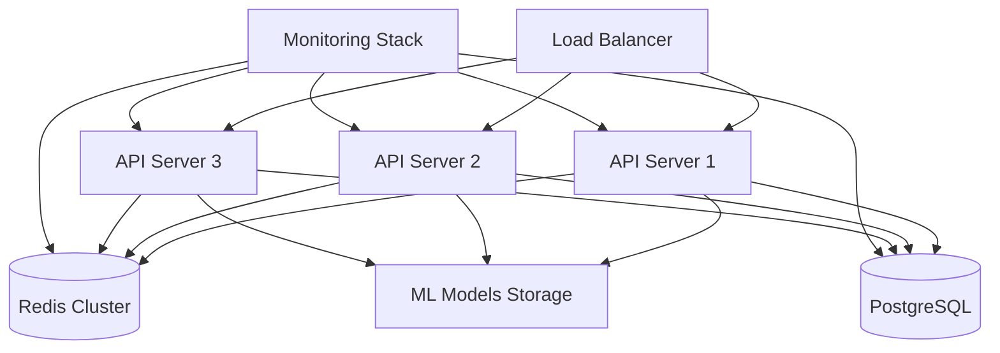

# CRONOS AI Protocol Discovery - Deployment Guide

## 🚀 **Production Deployment Guide**

This guide covers complete production deployment of the CRONOS AI Protocol Discovery System with enterprise-grade configurations, monitoring, and security.

## 📋 **Table of Contents**

- [Prerequisites](#prerequisites)
- [Infrastructure Requirements](#infrastructure-requirements)
- [Docker Deployment](#docker-deployment)
- [Kubernetes Deployment](#kubernetes-deployment)
- [Database Setup](#database-setup)
- [Security Configuration](#security-configuration)
- [Monitoring & Observability](#monitoring--observability)
- [Load Balancing](#load-balancing)
- [Backup & Recovery](#backup--recovery)
- [Performance Tuning](#performance-tuning)
- [Troubleshooting](#troubleshooting)

## ✅ **Prerequisites**

### **System Requirements**

- **OS**: Linux (Ubuntu 20.04+ / RHEL 8+ / CentOS 8+)
- **CPU**: 8+ cores (16+ recommended for production)
- **RAM**: 16GB minimum (32GB+ recommended)
- **Disk**: 100GB SSD minimum (500GB+ recommended)
- **Network**: 1Gbps minimum bandwidth

### **Software Dependencies**

- **Python**: 3.9+
- **Rust**: 1.70+
- **Docker**: 20.10+
- **Kubernetes**: 1.25+ (if using K8s)
- **PostgreSQL**: 13+
- **Redis**: 6.0+

### **Hardware Accelerations (Optional)**

- **GPU**: NVIDIA GPU with CUDA 11.8+ for ML acceleration
- **GPU Memory**: 8GB+ VRAM recommended

## 🏗️ **Infrastructure Requirements**

### **Production Architecture**



### **Minimum Production Setup**

| Component | Instances | Specs | Purpose |
|-----------|-----------|-------|---------|
| **API Servers** | 3 | 4 CPU, 16GB RAM | Protocol discovery services |
| **PostgreSQL** | 2 (Primary + Replica) | 8 CPU, 32GB RAM, 500GB SSD | Data persistence |
| **Redis** | 3 (Cluster) | 2 CPU, 8GB RAM | Caching and session storage |
| **Load Balancer** | 2 (HA) | 2 CPU, 4GB RAM | Traffic distribution |
| **Monitoring** | 1 | 4 CPU, 8GB RAM | Prometheus, Grafana, AlertManager |

## 🐳 **Docker Deployment**

### **1. Build Images**

```bash
# Clone repository
git clone https://github.com/cronos-ai/protocol-discovery.git
cd protocol-discovery

# Build production image
docker build -f ops/deploy/docker/dockerfiles/production.Dockerfile -t cronos-ai/protocol-discovery:v1.0.0 .

# Tag for registry
docker tag cronos-ai/protocol-discovery:v1.0.0 your-registry.com/cronos-ai/protocol-discovery:v1.0.0

# Push to registry
docker push your-registry.com/cronos-ai/protocol-discovery:v1.0.0
```

### **2. Docker Compose Setup**

Create `docker-compose.production.yml`:

```yaml
version: '3.8'

services:
  # Protocol Discovery API
  cronos-api:
    image: your-registry.com/cronos-ai/protocol-discovery:v1.0.0
    restart: unless-stopped
    ports:
      - "8080:8080"
      - "8000:8000"  # Prometheus metrics
    environment:
      - CRONOS_ENVIRONMENT=production
      - DATABASE_HOST=postgresql
      - DATABASE_PASSWORD=${DATABASE_PASSWORD}
      - REDIS_HOST=redis
      - REDIS_PASSWORD=${REDIS_PASSWORD}
      - JWT_SECRET=${JWT_SECRET}
      - ENCRYPTION_KEY=${ENCRYPTION_KEY}
    volumes:
      - ./config/cronos_ai.production.yaml:/app/config/cronos_ai.yaml:ro
      - ./ssl:/etc/ssl/certs:ro
      - cronos-models:/opt/cronos_ai/models
      - cronos-logs:/var/log/cronos_ai
    depends_on:
      - postgresql
      - redis
    deploy:
      replicas: 3
      resources:
        limits:
          cpus: '4'
          memory: 16G
        reservations:
          cpus: '2'
          memory: 8G
    healthcheck:
      test: ["CMD", "curl", "-f", "http://localhost:8080/health"]
      interval: 30s
      timeout: 10s
      retries: 3

  # PostgreSQL Database
  postgresql:
    image: postgres:15-alpine
    restart: unless-stopped
    ports:
      - "5432:5432"
    environment:
      - POSTGRES_DB=cronos_ai_prod
      - POSTGRES_USER=cronos_prod_user
      - POSTGRES_PASSWORD=${DATABASE_PASSWORD}
    volumes:
      - postgresql-data:/var/lib/postgresql/data
      - ./sql/init.sql:/docker-entrypoint-initdb.d/init.sql:ro
    deploy:
      resources:
        limits:
          cpus: '8'
          memory: 32G
        reservations:
          cpus: '4'
          memory: 16G
    healthcheck:
      test: ["CMD-SHELL", "pg_isready -U cronos_prod_user"]
      interval: 30s
      timeout: 5s
      retries: 3

  # Redis Cache
  redis:
    image: redis:7-alpine
    restart: unless-stopped
    ports:
      - "6379:6379"
    command: redis-server --requirepass ${REDIS_PASSWORD} --maxmemory 4gb --maxmemory-policy allkeys-lru
    volumes:
      - redis-data:/data
    deploy:
      resources:
        limits:
          cpus: '2'
          memory: 8G
        reservations:
          cpus: '1'
          memory: 4G
    healthcheck:
      test: ["CMD", "redis-cli", "-a", "${REDIS_PASSWORD}", "ping"]
      interval: 30s
      timeout: 5s
      retries: 3

  # Prometheus
  prometheus:
    image: prom/prometheus:latest
    restart: unless-stopped
    ports:
      - "9090:9090"
    volumes:
      - ./ops/observability/prometheus:/etc/prometheus:ro
      - prometheus-data:/prometheus
    command:
      - '--config.file=/etc/prometheus/prometheus.yml'
      - '--storage.tsdb.path=/prometheus'
      - '--storage.tsdb.retention.time=30d'
      - '--web.console.libraries=/etc/prometheus/console_libraries'
      - '--web.console.templates=/etc/prometheus/consoles'

  # Grafana
  grafana:
    image: grafana/grafana:latest
    restart: unless-stopped
    ports:
      - "3000:3000"
    environment:
      - GF_SECURITY_ADMIN_PASSWORD=${GRAFANA_PASSWORD}
      - GF_INSTALL_PLUGINS=grafana-piechart-panel
    volumes:
      - grafana-data:/var/lib/grafana
      - ./ops/observability/grafana:/etc/grafana/provisioning:ro

  # Nginx Load Balancer
  nginx:
    image: nginx:alpine
    restart: unless-stopped
    ports:
      - "80:80"
      - "443:443"
    volumes:
      - ./ops/deploy/nginx/nginx.conf:/etc/nginx/nginx.conf:ro
      - ./ssl:/etc/ssl/certs:ro
    depends_on:
      - cronos-api

volumes:
  postgresql-data:
  redis-data:
  prometheus-data:
  grafana-data:
  cronos-models:
  cronos-logs:

networks:
  default:
    name: cronos-network
```

### **3. Environment Configuration**

Create `.env.production`:

```bash
# Database
DATABASE_PASSWORD=your_secure_db_password_here

# Redis
REDIS_PASSWORD=your_secure_redis_password_here

# Security
JWT_SECRET=your_jwt_secret_minimum_32_characters_long
ENCRYPTION_KEY=your_encryption_key_minimum_32_characters_long

# Monitoring
GRAFANA_PASSWORD=your_secure_grafana_password
```

### **4. Deploy with Docker Compose**

```bash
# Deploy the stack
docker-compose -f docker-compose.production.yml --env-file .env.production up -d

# Check status
docker-compose -f docker-compose.production.yml ps

# View logs
docker-compose -f docker-compose.production.yml logs -f cronos-api

# Scale API services
docker-compose -f docker-compose.production.yml up -d --scale cronos-api=5
```

## ☸️ **Kubernetes Deployment**

### **1. Create Namespace**

```yaml
# namespace.yaml
apiVersion: v1
kind: Namespace
metadata:
  name: cronos-ai-prod
  labels:
    name: cronos-ai-prod
```

### **2. Secrets Management**

```yaml
# secrets.yaml
apiVersion: v1
kind: Secret
metadata:
  name: cronos-secrets
  namespace: cronos-ai-prod
type: Opaque
stringData:
  database-password: "your_secure_db_password"
  redis-password: "your_secure_redis_password"
  jwt-secret: "your_jwt_secret_minimum_32_characters"
  encryption-key: "your_encryption_key_minimum_32_characters"
```

### **3. ConfigMaps**

```yaml
# configmap.yaml
apiVersion: v1
kind: ConfigMap
metadata:
  name: cronos-config
  namespace: cronos-ai-prod
data:
  cronos_ai.yaml: |
    environment: production
    debug: false
    api_host: "0.0.0.0"
    api_port: 8080
    
    database:
      host: "postgresql-service"
      port: 5432
      database: "cronos_ai_prod"
      username: "cronos_prod_user"
      connection_pool_size: 20
    
    redis:
      host: "redis-service"
      port: 6379
      database: 0
      connection_pool_size: 20
    
    # ... rest of production config
```

### **4. PostgreSQL Deployment**

```yaml
# postgresql.yaml
apiVersion: apps/v1
kind: StatefulSet
metadata:
  name: postgresql
  namespace: cronos-ai-prod
spec:
  serviceName: postgresql-service
  replicas: 1
  selector:
    matchLabels:
      app: postgresql
  template:
    metadata:
      labels:
        app: postgresql
    spec:
      containers:
      - name: postgresql
        image: postgres:15
        ports:
        - containerPort: 5432
        env:
        - name: POSTGRES_DB
          value: "cronos_ai_prod"
        - name: POSTGRES_USER
          value: "cronos_prod_user"
        - name: POSTGRES_PASSWORD
          valueFrom:
            secretKeyRef:
              name: cronos-secrets
              key: database-password
        volumeMounts:
        - name: postgresql-storage
          mountPath: /var/lib/postgresql/data
        resources:
          requests:
            memory: "16Gi"
            cpu: "4"
          limits:
            memory: "32Gi"
            cpu: "8"
  volumeClaimTemplates:
  - metadata:
      name: postgresql-storage
    spec:
      accessModes: ["ReadWriteOnce"]
      resources:
        requests:
          storage: 500Gi

---
apiVersion: v1
kind: Service
metadata:
  name: postgresql-service
  namespace: cronos-ai-prod
spec:
  selector:
    app: postgresql
  ports:
  - port: 5432
    targetPort: 5432
```

### **5. Redis Deployment**

```yaml
# redis.yaml
apiVersion: apps/v1
kind: Deployment
metadata:
  name: redis
  namespace: cronos-ai-prod
spec:
  replicas: 3
  selector:
    matchLabels:
      app: redis
  template:
    metadata:
      labels:
        app: redis
    spec:
      containers:
      - name: redis
        image: redis:7-alpine
        ports:
        - containerPort: 6379
        command: 
        - redis-server
        - --requirepass
        - $(REDIS_PASSWORD)
        - --maxmemory
        - 4gb
        - --maxmemory-policy
        - allkeys-lru
        env:
        - name: REDIS_PASSWORD
          valueFrom:
            secretKeyRef:
              name: cronos-secrets
              key: redis-password
        resources:
          requests:
            memory: "4Gi"
            cpu: "1"
          limits:
            memory: "8Gi" 
            cpu: "2"

---
apiVersion: v1
kind: Service
metadata:
  name: redis-service
  namespace: cronos-ai-prod
spec:
  selector:
    app: redis
  ports:
  - port: 6379
    targetPort: 6379
```

### **6. Main Application Deployment**

```yaml
# cronos-api.yaml
apiVersion: apps/v1
kind: Deployment
metadata:
  name: cronos-api
  namespace: cronos-ai-prod
spec:
  replicas: 3
  selector:
    matchLabels:
      app: cronos-api
  template:
    metadata:
      labels:
        app: cronos-api
    spec:
      containers:
      - name: cronos-api
        image: your-registry.com/cronos-ai/protocol-discovery:v1.0.0
        ports:
        - containerPort: 8080
        - containerPort: 8000
        env:
        - name: CRONOS_ENVIRONMENT
          value: "production"
        - name: DATABASE_PASSWORD
          valueFrom:
            secretKeyRef:
              name: cronos-secrets
              key: database-password
        - name: REDIS_PASSWORD
          valueFrom:
            secretKeyRef:
              name: cronos-secrets
              key: redis-password
        - name: JWT_SECRET
          valueFrom:
            secretKeyRef:
              name: cronos-secrets
              key: jwt-secret
        - name: ENCRYPTION_KEY
          valueFrom:
            secretKeyRef:
              name: cronos-secrets
              key: encryption-key
        volumeMounts:
        - name: config-volume
          mountPath: /app/config
        - name: model-storage
          mountPath: /opt/cronos_ai/models
        resources:
          requests:
            memory: "8Gi"
            cpu: "2"
          limits:
            memory: "16Gi"
            cpu: "4"
        livenessProbe:
          httpGet:
            path: /health
            port: 8080
          initialDelaySeconds: 30
          periodSeconds: 30
        readinessProbe:
          httpGet:
            path: /health
            port: 8080
          initialDelaySeconds: 10
          periodSeconds: 5
      volumes:
      - name: config-volume
        configMap:
          name: cronos-config
      - name: model-storage
        persistentVolumeClaim:
          claimName: model-storage-pvc

---
apiVersion: v1
kind: Service
metadata:
  name: cronos-api-service
  namespace: cronos-ai-prod
spec:
  selector:
    app: cronos-api
  ports:
  - name: api
    port: 8080
    targetPort: 8080
  - name: metrics
    port: 8000
    targetPort: 8000
  type: ClusterIP

---
apiVersion: v1
kind: PersistentVolumeClaim
metadata:
  name: model-storage-pvc
  namespace: cronos-ai-prod
spec:
  accessModes:
    - ReadWriteMany
  resources:
    requests:
      storage: 100Gi
```

### **7. Ingress Configuration**

```yaml
# ingress.yaml
apiVersion: networking.k8s.io/v1
kind: Ingress
metadata:
  name: cronos-ingress
  namespace: cronos-ai-prod
  annotations:
    kubernetes.io/ingress.class: nginx
    cert-manager.io/cluster-issuer: letsencrypt-prod
    nginx.ingress.kubernetes.io/ssl-redirect: "true"
    nginx.ingress.kubernetes.io/rate-limit: "100"
spec:
  tls:
  - hosts:
    - api.cronos-ai.yourdomain.com
    secretName: cronos-tls
  rules:
  - host: api.cronos-ai.yourdomain.com
    http:
      paths:
      - path: /
        pathType: Prefix
        backend:
          service:
            name: cronos-api-service
            port:
              number: 8080
```

### **8. Deploy to Kubernetes**

```bash
# Apply all configurations
kubectl apply -f namespace.yaml
kubectl apply -f secrets.yaml
kubectl apply -f configmap.yaml
kubectl apply -f postgresql.yaml
kubectl apply -f redis.yaml
kubectl apply -f cronos-api.yaml
kubectl apply -f ingress.yaml

# Check deployment status
kubectl get pods -n cronos-ai-prod
kubectl get services -n cronos-ai-prod
kubectl get ingress -n cronos-ai-prod

# Scale deployment
kubectl scale deployment cronos-api --replicas=5 -n cronos-ai-prod

# View logs
kubectl logs -f deployment/cronos-api -n cronos-ai-prod
```

## 🗄️ **Database Setup**

### **1. PostgreSQL Initialization**

```sql
-- Create database and user
CREATE DATABASE cronos_ai_prod;
CREATE USER cronos_prod_user WITH ENCRYPTED PASSWORD 'your_secure_password';
GRANT ALL PRIVILEGES ON DATABASE cronos_ai_prod TO cronos_prod_user;

-- Connect to cronos_ai_prod database
\c cronos_ai_prod;

-- Create tables
CREATE TABLE protocols (
    id SERIAL PRIMARY KEY,
    name VARCHAR(255) UNIQUE NOT NULL,
    confidence FLOAT NOT NULL,
    grammar_rules JSONB NOT NULL,
    parser_config JSONB NOT NULL,
    validation_rules JSONB NOT NULL,
    statistics JSONB NOT NULL,
    created_at TIMESTAMP DEFAULT CURRENT_TIMESTAMP,
    updated_at TIMESTAMP DEFAULT CURRENT_TIMESTAMP
);

CREATE TABLE discovery_sessions (
    id SERIAL PRIMARY KEY,
    session_id VARCHAR(255) UNIQUE NOT NULL,
    traffic_data_hash VARCHAR(64) NOT NULL,
    discovered_protocols JSONB NOT NULL,
    processing_time FLOAT NOT NULL,
    created_at TIMESTAMP DEFAULT CURRENT_TIMESTAMP
);

CREATE TABLE metrics (
    id SERIAL PRIMARY KEY,
    metric_name VARCHAR(255) NOT NULL,
    metric_value FLOAT NOT NULL,
    labels JSONB,
    timestamp TIMESTAMP DEFAULT CURRENT_TIMESTAMP
);

-- Create indexes
CREATE INDEX idx_protocols_name ON protocols(name);
CREATE INDEX idx_protocols_confidence ON protocols(confidence);
CREATE INDEX idx_discovery_sessions_hash ON discovery_sessions(traffic_data_hash);
CREATE INDEX idx_metrics_name_timestamp ON metrics(metric_name, timestamp);

-- Grant permissions
GRANT ALL PRIVILEGES ON ALL TABLES IN SCHEMA public TO cronos_prod_user;
GRANT ALL PRIVILEGES ON ALL SEQUENCES IN SCHEMA public TO cronos_prod_user;
```

### **2. Database Backup Script**

```bash
#!/bin/bash
# backup-db.sh

DB_HOST=${DATABASE_HOST:-localhost}
DB_NAME=${DATABASE_NAME:-cronos_ai_prod}
DB_USER=${DATABASE_USER:-cronos_prod_user}
BACKUP_DIR=${BACKUP_DIR:-/var/backups/cronos_ai}
RETENTION_DAYS=${RETENTION_DAYS:-30}

# Create backup directory
mkdir -p $BACKUP_DIR

# Create backup
BACKUP_FILE="$BACKUP_DIR/cronos_ai_backup_$(date +%Y%m%d_%H%M%S).sql"

echo "Creating database backup..."
PGPASSWORD=$DATABASE_PASSWORD pg_dump -h $DB_HOST -U $DB_USER -d $DB_NAME > $BACKUP_FILE

if [ $? -eq 0 ]; then
    echo "Backup created successfully: $BACKUP_FILE"
    
    # Compress backup
    gzip $BACKUP_FILE
    echo "Backup compressed: $BACKUP_FILE.gz"
    
    # Remove old backups
    find $BACKUP_DIR -name "*.sql.gz" -mtime +$RETENTION_DAYS -delete
    echo "Old backups cleaned up (older than $RETENTION_DAYS days)"
else
    echo "Backup failed!"
    exit 1
fi
```

## 🔒 **Security Configuration**

### **1. SSL/TLS Setup**

```bash
# Generate SSL certificates (for testing - use proper CA in production)
openssl req -x509 -nodes -days 365 -newkey rsa:2048 \
  -keyout ssl/cronos_ai.key \
  -out ssl/cronos_ai.crt \
  -subj "/C=US/ST=State/L=City/O=Organization/CN=api.cronos-ai.yourdomain.com"

# Set proper permissions
chmod 600 ssl/cronos_ai.key
chmod 644 ssl/cronos_ai.crt
```

### **2. API Key Management**

```python
# Generate API keys
import secrets
import hashlib

def generate_api_key():
    """Generate a secure API key."""
    raw_key = secrets.token_urlsafe(32)
    key_hash = hashlib.sha256(raw_key.encode()).hexdigest()
    return raw_key, key_hash

# Generate keys for different services
admin_key, admin_hash = generate_api_key()
service_key, service_hash = generate_api_key()

print(f"Admin API Key: {admin_key}")
print(f"Admin Hash: {admin_hash}")
print(f"Service API Key: {service_key}")
print(f"Service Hash: {service_hash}")
```

### **3. Firewall Configuration**

```bash
# Ubuntu/Debian firewall setup
sudo ufw enable
sudo ufw default deny incoming
sudo ufw default allow outgoing

# Allow SSH
sudo ufw allow ssh

# Allow HTTP/HTTPS
sudo ufw allow 80/tcp
sudo ufw allow 443/tcp

# Allow API port (if needed externally)
sudo ufw allow 8080/tcp

# Allow metrics port (internal only)
sudo ufw allow from 10.0.0.0/8 to any port 8000

# Reload firewall
sudo ufw reload
```

## 📊 **Monitoring & Observability**

### **1. Prometheus Configuration**

```yaml
# prometheus.yml
global:
  scrape_interval: 15s
  evaluation_interval: 15s

rule_files:
  - "rules.yaml"

alerting:
  alertmanagers:
    - static_configs:
        - targets:
          - alertmanager:9093

scrape_configs:
  - job_name: 'cronos-api'
    static_configs:
      - targets: ['cronos-api:8000']
    scrape_interval: 5s
    metrics_path: '/metrics'
    
  - job_name: 'postgresql'
    static_configs:
      - targets: ['postgres-exporter:9187']
      
  - job_name: 'redis'
    static_configs:
      - targets: ['redis-exporter:9121']
      
  - job_name: 'node'
    static_configs:
      - targets: ['node-exporter:9100']
```

### **2. Alerting Rules**

```yaml
# rules.yaml
groups:
- name: cronos-ai-alerts
  rules:
  - alert: HighErrorRate
    expr: rate(protocol_discovery_errors_total[5m]) > 0.05
    for: 2m
    labels:
      severity: critical
    annotations:
      summary: High error rate detected
      description: "Error rate is {{ $value }} errors per second"
      
  - alert: HighResponseTime
    expr: histogram_quantile(0.95, rate(protocol_discovery_duration_seconds_bucket[5m])) > 2
    for: 5m
    labels:
      severity: warning
    annotations:
      summary: High response time
      description: "95th percentile response time is {{ $value }} seconds"
      
  - alert: DatabaseDown
    expr: up{job="postgresql"} == 0
    for: 1m
    labels:
      severity: critical
    annotations:
      summary: Database is down
      description: "PostgreSQL database is not responding"
      
  - alert: RedisDown
    expr: up{job="redis"} == 0
    for: 1m
    labels:
      severity: critical
    annotations:
      summary: Redis is down
      description: "Redis cache is not responding"
```

### **3. Grafana Dashboard**

```json
{
  "dashboard": {
    "title": "CRONOS AI Protocol Discovery",
    "panels": [
      {
        "title": "Request Rate",
        "type": "graph",
        "targets": [
          {
            "expr": "rate(protocol_discovery_requests_total[1m])",
            "legendFormat": "{{status}}"
          }
        ]
      },
      {
        "title": "Response Time",
        "type": "graph", 
        "targets": [
          {
            "expr": "histogram_quantile(0.95, rate(protocol_discovery_duration_seconds_bucket[5m]))",
            "legendFormat": "95th percentile"
          },
          {
            "expr": "histogram_quantile(0.50, rate(protocol_discovery_duration_seconds_bucket[5m]))",
            "legendFormat": "50th percentile"
          }
        ]
      },
      {
        "title": "System Resources",
        "type": "graph",
        "targets": [
          {
            "expr": "system_cpu_usage_percent",
            "legendFormat": "CPU %"
          },
          {
            "expr": "system_memory_usage_percent", 
            "legendFormat": "Memory %"
          }
        ]
      }
    ]
  }
}
```

## ⚖️ **Load Balancing**

### **1. Nginx Configuration**

```nginx
# nginx.conf
upstream cronos_api {
    server cronos-api-1:8080 weight=1 max_fails=3 fail_timeout=30s;
    server cronos-api-2:8080 weight=1 max_fails=3 fail_timeout=30s;
    server cronos-api-3:8080 weight=1 max_fails=3 fail_timeout=30s;
}

server {
    listen 80;
    server_name api.cronos-ai.yourdomain.com;
    return 301 https://$server_name$request_uri;
}

server {
    listen 443 ssl http2;
    server_name api.cronos-ai.yourdomain.com;
    
    ssl_certificate /etc/ssl/certs/cronos_ai.crt;
    ssl_certificate_key /etc/ssl/certs/cronos_ai.key;
    
    # Security headers
    add_header X-Frame-Options DENY;
    add_header X-Content-Type-Options nosniff;
    add_header X-XSS-Protection "1; mode=block";
    add_header Strict-Transport-Security "max-age=31536000; includeSubDomains";
    
    # Rate limiting
    limit_req_zone $binary_remote_addr zone=api:10m rate=10r/s;
    
    location / {
        limit_req zone=api burst=20 nodelay;
        
        proxy_pass http://cronos_api;
        proxy_set_header Host $host;
        proxy_set_header X-Real-IP $remote_addr;
        proxy_set_header X-Forwarded-For $proxy_add_x_forwarded_for;
        proxy_set_header X-Forwarded-Proto $scheme;
        
        # Timeouts
        proxy_connect_timeout 5s;
        proxy_send_timeout 30s;
        proxy_read_timeout 30s;
        
        # Health check
        proxy_next_upstream error timeout invalid_header http_502 http_503 http_504;
    }
    
    location /metrics {
        # Restrict metrics access
        allow 10.0.0.0/8;
        deny all;
        
        proxy_pass http://cronos_api;
        proxy_set_header Host $host;
    }
    
    location /health {
        access_log off;
        proxy_pass http://cronos_api;
    }
}
```

## 💾 **Backup & Recovery**

### **1. Automated Backup Script**

```bash
#!/bin/bash
# comprehensive-backup.sh

set -euo pipefail

# Configuration
BACKUP_ROOT="/var/backups/cronos_ai"
DATE=$(date +%Y%m%d_%H%M%S)
RETENTION_DAYS=30
S3_BUCKET="cronos-ai-backups"

# Create backup directory
mkdir -p "$BACKUP_ROOT/$DATE"

echo "Starting comprehensive backup for CRONOS AI..."

# 1. Database backup
echo "Backing up PostgreSQL database..."
PGPASSWORD=$DATABASE_PASSWORD pg_dump \
  -h $DATABASE_HOST \
  -U $DATABASE_USER \
  -d $DATABASE_NAME \
  --verbose \
  --no-owner \
  --no-privileges > "$BACKUP_ROOT/$DATE/database.sql"

# 2. Redis backup
echo "Backing up Redis data..."
redis-cli -h $REDIS_HOST -a $REDIS_PASSWORD --rdb "$BACKUP_ROOT/$DATE/redis.rdb"

# 3. ML Models backup
echo "Backing up ML models..."
tar -czf "$BACKUP_ROOT/$DATE/models.tar.gz" /opt/cronos_ai/models/

# 4. Configuration backup
echo "Backing up configuration files..."
tar -czf "$BACKUP_ROOT/$DATE/config.tar.gz" \
  /app/config/ \
  /etc/ssl/certs/cronos_ai.* \
  /etc/nginx/sites-available/cronos-ai

# 5. Create manifest
echo "Creating backup manifest..."
cat > "$BACKUP_ROOT/$DATE/manifest.json" << EOF
{
  "timestamp": "$(date -Iseconds)",
  "backup_id": "$DATE",
  "components": {
    "database": "database.sql",
    "redis": "redis.rdb", 
    "models": "models.tar.gz",
    "config": "config.tar.gz"
  },
  "checksums": {
    "database": "$(sha256sum $BACKUP_ROOT/$DATE/database.sql | cut -d' ' -f1)",
    "redis": "$(sha256sum $BACKUP_ROOT/$DATE/redis.rdb | cut -d' ' -f1)",
    "models": "$(sha256sum $BACKUP_ROOT/$DATE/models.tar.gz | cut -d' ' -f1)",
    "config": "$(sha256sum $BACKUP_ROOT/$DATE/config.tar.gz | cut -d' ' -f1)"
  }
}
EOF

# 6. Create archive
echo "Creating backup archive..."
cd "$BACKUP_ROOT"
tar -czf "cronos_ai_backup_$DATE.tar.gz" "$DATE/"

# 7. Upload to S3 (if configured)
if [[ -n "${AWS_ACCESS_KEY_ID:-}" ]]; then
  echo "Uploading backup to S3..."
  aws s3 cp "cronos_ai_backup_$DATE.tar.gz" "s3://$S3_BUCKET/backups/"
fi

# 8. Cleanup old backups
echo "Cleaning up old backups..."
find "$BACKUP_ROOT" -name "cronos_ai_backup_*.tar.gz" -mtime +$RETENTION_DAYS -delete
rm -rf "$BACKUP_ROOT/$DATE"

echo "Backup completed successfully: cronos_ai_backup_$DATE.tar.gz"
```

### **2. Recovery Script**

```bash
#!/bin/bash
# recovery.sh

set -euo pipefail

BACKUP_FILE="$1"
RECOVERY_DIR="/tmp/cronos_ai_recovery"

if [[ -z "$BACKUP_FILE" ]]; then
  echo "Usage: $0 <backup_file>"
  exit 1
fi

echo "Starting recovery from backup: $BACKUP_FILE"

# Extract backup
mkdir -p "$RECOVERY_DIR"
tar -xzf "$BACKUP_FILE" -C "$RECOVERY_DIR"

# Find backup directory
BACKUP_DIR=$(find "$RECOVERY_DIR" -type d -name "20*" | head -1)

if [[ ! -d "$BACKUP_DIR" ]]; then
  echo "Error: Could not find backup directory"
  exit 1
fi

# Validate manifest
if [[ ! -f "$BACKUP_DIR/manifest.json" ]]; then
  echo "Error: Missing backup manifest"
  exit 1
fi

echo "Validating backup integrity..."
cd "$BACKUP_DIR"

# Check checksums
for component in database redis models config; do
  expected_checksum=$(jq -r ".checksums.$component" manifest.json)
  actual_checksum=$(sha256sum $(jq -r ".components.$component" manifest.json) | cut -d' ' -f1)
  
  if [[ "$expected_checksum" != "$actual_checksum" ]]; then
    echo "Error: Checksum mismatch for $component"
    exit 1
  fi
done

echo "Backup integrity verified. Proceeding with recovery..."

# 1. Restore database
echo "Restoring PostgreSQL database..."
PGPASSWORD=$DATABASE_PASSWORD psql \
  -h $DATABASE_HOST \
  -U $DATABASE_USER \
  -d $DATABASE_NAME \
  -c "DROP SCHEMA public CASCADE; CREATE SCHEMA public;"

PGPASSWORD=$DATABASE_PASSWORD psql \
  -h $DATABASE_HOST \
  -U $DATABASE_USER \
  -d $DATABASE_NAME \
  < database.sql

# 2. Restore Redis
echo "Restoring Redis data..."
redis-cli -h $REDIS_HOST -a $REDIS_PASSWORD FLUSHALL
redis-cli -h $REDIS_HOST -a $REDIS_PASSWORD --pipe < redis.rdb

# 3. Restore ML models
echo "Restoring ML models..."
tar -xzf models.tar.gz -C /

# 4. Restore configuration
echo "Restoring configuration..."
tar -xzf config.tar.gz -C /

# Cleanup
rm -rf "$RECOVERY_DIR"

echo "Recovery completed successfully!"
echo "Please restart the CRONOS AI services to apply the restored configuration."
```

## 🚀 **Performance Tuning**

### **1. System-Level Optimizations**

```bash
# /etc/sysctl.conf optimizations
net.core.somaxconn = 65535
net.ipv4.tcp_max_syn_backlog = 65535
net.core.netdev_max_backlog = 65535
net.ipv4.tcp_fin_timeout = 30
net.ipv4.tcp_keepalive_time = 1200
net.ipv4.tcp_keepalive_intvl = 30
net.ipv4.tcp_keepalive_probes = 3

# Apply changes
sudo sysctl -p
```

### **2. Application Tuning**

```yaml
# Production configuration tuning
performance:
  cache_size: 50000
  cache_ttl: 7200
  use_redis_cache: true
  
  # Memory management
  max_memory_usage_mb: 16384
  gc_threshold: 0.85
  
  # Threading
  max_threads: 32
  io_thread_pool_size: 100
  cpu_thread_pool_size: 16
  
  # Batching  
  batch_size: 2000
  batch_flush_interval: 0.5

ai_engine:
  # GPU optimization
  use_gpu: true
  gpu_memory_limit: 0.95
  batch_size: 128
  
  # Model optimization
  ensemble_size: 7
  cnn_num_filters: 256
  lstm_hidden_size: 512
  
monitoring:
  metrics_flush_interval: 10.0
  max_metric_points: 100000
```

### **3. Database Tuning**

```sql
-- PostgreSQL performance tuning
ALTER SYSTEM SET shared_buffers = '8GB';
ALTER SYSTEM SET effective_cache_size = '24GB';
ALTER SYSTEM SET maintenance_work_mem = '2GB';
ALTER SYSTEM SET checkpoint_completion_target = 0.9;
ALTER SYSTEM SET wal_buffers = '16MB';
ALTER SYSTEM SET default_statistics_target = 100;
ALTER SYSTEM SET random_page_cost = 1.1;
ALTER SYSTEM SET effective_io_concurrency = 200;
ALTER SYSTEM SET work_mem = '256MB';
ALTER SYSTEM SET max_connections = 200;

-- Reload configuration
SELECT pg_reload_conf();
```

## 🔧 **Troubleshooting**

### **Common Issues and Solutions**

#### **1. High Memory Usage**

```bash
# Check memory usage
kubectl top pods -n cronos-ai-prod

# Check detailed memory breakdown
kubectl exec -it cronos-api-xxx -n cronos-ai-prod -- python -c "
from ai_engine.core.performance_optimizer import get_performance_optimizer
print(get_performance_optimizer().get_system_metrics())
"

# Solution: Increase memory limits or reduce cache sizes
kubectl patch deployment cronos-api -n cronos-ai-prod -p '{"spec":{"template":{"spec":{"containers":[{"name":"cronos-api","resources":{"limits":{"memory":"32Gi"}}}]}}}}'
```

#### **2. Database Connection Issues**

```bash
# Test database connectivity
kubectl exec -it cronos-api-xxx -n cronos-ai-prod -- python -c "
import psycopg2
try:
    conn = psycopg2.connect(
        host='postgresql-service',
        database='cronos_ai_prod', 
        user='cronos_prod_user',
        password='$DATABASE_PASSWORD'
    )
    print('Database connection successful')
    conn.close()
except Exception as e:
    print(f'Database connection failed: {e}')
"

# Check database logs
kubectl logs statefulset/postgresql -n cronos-ai-prod

# Solution: Check connection pool settings and increase if needed
```

#### **3. Performance Issues**

```bash
# Check API response times
curl -w "Total time: %{time_total}s\n" -s -o /dev/null https://api.cronos-ai.yourdomain.com/health

# Check metrics
curl https://api.cronos-ai.yourdomain.com/metrics | grep protocol_discovery_duration

# Enable debug logging temporarily
kubectl set env deployment/cronos-api LOG_LEVEL=DEBUG -n cronos-ai-prod

# Solution: Enable GPU acceleration, increase cache sizes, tune batch sizes
```

#### **4. SSL/TLS Issues**

```bash
# Test SSL certificate
openssl s_client -connect api.cronos-ai.yourdomain.com:443 -servername api.cronos-ai.yourdomain.com

# Check certificate expiry
openssl x509 -in ssl/cronos_ai.crt -text -noout | grep "Not After"

# Solution: Renew certificates and restart services
```

### **Health Check Script**

```bash
#!/bin/bash
# health-check.sh

echo "CRONOS AI System Health Check"
echo "============================="

# API Health
echo "1. API Health Check:"
api_response=$(curl -s -o /dev/null -w "%{http_code}" https://api.cronos-ai.yourdomain.com/health)
if [[ $api_response == "200" ]]; then
  echo "✅ API is healthy"
else
  echo "❌ API is unhealthy (HTTP $api_response)"
fi

# Database Health
echo "2. Database Health Check:"
db_response=$(kubectl exec -it postgresql-0 -n cronos-ai-prod -- pg_isready -U cronos_prod_user 2>/dev/null | grep "accepting connections")
if [[ -n "$db_response" ]]; then
  echo "✅ Database is healthy"
else
  echo "❌ Database is unhealthy"
fi

# Redis Health
echo "3. Redis Health Check:"
redis_response=$(kubectl exec -it deployment/redis -n cronos-ai-prod -- redis-cli -a $REDIS_PASSWORD ping 2>/dev/null)
if [[ "$redis_response" == "PONG" ]]; then
  echo "✅ Redis is healthy"
else
  echo "❌ Redis is unhealthy"
fi

# Check resource usage
echo "4. Resource Usage:"
kubectl top pods -n cronos-ai-prod

# Check recent errors
echo "5. Recent Errors:"
kubectl logs --since=1h -l app=cronos-api -n cronos-ai-prod | grep ERROR | tail -5

echo "============================="
echo "Health check completed"
```

---

**Deployment Guide Version**: v1.0.0  
**Last Updated**: 2024-01-15  
**Support**: deployment-support@cronos-ai.com