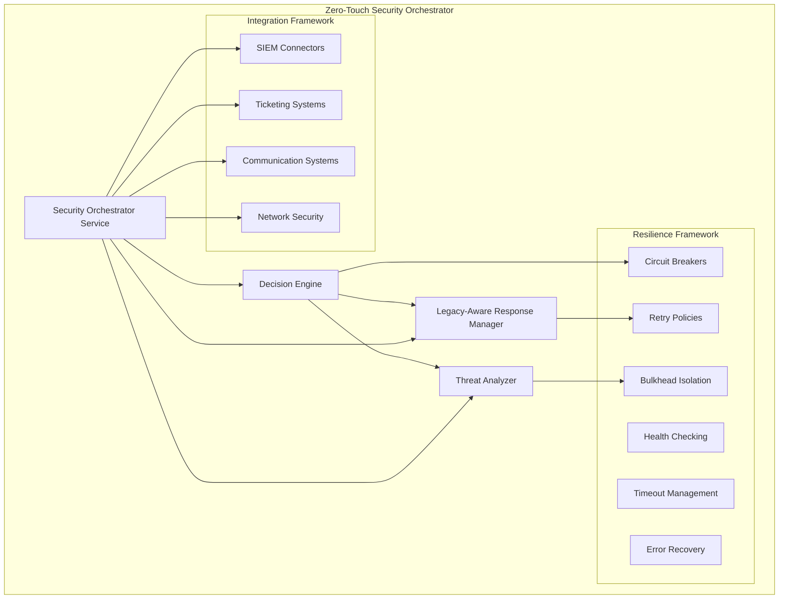

# CRONOS AI Engine - Zero-Touch Security Orchestrator

## Overview

The Zero-Touch Security Orchestrator is an enterprise-grade autonomous security response system that combines threat analysis, decision making, and automated response execution with specialized awareness for legacy systems and protocols.

## Table of Contents

- [Architecture](#architecture)
- [Core Components](#core-components)
- [Features](#features)
- [Getting Started](#getting-started)
- [Configuration](#configuration)
- [API Reference](#api-reference)
- [Deployment](#deployment)
- [Monitoring](#monitoring)
- [Troubleshooting](#troubleshooting)

## Architecture

The Zero-Touch Security Orchestrator implements a microservices architecture with the following key components:



## Core Components

### 1. Zero-Touch Decision Engine

**Purpose**: Autonomous security decision making using LLM integration and machine learning models.

**Key Features**:
- Multi-stage threat analysis with confidence scoring
- LLM-powered decision logic with fallback strategies
- Business impact assessment and cost calculation
- Autonomous response execution with human escalation
- Comprehensive audit logging and decision tracking

**Usage Example**:
```python
from ai_engine.security import ZeroTouchDecisionEngine

engine = ZeroTouchDecisionEngine()
await engine.initialize()

response = await engine.analyze_and_respond(security_event)
if response.confidence >= 0.95:
    await engine.execute_response(response)
else:
    await engine.escalate_to_human(response, security_event)
```

### 2. Legacy-Aware Response Manager

**Purpose**: Safe execution of security responses on legacy systems with protocol-specific constraints.

**Key Features**:
- Protocol-specific safety constraints (HL7-MLLP, ISO8583, Modbus, TN3270E)
- Dependency analysis and impact assessment
- Safe quarantine with rollback capabilities
- Legacy system health monitoring
- Gradual response escalation

**Supported Protocols**:
- **HL7-MLLP**: Healthcare messaging with patient safety constraints
- **ISO8583**: Financial transactions with business continuity requirements
- **Modbus**: Industrial control systems with operational safety limits
- **TN3270E**: Mainframe systems with session management

### 3. Threat Analyzer

**Purpose**: Advanced threat detection using ML models and LLM-powered contextual analysis.

**Key Features**:
- ML model integration for threat classification
- Feature extraction from security events and network traffic
- IOC (Indicators of Compromise) analysis and correlation
- LLM-powered threat contextualization
- Business impact assessment with compliance considerations

**ML Models Supported**:
- Anomaly detection models
- Classification models for threat types
- Clustering models for attack pattern identification
- Time series models for behavioral analysis

### 4. Resilience Framework

**Purpose**: Enterprise-grade resilience patterns for fault tolerance and high availability.

**Components**:
- **Circuit Breakers**: Prevent cascading failures with configurable thresholds
- **Retry Policies**: Intelligent retry with exponential backoff and jitter
- **Bulkhead Isolation**: Resource pooling and isolation to prevent resource exhaustion
- **Health Checking**: Comprehensive health monitoring with dependency tracking
- **Timeout Management**: Adaptive timeouts based on performance metrics
- **Error Recovery**: Automated error recovery with multiple strategies

### 5. Integration Framework

**Purpose**: Seamless integration with external security systems and tools.

**Integrations**:
- **SIEM Systems**: Splunk, QRadar with event correlation and alerting
- **Ticketing Systems**: ServiceNow, Jira with automated lifecycle management
- **Communication**: Slack, Email with severity-based routing
- **Network Security**: Firewalls, IDS/IPS with automated response actions

## Features

### 🤖 Autonomous Operation
- **Zero-touch response**: Fully automated security incident response
- **Confidence-based execution**: Actions executed based on AI confidence scores
- **Human escalation**: Automatic escalation when confidence is low
- **Learning capabilities**: Continuous improvement from response outcomes

### 🏛️ Legacy System Awareness
- **Protocol intelligence**: Deep understanding of legacy protocols
- **Safety constraints**: Protocol-specific safety and business rules
- **Gradual response**: Incremental response escalation to minimize disruption
- **Rollback capabilities**: Safe rollback mechanisms for all actions

### 🛡️ Enterprise Security
- **Comprehensive logging**: Structured JSON logging with audit trails
- **Sensitive data masking**: Automatic PII and sensitive data protection
- **Compliance support**: SOC2, ISO27001, PCI-DSS compliance features
- **Role-based access**: Fine-grained access control and authorization

### 🔄 High Availability
- **Fault tolerance**: Circuit breakers and retry mechanisms
- **Health monitoring**: Comprehensive health checking and alerting
- **Resource management**: Bulkhead isolation and resource pooling
- **Graceful degradation**: Continued operation under failure conditions

### 📊 Observability
- **Prometheus metrics**: Comprehensive metrics collection and monitoring
- **Health dashboards**: Real-time health and performance monitoring
- **Alert management**: Intelligent alerting with severity-based routing
- **Performance tracking**: Detailed performance metrics and optimization

## Getting Started

### Prerequisites

- Python 3.9+
- Docker and Docker Compose
- Kubernetes cluster (for production deployment)
- Redis (for caching and session management)
- PostgreSQL (for persistent data storage)

### Installation

1. **Clone the Repository**:
   ```bash
   git clone <repository-url>
   cd cronos-ai
   ```

2. **Install Dependencies**:
   ```bash
   pip install -r requirements.txt
   ```

3. **Configure Environment**:
   ```bash
   cp .env.example .env
   # Edit .env with your configuration
   ```

4. **Initialize Database**:
   ```bash
   python -m ai_engine.security.scripts.init_db
   ```

5. **Start Services**:
   ```bash
   python -m ai_engine.security.security_service
   ```

### Quick Start Example

```python
import asyncio
from ai_engine.security import (
    SecurityOrchestratorService,
    SecurityEvent,
    ThreatLevel,
    EventType
)

async def main():
    # Initialize the orchestrator
    orchestrator = SecurityOrchestratorService()
    await orchestrator.initialize()
    
    # Create a security event
    event = SecurityEvent(
        event_type=EventType.UNAUTHORIZED_ACCESS,
        threat_level=ThreatLevel.HIGH,
        source_ip="192.168.1.100",
        target_system="legacy-mainframe",
        description="Unauthorized access attempt to mainframe system"
    )
    
    # Process the event
    response = await orchestrator.process_security_event(event)
    print(f"Response: {response.status}")
    print(f"Actions: {len(response.actions)} actions executed")

if __name__ == "__main__":
    asyncio.run(main())
```

## Configuration

### Environment Variables

| Variable | Description | Default |
|----------|-------------|---------|
| `CRONOS_LOG_LEVEL` | Logging level | `INFO` |
| `CRONOS_CONFIG_PATH` | Path to configuration file | `config/security/enterprise-security-config.yaml` |
| `REDIS_URL` | Redis connection URL | `redis://localhost:6379` |
| `DATABASE_URL` | Database connection URL | `postgresql://localhost:5432/cronos` |
| `LLM_PROVIDER` | LLM provider (openai, anthropic, ollama) | `openai` |
| `OPENAI_API_KEY` | OpenAI API key | Required if using OpenAI |
| `ANTHROPIC_API_KEY` | Anthropic API key | Required if using Anthropic |

### Configuration Files

**Main Configuration**: `config/security/enterprise-security-config.yaml`

Key configuration sections:
- `zero_touch_integrations`: External system integrations
- `security`: Core security settings
- `resilience`: Resilience framework configuration
- `logging`: Logging and audit configuration
- `monitoring`: Metrics and health monitoring

### Integration Configuration

#### SIEM Integration (Splunk)
```yaml
zero_touch_integrations:
  enhanced_siem:
    enabled: true
    connector_type: "splunk"
    endpoint: "${SIEM_ENDPOINT}"
    credentials:
      hec_token: "${SPLUNK_HEC_TOKEN}"
    custom_config:
      index: "cronos-security"
      auto_create_alerts: true
```

#### Ticketing Integration (ServiceNow)
```yaml
zero_touch_integrations:
  ticketing_system:
    enabled: true
    system_type: "servicenow"
    endpoint: "${SERVICENOW_ENDPOINT}"
    credentials:
      username: "${SERVICENOW_USERNAME}"
      password: "${SERVICENOW_PASSWORD}"
    custom_config:
      auto_create_tickets: true
      ticket_creation_threshold: "high"
```

## API Reference

### Security Orchestrator Service

#### Process Security Event
```python
async def process_security_event(
    self, 
    security_event: SecurityEvent
) -> AutomatedResponse
```

Process a security event and return automated response.

**Parameters**:
- `security_event`: The security event to process

**Returns**:
- `AutomatedResponse`: The automated response with actions and status

#### Get System Health
```python
async def get_system_health(self) -> Dict[str, Any]
```

Get comprehensive system health status.

**Returns**:
- `Dict[str, Any]`: System health metrics and status

### Decision Engine

#### Analyze and Respond
```python
async def analyze_and_respond(
    self,
    security_event: SecurityEvent
) -> AutomatedResponse
```

Analyze security event and generate autonomous response.

### Legacy Response Manager

#### Execute Safe Quarantine
```python
async def execute_safe_quarantine(
    self,
    system: LegacySystem,
    threat_level: str,
    preserve_business_continuity: bool = True
) -> QuarantineResult
```

Execute safe quarantine of legacy system with business continuity preservation.

### Resilience Manager

#### Execute Resilient Operation
```python
async def execute_resilient_operation(
    self,
    operation: Callable,
    operation_name: str,
    circuit_breaker_name: Optional[str] = None,
    retry_policy_name: Optional[str] = None,
    timeout_policy_name: Optional[str] = None
) -> Any
```

Execute operation with full resilience capabilities.

## Deployment

### Docker Deployment

**Dockerfile**:
```dockerfile
FROM python:3.9-slim

WORKDIR /app
COPY requirements.txt .
RUN pip install -r requirements.txt

COPY . .
EXPOSE 8000

CMD ["python", "-m", "ai_engine.security.security_service"]
```

**Docker Compose**:
```yaml
version: '3.8'
services:
  cronos-security:
    build: .
    ports:
      - "8000:8000"
    environment:
      - REDIS_URL=redis://redis:6379
      - DATABASE_URL=postgresql://postgres:password@db:5432/cronos
    depends_on:
      - redis
      - db
  
  redis:
    image: redis:alpine
  
  db:
    image: postgres:13
    environment:
      POSTGRES_DB: cronos
      POSTGRES_PASSWORD: password
```

### Kubernetes Deployment

**Deployment Manifest**:
```yaml
apiVersion: apps/v1
kind: Deployment
metadata:
  name: cronos-security-orchestrator
spec:
  replicas: 3
  selector:
    matchLabels:
      app: cronos-security
  template:
    metadata:
      labels:
        app: cronos-security
    spec:
      containers:
      - name: cronos-security
        image: cronos/security-orchestrator:latest
        ports:
        - containerPort: 8000
        env:
        - name: CRONOS_LOG_LEVEL
          value: "INFO"
        - name: REDIS_URL
          value: "redis://redis-service:6379"
        livenessProbe:
          httpGet:
            path: /health
            port: 8000
        readinessProbe:
          httpGet:
            path: /ready
            port: 8000
```

### Helm Chart

**Chart.yaml**:
```yaml
apiVersion: v2
name: cronos-security-orchestrator
description: Zero-Touch Security Orchestrator
version: 1.0.0
appVersion: "1.0.0"
```

**values.yaml**:
```yaml
image:
  repository: cronos/security-orchestrator
  tag: latest
  pullPolicy: IfNotPresent

replicaCount: 3

service:
  type: ClusterIP
  port: 8000

ingress:
  enabled: true
  className: nginx
  annotations:
    nginx.ingress.kubernetes.io/ssl-redirect: "true"
  hosts:
    - host: cronos-security.example.com
      paths:
        - path: /
          pathType: Prefix

resources:
  limits:
    cpu: 1000m
    memory: 2Gi
  requests:
    cpu: 500m
    memory: 1Gi

autoscaling:
  enabled: true
  minReplicas: 3
  maxReplicas: 10
  targetCPUUtilizationPercentage: 70
```

## Monitoring

### Prometheus Metrics

The system exposes comprehensive metrics at `/metrics`:

- **Security Metrics**:
  - `cronos_security_events_total`: Total security events processed
  - `cronos_threat_analysis_duration_seconds`: Threat analysis execution time
  - `cronos_automated_responses_total`: Total automated responses executed
  - `cronos_confidence_score`: AI confidence scores distribution

- **Resilience Metrics**:
  - `cronos_circuit_breaker_state`: Circuit breaker states
  - `cronos_retry_attempts_total`: Total retry attempts
  - `cronos_timeout_operations_total`: Operations that timed out
  - `cronos_resource_pool_utilization`: Resource pool utilization

- **Integration Metrics**:
  - `cronos_integration_requests_total`: Total integration requests
  - `cronos_integration_failures_total`: Failed integration requests
  - `cronos_integration_response_time_seconds`: Integration response times

### Grafana Dashboard

Import the provided Grafana dashboard (`ops/grafana-dashboards/cronos-security-orchestrator.json`) for comprehensive monitoring:

- System Overview
- Security Event Processing
- Threat Analysis Performance
- Integration Health
- Resilience Metrics
- Error Rates and Recovery

### Health Endpoints

- `GET /health`: Overall system health
- `GET /health/live`: Liveness probe
- `GET /health/ready`: Readiness probe  
- `GET /metrics`: Prometheus metrics

## Troubleshooting

### Common Issues

#### High Memory Usage
**Symptoms**: Container OOMKilled, high memory alerts
**Solutions**:
- Check ML model memory usage: `GET /api/v1/threat-analyzer/metrics`
- Adjust resource limits in Kubernetes
- Enable memory optimization: Set `CRONOS_MEMORY_OPTIMIZATION=true`

#### Circuit Breakers Opening
**Symptoms**: Increased error rates, degraded functionality
**Solutions**:
- Check external system health: `GET /health/integrations`
- Review circuit breaker metrics: `GET /metrics` (search for `circuit_breaker`)
- Manually reset circuit breakers: `POST /api/v1/resilience/circuit-breakers/{name}/reset`

#### Legacy System Quarantine Issues
**Symptoms**: Quarantine operations failing, business continuity alerts
**Solutions**:
- Review legacy system dependencies: `GET /api/v1/legacy/dependencies`
- Check protocol constraints: Review logs for constraint violations
- Verify rollback capabilities: `GET /api/v1/legacy/rollback-status`

#### Integration Failures
**Symptoms**: SIEM/ticketing system not receiving events
**Solutions**:
- Check integration health: `GET /health/integrations`
- Review integration logs: Look for authentication/network errors
- Test individual integrations: `POST /api/v1/integrations/{name}/test`

### Debugging

#### Enable Debug Logging
```bash
export CRONOS_LOG_LEVEL=DEBUG
```

#### Access Debug Information
```python
from ai_engine.security import get_resilience_manager

manager = get_resilience_manager()
metrics = manager.get_global_metrics()
print(f"System metrics: {metrics}")
```

#### Check Component Health
```bash
curl -X GET http://localhost:8000/health/detailed
```

### Support

For technical support:
- Check the troubleshooting guide above
- Review system logs and metrics
- Contact the CRONOS AI Security Team
- File issues in the project repository

## License

Enterprise License - See LICENSE file for details.

## Contributing

Please read CONTRIBUTING.md for details on our code of conduct and the process for submitting pull requests.