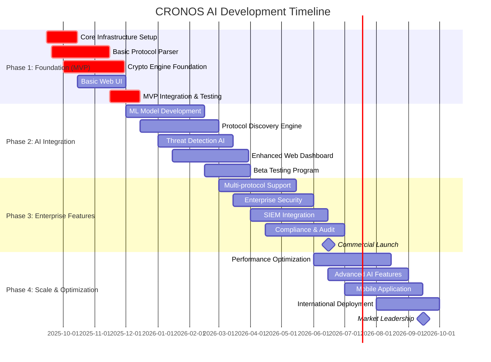
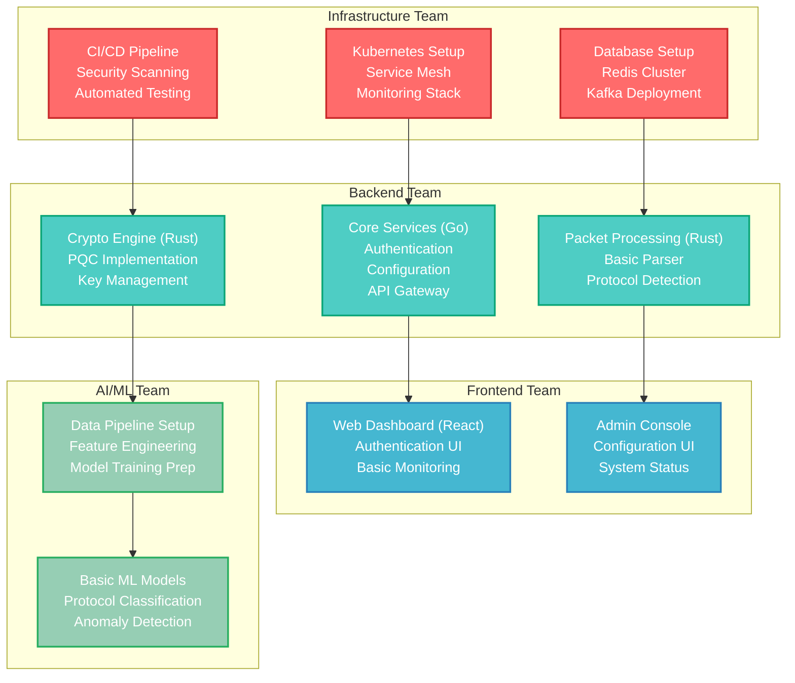
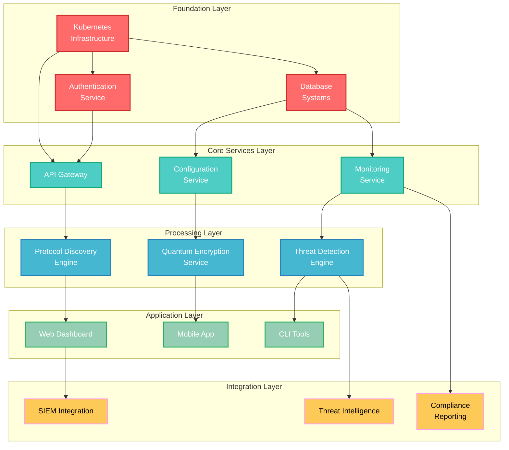
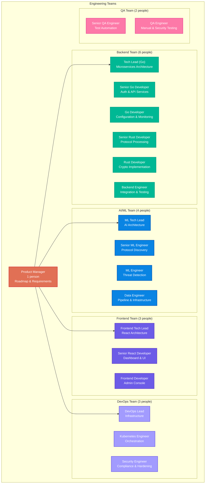
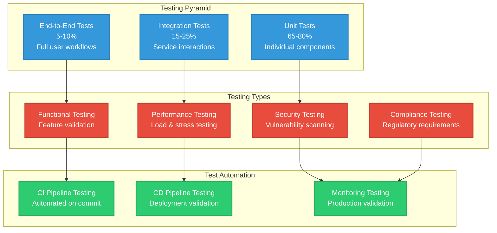
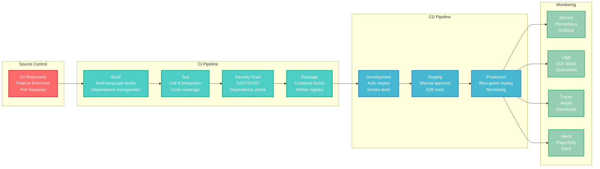

# CRONOS AI - Module-wise Implementation Plan & Feature Checklist

**Document Classification**: Project Implementation Plan  
**Target Audience**: Development Teams, Project Managers, Technical Leads  
**Version**: 1.0  
**Date**: September 2025  
**Current Status**: MVP 25% Complete (Expected MVP: December 2025)

---

## Table of Contents

1. [Implementation Overview](#implementation-overview)
2. [Phase-wise Development Plan](#phase-wise-development-plan)
3. [Module Implementation Details](#module-implementation-details)
4. [Feature Implementation Checklist](#feature-implementation-checklist)
5. [Dependencies & Integration Matrix](#dependencies--integration-matrix)
6. [Resource Allocation](#resource-allocation)
7. [Testing Strategy](#testing-strategy)
8. [Deployment & DevOps](#deployment--devops)

---

## Implementation Overview

### Development Phases Timeline



### Current Status Assessment (September 2025)

**Completed (25% MVP)**:
- ✅ Basic project structure and repository setup
- ✅ Initial Rust packet processing foundation
- ✅ Go microservices framework setup
- ✅ Basic React.js UI components
- ✅ Docker containerization setup
- ✅ CI/CD pipeline foundation

**In Progress**:
- 🔄 Protocol parsing engine (Rust)
- 🔄 Authentication service (Go)
- 🔄 Database schema design
- 🔄 Basic web dashboard

**Remaining for MVP (75%)**:
- ❌ Quantum encryption implementation
- ❌ AI protocol discovery engine
- ❌ Complete web UI
- ❌ Integration testing
- ❌ Security hardening

---

## Phase-wise Development Plan

### Phase 1: Foundation & MVP (Sep 2025 - Dec 2025)

**Objective**: Deliver working MVP with basic protocol parsing and quantum encryption



### Phase 2: AI Integration (Dec 2025 - Apr 2026)

**Objective**: Integrate AI-powered protocol discovery and threat detection

### Phase 3: Enterprise Features (Mar 2026 - Jul 2026)

**Objective**: Add enterprise-grade features for commercial launch

### Phase 4: Scale & Optimization (Jun 2026 - Oct 2026)

**Objective**: Optimize for scale and add advanced features

---

## Module Implementation Details

### Module 1: Core Infrastructure

**Technology Stack**: Kubernetes, Istio, Prometheus, Grafana, Jaeger

**Development Timeline**: Weeks 1-4 (Sep 15 - Oct 15, 2025)

**Features to Implement**:

#### 1.1 Container Orchestration
- **Kubernetes Cluster Setup**
  - Multi-node cluster configuration
  - RBAC and security policies
  - Network policies and CNI configuration
  - Storage classes and persistent volumes

- **Service Mesh Implementation**
  - Istio installation and configuration
  - mTLS between all services
  - Traffic management and load balancing
  - Circuit breaker and retry policies

#### 1.2 Observability Stack
- **Monitoring System**
  - Prometheus metrics collection
  - Grafana dashboard setup
  - AlertManager configuration
  - Custom metrics for CRONOS components

- **Distributed Tracing**
  - Jaeger deployment
  - OpenTelemetry instrumentation
  - Trace correlation across services
  - Performance bottleneck identification

- **Centralized Logging**
  - Fluentd/Fluent Bit log aggregation
  - Elasticsearch cluster setup
  - Kibana dashboards
  - Log retention and archival

#### 1.3 Security Infrastructure
- **Certificate Management**
  - cert-manager deployment
  - Automatic certificate rotation
  - Custom CA for internal services
  - External certificate integration

- **Secrets Management**
  - Kubernetes secrets encryption
  - External secrets operator
  - HashiCorp Vault integration
  - Secret rotation automation

**Implementation Checklist**:

```markdown
## Infrastructure Setup Checklist

### Kubernetes Cluster
- [ ] Multi-master Kubernetes cluster deployed
- [ ] RBAC policies configured
- [ ] Network policies implemented
- [ ] Storage classes configured
- [ ] Backup and disaster recovery setup

### Service Mesh
- [ ] Istio control plane deployed
- [ ] Data plane proxy injection configured
- [ ] mTLS enabled for all services
- [ ] Traffic management rules defined
- [ ] Security policies implemented

### Monitoring & Observability
- [ ] Prometheus deployed and configured
- [ ] Grafana dashboards created
- [ ] AlertManager rules defined
- [ ] Jaeger tracing setup
- [ ] Log aggregation pipeline configured

### Security
- [ ] cert-manager operational
- [ ] Vault integration completed
- [ ] Secret encryption enabled
- [ ] Security scanning integrated
- [ ] Compliance policies defined

### Testing
- [ ] Infrastructure as Code validated
- [ ] Disaster recovery tested
- [ ] Security scans passed
- [ ] Performance benchmarks met
- [ ] Documentation completed
```

---

### Module 2: Authentication & Authorization Service

**Technology Stack**: Go, Gin, JWT, Redis, PostgreSQL

**Development Timeline**: Weeks 2-6 (Sep 22 - Oct 27, 2025)

**Features to Implement**:

#### 2.1 User Management
- **User Registration & Profile**
  - User registration with email verification
  - Profile management and settings
  - Password policies and validation
  - Account activation and deactivation

- **Multi-Factor Authentication**
  - TOTP-based MFA (Google Authenticator)
  - SMS-based verification
  - Backup codes generation
  - MFA enforcement policies

#### 2.2 Authentication System
- **JWT Token Management**
  - Access token generation (15-minute expiry)
  - Refresh token handling (30-day expiry)
  - Token blacklisting on logout
  - Automatic token rotation

- **Session Management**
  - Redis-based session storage
  - Concurrent session limits
  - Session timeout policies
  - Activity-based session extension

#### 2.3 Authorization Framework
- **Role-Based Access Control (RBAC)**
  - Dynamic role assignment
  - Permission-based authorization
  - Resource-level access control
  - Hierarchical role inheritance

- **API Security**
  - Rate limiting per user/IP
  - Request signature validation
  - API key management
  - Audit logging for all requests

**Implementation Checklist**:

```markdown
## Authentication Service Checklist

### Core Authentication
- [ ] User registration API implemented
- [ ] Email verification system working
- [ ] Login/logout endpoints functional
- [ ] Password reset flow completed
- [ ] JWT token generation/validation

### Multi-Factor Authentication
- [ ] TOTP MFA integration
- [ ] SMS verification system
- [ ] Backup codes generation
- [ ] MFA enforcement policies
- [ ] Recovery procedures defined

### Authorization System
- [ ] RBAC model implemented
- [ ] Permission system functional
- [ ] Resource-level access control
- [ ] Role hierarchy working
- [ ] API authorization middleware

### Security Features
- [ ] Rate limiting implemented
- [ ] Brute force protection
- [ ] Account lockout policies
- [ ] Audit logging complete
- [ ] Security headers configured

### Integration & Testing
- [ ] Unit tests (>90% coverage)
- [ ] Integration tests complete
- [ ] Security testing passed
- [ ] Performance benchmarks met
- [ ] Documentation updated
```

---

### Module 3: Protocol Discovery Engine

**Technology Stack**: Rust, PyTorch, nom parser, ONNX Runtime

**Development Timeline**: Weeks 4-12 (Oct 8 - Dec 3, 2025)

**Features to Implement**:

#### 3.1 Packet Processing Engine (Rust)
- **High-Performance Capture**
  - DPDK integration for kernel bypass
  - Zero-copy packet processing
  - Multi-queue packet distribution
  - Hardware timestamping support

- **Protocol Classification**
  - Deep packet inspection (DPI)
  - Statistical analysis engine
  - Pattern recognition algorithms
  - Protocol fingerprinting

#### 3.2 AI-Powered Discovery (Python)
- **Machine Learning Pipeline**
  - Feature extraction from packet data
  - Transformer-based sequence modeling
  - Clustering for message grouping
  - Grammar inference algorithms

- **Model Training Infrastructure**
  - Distributed training with PyTorch
  - MLflow experiment tracking
  - Automated hyperparameter tuning
  - Model versioning and registry

#### 3.3 Parser Generation
- **Dynamic Parser Creation**
  - Code generation from learned patterns
  - nom combinator-based parsers
  - Runtime parser compilation
  - Parser validation and testing

- **Protocol Schema Management**
  - Schema registry and versioning
  - Protocol documentation generation
  - Field type inference
  - Validation rule creation

**Implementation Checklist**:

```markdown
## Protocol Discovery Engine Checklist

### Packet Processing (Rust)
- [ ] DPDK integration completed
- [ ] Multi-threaded packet capture
- [ ] Zero-copy processing pipeline
- [ ] Protocol classification engine
- [ ] Statistical analysis module

### AI/ML Pipeline (Python)
- [ ] Feature extraction framework
- [ ] Transformer model implementation
- [ ] Training pipeline setup
- [ ] Model serving infrastructure
- [ ] Experiment tracking configured

### Parser Generation
- [ ] Dynamic parser generator
- [ ] nom combinator integration
- [ ] Runtime compilation system
- [ ] Parser validation framework
- [ ] Error handling and recovery

### Protocol Management
- [ ] Schema registry implementation
- [ ] Protocol versioning system
- [ ] Documentation generator
- [ ] Validation engine
- [ ] API endpoints for management

### Testing & Validation
- [ ] Unit tests for all components
- [ ] Integration tests with sample protocols
- [ ] Performance benchmarks
- [ ] Accuracy validation
- [ ] Edge case handling
```

---

### Module 4: Quantum Encryption Service

**Technology Stack**: Rust, liboqs, ring, OpenSSL, HSM integration

**Development Timeline**: Weeks 6-14 (Oct 20 - Dec 17, 2025)

**Features to Implement**:

#### 4.1 Post-Quantum Cryptography
- **Algorithm Implementation**
  - Kyber (KEM) - Key Encapsulation Mechanism
  - Dilithium (DSA) - Digital Signature Algorithm
  - SPHINCS+ (Signatures) - Hash-based signatures
  - Falcon (Signatures) - Lattice-based signatures

- **Hardware Acceleration**
  - AVX-512 SIMD optimizations
  - ARM NEON support for mobile
  - FPGA acceleration for high-throughput
  - GPU acceleration for bulk operations

#### 4.2 Key Management System
- **Lifecycle Management**
  - Automated key generation
  - Key rotation policies
  - Key escrow and recovery
  - Secure key distribution

- **HSM Integration**
  - PKCS#11 interface implementation
  - Hardware security module support
  - FIPS 140-2 Level 3/4 compliance
  - Tamper detection and response

#### 4.3 Crypto Service API
- **High-Level Operations**
  - Encrypt/decrypt operations
  - Digital signing and verification
  - Key exchange protocols
  - Perfect forward secrecy

- **Performance Optimization**
  - Connection pooling
  - Batch operations
  - Async processing
  - Memory-efficient operations

**Implementation Checklist**:

```markdown
## Quantum Encryption Service Checklist

### PQC Algorithm Implementation
- [ ] Kyber KEM implementation
- [ ] Dilithium signatures working
- [ ] SPHINCS+ integration complete
- [ ] Falcon signatures operational
- [ ] Algorithm selection framework

### Hardware Acceleration
- [ ] AVX-512 optimizations implemented
- [ ] ARM NEON support added
- [ ] FPGA acceleration framework
- [ ] GPU acceleration pipeline
- [ ] Performance benchmarking

### Key Management
- [ ] Key generation service
- [ ] Automated rotation system
- [ ] HSM integration complete
- [ ] Key escrow procedures
- [ ] Recovery mechanisms tested

### Crypto Service API
- [ ] REST API endpoints
- [ ] gRPC service interface
- [ ] Async operation support
- [ ] Error handling complete
- [ ] Rate limiting implemented

### Security & Compliance
- [ ] FIPS 140-2 validation
- [ ] Side-channel attack protection
- [ ] Timing attack mitigation
- [ ] Memory security measures
- [ ] Audit trail implementation
```

---

### Module 5: Web Dashboard & Admin Console

**Technology Stack**: React.js, TypeScript, Next.js, TailwindCSS, WebSocket

**Development Timeline**: Weeks 8-16 (Nov 3 - Dec 29, 2025)

**Features to Implement**:

#### 5.1 Real-time Dashboard
- **System Monitoring**
  - Live system metrics display
  - Network traffic visualization
  - Protocol distribution charts
  - Threat detection alerts

- **Performance Analytics**
  - Throughput and latency metrics
  - Error rate monitoring
  - Resource utilization graphs
  - Historical trend analysis

#### 5.2 Administrative Interface
- **Configuration Management**
  - System configuration panels
  - Protocol management interface
  - User and role management
  - Security policy configuration

- **Protocol Discovery Interface**
  - Real-time discovery progress
  - Protocol schema viewer
  - Field mapping editor
  - Validation result display

#### 5.3 Security Operations Center
- **Threat Detection Dashboard**
  - Real-time alert feed
  - Incident investigation tools
  - Threat intelligence integration
  - Response action panels

- **Audit and Compliance**
  - Audit log viewer
  - Compliance report generation
  - Policy violation alerts
  - Regulatory dashboard

**Implementation Checklist**:

```markdown
## Web Dashboard Checklist

### Core Dashboard
- [ ] React.js application structure
- [ ] TypeScript configuration
- [ ] Responsive design implementation
- [ ] Real-time WebSocket integration
- [ ] Navigation and routing

### Monitoring Interface
- [ ] System metrics display
- [ ] Live charts and graphs
- [ ] Alert notification system
- [ ] Performance dashboards
- [ ] Historical data views

### Administrative Features
- [ ] User management interface
- [ ] Role and permission management
- [ ] System configuration panels
- [ ] Protocol management UI
- [ ] Security settings interface

### Security Operations
- [ ] Threat detection dashboard
- [ ] Incident response interface
- [ ] Audit log viewer
- [ ] Compliance reporting
- [ ] Alert management system

### Testing & Quality
- [ ] Unit tests for components
- [ ] Integration tests complete
- [ ] Accessibility compliance
- [ ] Performance optimization
- [ ] Browser compatibility testing
```

---

### Module 6: Threat Detection & AI Analytics

**Technology Stack**: Python, PyTorch, scikit-learn, Apache Kafka, Redis

**Development Timeline**: Weeks 12-20 (Dec 1, 2025 - Jan 26, 2026)

**Features to Implement**:

#### 6.1 Anomaly Detection Engine
- **Statistical Methods**
  - Isolation Forest for outlier detection
  - One-Class SVM for novelty detection
  - Statistical process control
  - Time-series anomaly detection

- **Deep Learning Models**
  - Variational Autoencoder (VAE)
  - Long Short-Term Memory (LSTM)
  - Transformer-based anomaly detection
  - Graph Neural Networks (GNN)

#### 6.2 Behavioral Analytics
- **User Behavior Analysis**
  - User and Entity Behavior Analytics (UEBA)
  - Baseline behavior establishment
  - Deviation detection algorithms
  - Risk scoring mechanisms

- **Network Behavior Analysis**
  - Traffic pattern analysis
  - Communication graph analysis
  - Protocol usage patterns
  - Lateral movement detection

#### 6.3 Threat Intelligence Integration
- **External Feed Integration**
  - IoC (Indicators of Compromise) feeds
  - Threat intelligence platforms
  - Reputation services
  - Malware signature databases

- **Real-time Processing**
  - Stream processing with Kafka
  - Real-time model inference
  - Alert generation and routing
  - Automated response triggers

**Implementation Checklist**:

```markdown
## Threat Detection System Checklist

### Anomaly Detection
- [ ] Isolation Forest implementation
- [ ] VAE model for network traffic
- [ ] LSTM for sequence anomalies
- [ ] Statistical baseline calculation
- [ ] Multi-algorithm ensemble

### Behavioral Analytics
- [ ] User behavior profiling
- [ ] Network traffic analysis
- [ ] Communication pattern detection
- [ ] Risk scoring algorithm
- [ ] Baseline drift detection

### Machine Learning Pipeline
- [ ] Feature engineering pipeline
- [ ] Model training automation
- [ ] Real-time inference service
- [ ] Model performance monitoring
- [ ] A/B testing framework

### Threat Intelligence
- [ ] External feed connectors
- [ ] IoC matching engine
- [ ] Reputation lookup service
- [ ] Automated enrichment
- [ ] False positive reduction

### Integration & Deployment
- [ ] Kafka stream processing
- [ ] Redis caching layer
- [ ] API service endpoints
- [ ] Alert notification system
- [ ] Performance optimization
```

---

### Module 7: API Gateway & Service Integration

**Technology Stack**: Go, Gin, gRPC, OpenAPI, Kong/Envoy

**Development Timeline**: Weeks 10-18 (Nov 17, 2025 - Jan 12, 2026)

**Features to Implement**:

#### 7.1 API Gateway Core
- **Request Routing**
  - Dynamic service discovery
  - Load balancing algorithms
  - Health check integration
  - Circuit breaker implementation

- **Protocol Translation**
  - REST to gRPC conversion
  - GraphQL endpoint support
  - WebSocket gateway
  - Legacy protocol bridges

#### 7.2 Security Layer
- **Authentication & Authorization**
  - JWT token validation
  - API key management
  - OAuth 2.0 integration
  - Rate limiting per client

- **Request Processing**
  - Request/response validation
  - Content filtering
  - Data sanitization
  - Audit logging

#### 7.3 Developer Experience
- **API Documentation**
  - OpenAPI 3.0 specification
  - Interactive documentation
  - SDK generation
  - Code examples

- **Developer Portal**
  - API key management
  - Usage analytics
  - Rate limit monitoring
  - Support ticket system

**Implementation Checklist**:

```markdown
## API Gateway Checklist

### Core Gateway Features
- [ ] Request routing engine
- [ ] Load balancing implementation
- [ ] Service discovery integration
- [ ] Circuit breaker patterns
- [ ] Health checking system

### Security Implementation
- [ ] JWT authentication
- [ ] API key management
- [ ] Rate limiting engine
- [ ] Request validation
- [ ] Audit logging system

### Protocol Support
- [ ] REST API gateway
- [ ] gRPC proxy implementation
- [ ] GraphQL endpoint
- [ ] WebSocket support
- [ ] Legacy protocol bridges

### Developer Experience
- [ ] OpenAPI documentation
- [ ] Interactive API explorer
- [ ] SDK generation scripts
- [ ] Developer portal
- [ ] Usage analytics dashboard

### Performance & Monitoring
- [ ] Response time optimization
- [ ] Throughput benchmarking
- [ ] Error rate monitoring
- [ ] Resource utilization tracking
- [ ] Alerting system setup
```

---

### Module 8: Data Pipeline & Storage

**Technology Stack**: Apache Kafka, TimescaleDB, MongoDB, Redis, MinIO

**Development Timeline**: Weeks 6-14 (Oct 20 - Dec 15, 2025)

**Features to Implement**:

#### 8.1 Data Ingestion Pipeline
- **Stream Processing**
  - Kafka cluster setup
  - Schema registry configuration
  - Stream processing with Kafka Streams
  - Dead letter queue handling

- **Data Validation**
  - Schema validation
  - Data quality checks
  - Duplicate detection
  - Format normalization

#### 8.2 Storage Systems
- **Time-Series Database**
  - TimescaleDB for metrics
  - Automated partitioning
  - Data retention policies
  - Compression strategies

- **Document Storage**
  - MongoDB for protocol schemas
  - Flexible document structure
  - Indexing strategies
  - Replication setup

- **Object Storage**
  - MinIO for large files
  - Packet capture storage
  - Model artifacts storage
  - Backup and archival

#### 8.3 Data Processing
- **Batch Processing**
  - Apache Spark integration
  - ETL job scheduling
  - Data aggregation
  - Report generation

- **Real-time Processing**
  - Stream analytics
  - Window-based aggregations
  - Event correlation
  - Alert generation

**Implementation Checklist**:

```markdown
## Data Pipeline Checklist

### Stream Processing
- [ ] Kafka cluster deployed
- [ ] Schema registry operational
- [ ] Producer/consumer services
- [ ] Stream processing jobs
- [ ] Error handling and DLQ

### Storage Systems
- [ ] TimescaleDB cluster setup
- [ ] MongoDB replica set
- [ ] Redis cluster configuration
- [ ] MinIO object storage
- [ ] Backup and recovery procedures

### Data Pipeline
- [ ] Ingestion service implementation
- [ ] Data validation framework
- [ ] ETL job development
- [ ] Monitoring and alerting
- [ ] Performance optimization

### Data Quality
- [ ] Schema validation rules
- [ ] Data quality metrics
- [ ] Anomaly detection in data
- [ ] Automated data cleaning
- [ ] Quality reporting dashboard

### Integration Testing
- [ ] End-to-end data flow testing
- [ ] Performance benchmarking
- [ ] Failover testing
- [ ] Data consistency validation
- [ ] Backup/restore testing
```

---

## Feature Implementation Checklist

### MVP Features (Phase 1 - December 2025)

#### Core Platform Features

```markdown
## MVP Feature Checklist

### Infrastructure & DevOps
- [ ] Kubernetes cluster operational
- [ ] CI/CD pipeline functional
- [ ] Monitoring stack deployed
- [ ] Security scanning integrated
- [ ] Container registry setup

### Authentication & Security
- [ ] User registration/login system
- [ ] JWT authentication working
- [ ] Basic RBAC implementation
- [ ] API rate limiting
- [ ] Audit logging basic functionality

### Protocol Processing
- [ ] Packet capture working
- [ ] Basic protocol detection
- [ ] Simple parsing for 3-5 protocols
- [ ] Message validation
- [ ] Error handling and recovery

### Quantum Encryption
- [ ] Kyber KEM implementation
- [ ] Basic key management
- [ ] Encrypt/decrypt operations
- [ ] Key rotation mechanism
- [ ] HSM integration (basic)

### Web Interface
- [ ] User authentication UI
- [ ] System dashboard
- [ ] Protocol management interface
- [ ] Basic monitoring views
- [ ] Configuration panels

### AI/ML Foundation
- [ ] Data pipeline setup
- [ ] Basic ML model training
- [ ] Feature extraction
- [ ] Model serving infrastructure
- [ ] Experiment tracking

### Testing & Quality
- [ ] Unit tests (>80% coverage)
- [ ] Integration tests
- [ ] End-to-end testing
- [ ] Security testing
- [ ] Performance benchmarks

### Documentation
- [ ] API documentation
- [ ] Deployment guides
- [ ] User manuals
- [ ] Developer documentation
- [ ] Architecture documentation
```

### Commercial Features (Phase 2-3 - July 2026)

#### Enterprise-Grade Features

```markdown
## Commercial Feature Checklist

### Advanced Protocol Support
- [ ] 20+ protocol parsers
- [ ] Custom protocol learning
- [ ] Protocol versioning
- [ ] Legacy protocol bridges
- [ ] Real-time parser generation

### Enterprise Security
- [ ] Advanced RBAC with fine-grained permissions
- [ ] Multi-tenant isolation
- [ ] Enterprise SSO integration
- [ ] Advanced audit capabilities
- [ ] Compliance reporting (SOC2, ISO27001)

### Threat Detection & AI
- [ ] Advanced anomaly detection
- [ ] Behavioral analytics
- [ ] Threat intelligence integration
- [ ] Automated incident response
- [ ] Machine learning model optimization

### Integration & APIs
- [ ] SIEM integration (Splunk, QRadar)
- [ ] REST/GraphQL APIs
- [ ] Webhook notifications
- [ ] Third-party connectors
- [ ] SDK for popular languages

### Scalability & Performance
- [ ] Horizontal auto-scaling
- [ ] Multi-region deployment
- [ ] Performance optimization
- [ ] Load testing and capacity planning
- [ ] Edge deployment capabilities

### Advanced UI/UX
- [ ] Advanced dashboards
- [ ] Mobile-responsive design
- [ ] Real-time collaboration
- [ ] Customizable widgets
- [ ] White-label options
```

---

## Dependencies & Integration Matrix

### Module Dependency Map



### Critical Path Analysis

**Critical Dependencies**:
1. **Kubernetes Infrastructure** → All other modules
2. **Authentication Service** → API Gateway → All application modules
3. **Database Systems** → Configuration Service → Protocol Discovery
4. **Protocol Discovery** → Threat Detection → Web Dashboard

**Parallel Development Tracks**:
- **Track 1**: Infrastructure → Auth → API Gateway
- **Track 2**: Database → Configuration → Protocol Discovery
- **Track 3**: Quantum Crypto (independent development)
- **Track 4**: Web UI (depends on API Gateway)

---

## Resource Allocation

### Team Structure & Responsibilities

#### Development Teams



#### Resource Allocation by Phase

| Phase | Duration | Backend | AI/ML | Frontend | DevOps | QA | Total |
|-------|----------|---------|-------|----------|--------|----|-------|
| **Phase 1 (MVP)** | 3 months | 6 | 4 | 3 | 3 | 2 | 18 |
| **Phase 2 (AI)** | 4 months | 6 | 4 | 3 | 2 | 2 | 17 |
| **Phase 3 (Enterprise)** | 4 months | 8 | 3 | 4 | 3 | 3 | 21 |
| **Phase 4 (Scale)** | 4 months | 10 | 4 | 5 | 4 | 3 | 26 |

#### Budget Allocation

**Development Costs (Annual)**:
- **Personnel (₹12-15 crores)**: 80% of budget
- **Infrastructure (₹1.5-2 crores)**: 12% of budget
- **Tools & Licenses (₹1-1.5 crores)**: 8% of budget

**Infrastructure Costs (Monthly)**:
- **Cloud Infrastructure**: ₹8-12 lakhs/month
- **Development Tools**: ₹3-5 lakhs/month
- **Security & Compliance**: ₹2-4 lakhs/month

---

## Testing Strategy

### Testing Pyramid



### Testing Implementation Plan

#### Phase 1: MVP Testing (December 2025)

```markdown
## MVP Testing Checklist

### Unit Testing
- [ ] Go services unit tests (>90% coverage)
- [ ] Rust components unit tests (>85% coverage)
- [ ] Python ML components tests (>80% coverage)
- [ ] React component tests (>85% coverage)
- [ ] Test data fixtures and mocks

### Integration Testing
- [ ] Service-to-service communication tests
- [ ] Database integration tests
- [ ] API endpoint integration tests
- [ ] Authentication flow tests
- [ ] Error handling and recovery tests

### End-to-End Testing
- [ ] User registration and login flows
- [ ] Protocol processing workflows
- [ ] Encryption/decryption operations
- [ ] Dashboard functionality
- [ ] Configuration management

### Performance Testing
- [ ] Load testing (1000 concurrent users)
- [ ] Stress testing (packet processing)
- [ ] Memory leak detection
- [ ] Response time validation (<100ms API)
- [ ] Throughput testing (1Gbps network)

### Security Testing
- [ ] Authentication security tests
- [ ] Authorization bypass attempts
- [ ] Input validation testing
- [ ] SQL injection prevention
- [ ] XSS prevention validation
```

#### Phase 2-4: Comprehensive Testing

```markdown
## Advanced Testing Checklist

### Chaos Engineering
- [ ] Network partition testing
- [ ] Service failure simulation
- [ ] Database failover testing
- [ ] Load balancer failure tests
- [ ] Data center outage simulation

### Security Testing
- [ ] Penetration testing
- [ ] Vulnerability scanning
- [ ] Compliance validation
- [ ] Crypto implementation testing
- [ ] Side-channel attack testing

### Performance & Scale Testing
- [ ] 10Gbps throughput testing
- [ ] 100,000 concurrent connections
- [ ] Multi-region latency testing
- [ ] Auto-scaling validation
- [ ] Resource utilization optimization

### Compliance Testing
- [ ] SOC 2 Type II validation
- [ ] ISO 27001 compliance
- [ ] GDPR compliance testing
- [ ] HIPAA compliance validation
- [ ] Industry-specific testing
```

---

## Deployment & DevOps

### CI/CD Pipeline



### Infrastructure as Code

```markdown
## Infrastructure Deployment Checklist

### Infrastructure as Code
- [ ] Terraform configurations for cloud resources
- [ ] Kubernetes manifests and Helm charts
- [ ] Ansible playbooks for configuration
- [ ] GitOps with ArgoCD deployment
- [ ] Environment-specific configurations

### Container Strategy
- [ ] Multi-stage Dockerfile optimization
- [ ] Base image security scanning
- [ ] Container registry setup
- [ ] Image signing and verification
- [ ] Container runtime security

### Deployment Strategy
- [ ] Blue-green deployment implementation
- [ ] Canary deployment support
- [ ] Rollback procedures
- [ ] Database migration strategy
- [ ] Zero-downtime deployment validation

### Monitoring & Observability
- [ ] Application metrics collection
- [ ] Infrastructure monitoring
- [ ] Log aggregation and analysis
- [ ] Distributed tracing setup
- [ ] Alert notification configuration

### Disaster Recovery
- [ ] Backup automation
- [ ] Cross-region replication
- [ ] Recovery time objectives (RTO < 4 hours)
- [ ] Recovery point objectives (RPO < 1 hour)
- [ ] Disaster recovery testing
```

### Production Readiness Checklist

```markdown
## Production Readiness Checklist

### Security Hardening
- [ ] Network security policies implemented
- [ ] mTLS enabled for all services
- [ ] Secrets management operational
- [ ] Security scanning in CI/CD
- [ ] Compliance validation complete

### Performance Optimization
- [ ] Auto-scaling policies configured
- [ ] Resource limits and requests set
- [ ] Performance benchmarks validated
- [ ] Caching strategies implemented
- [ ] Database optimization complete

### Operational Excellence
- [ ] Monitoring dashboards created
- [ ] Alert runbooks documented
- [ ] Incident response procedures
- [ ] On-call rotation established
- [ ] Documentation up to date

### Business Continuity
- [ ] High availability architecture
- [ ] Disaster recovery plan tested
- [ ] Data backup and retention
- [ ] Service level agreements defined
- [ ] Customer communication plan
```

---

## Summary & Next Steps

### Immediate Actions (Next 30 Days)

1. **Team Assembly**
   - Finalize hiring for critical positions
   - Establish team communication channels
   - Set up development environments

2. **Infrastructure Setup**
   - Deploy Kubernetes cluster
   - Set up CI/CD pipeline
   - Configure monitoring stack

3. **Development Kickoff**
   - Begin MVP development sprints
   - Implement core authentication service
   - Start protocol parsing engine

4. **Project Management**
   - Set up project tracking (Jira/Linear)
   - Establish sprint cadence (2-week sprints)
   - Create feature requirement documents

### Success Metrics

**MVP Success Criteria (December 2025)**:
- ✅ All MVP features implemented and tested
- ✅ System can process 1Gbps network traffic
- ✅ Basic protocol discovery working for 5 protocols
- ✅ Web dashboard functional with real-time updates
- ✅ Security testing passed with no critical vulnerabilities

**Commercial Launch Success Criteria (June 2026)**:
- ✅ 20+ protocols supported
- ✅ Enterprise security features implemented
- ✅ First 5 pilot customers onboarded
- ✅ Performance benchmarks met (10Gbps throughput)
- ✅ Compliance certifications obtained
